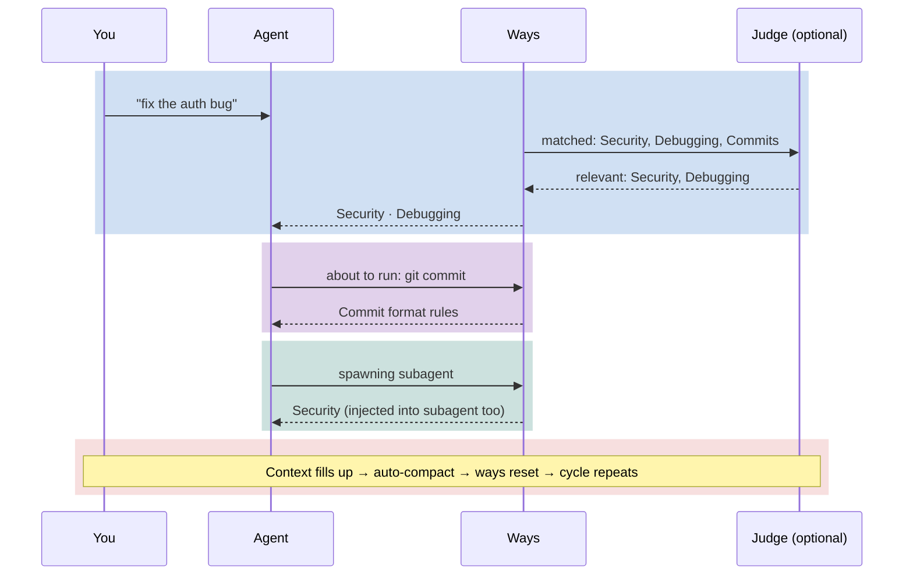
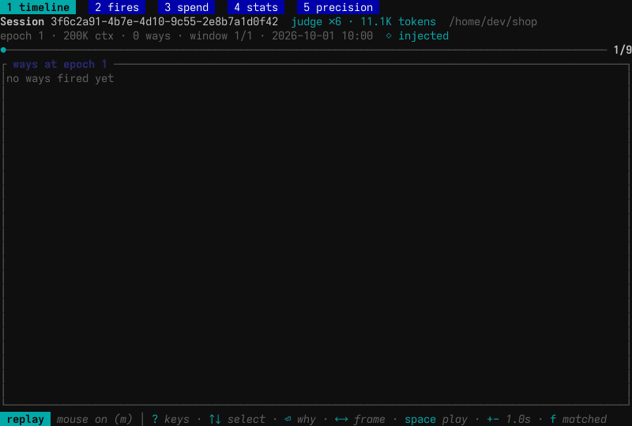

<p align="center">
  
</p>

# Agent Ways


Organizational socialization for AI coding agents. Ways encode *"the way we do it around here"* — the local norms an agent cannot know because it was never told them — and deliver them the way human teams actually transmit norms: situated, at the moment of relevant action, just before tools execute.

An LLM session cannot internalize norms — no weight updates, no carried memory; every session is a new hire. So the system re-enacts socialization mechanically, on a spaced schedule that substitutes for the memory the agent does not have. In one sentence: *procedural memory for coding agents, maintained by spaced repetition.* Every project-coined term here maps to an established concept — the [vocabulary reference](docs/vocabulary.md) is the index.

> **Current status:** Agent Ways ships with full support for [Claude Code](https://code.claude.com/docs). Support for additional CLI-based coding agents is in development.



**Ways** = policy and process encoded as contextual guidance. Triggered by keywords, commands, and file patterns — they fire before tools execute, re-disclose on a token-distance cadence as their influence fades, and carry into subagents.

**Why this works:** System prompt adherence decays as a power law over conversation turns — instructions at position zero lose influence as context grows. This is the forgetting curve (Ebbinghaus) operating over token distance instead of days, and the countermeasure is the one human learning already uses: spaced repetition. Ways inject small, relevant guidance near the attention cursor at the moment it matters and re-disclose it as its influence fades, maintaining steady-state adherence instead of a damped sawtooth. It's [progressive disclosure](docs/hooks-and-ways/context-decay.md) applied to the model itself.

### Session replay with `ways session replay`

`ways session replay` replays a session's way-firing history frame by frame, and follows a live session as it writes. Each frame shows a way firing at a specific point in the conversation — you can see how guidance clusters near the active attention cursor and packs into the context window like a compression pattern.

[](docs/images/ways-introspect.mp4)

<sub>[Download the recording](docs/images/ways-introspect.mp4) (228K MP4).</sub>

Semantic matching runs on your machine through the **embedding engine** (all-MiniLM-L6-v2, a ~21MB GGUF model). It handles similarity of meaning: "pin lockfile versions" matches the supply chain way even though those exact words are absent from the way's vocabulary. `ways status` reports the matcher's current calibration.

---

This repo ships with software development ways, but the mechanism is general-purpose. You could have ways for:
- Excel/Office productivity
- AWS operations
- Financial analysis
- Research workflows
- Anything with patterns your agent should know about

## What's in the box

agent-ways is a suite of binaries plus the ways corpus, the hooks that deliver it, skills and subagents. `tools/suite-bins` lists the Rust binaries the installer builds and links onto your `PATH`.

| Component | What it does | Docs |
|---|---|---|
| `ways` | The CLI and the hook engine. Every hook script calls it to match ways, track session state and inject guidance. It also carries install, update, settings and authoring commands. | [CLI reference](docs/reference/ways-cli.md) |
| `way-embed` | The embedding engine (C++, llama.cpp) for semantic matching. It is optional: without it, only `pattern:`, `commands:` and `files:` triggers fire. | [Matching](docs/hooks-and-ways/matching.md), [finishing an install](docs/finish-install.md) |
| `ways-agent` | A resident per-user daemon that holds your provider key and runs the relevance judge. The hook starts it on first use. | [Relevance judge](docs/explanation/relevance-judge/), [ADR-502](docs/architecture/platform/ADR-502-the-ways-agent-one-resident-daemon-per-user-for-search-judging-and-key-custody.md) |
| `ways-mcp` | The agent-ways MCP server, registered with Claude Code as `agent-ways`. It hosts attend and later modules. | [ADR-501](docs/architecture/platform/ADR-501-the-agent-ways-mcp-server-one-server-for-attend-keepalive-and-later-modules-inbound-through-channels.md) |
| `attend` | The awareness layer: sensors for git state, peer sessions and process activity, surfaced into a running session as notifications. | [Attend and Monitor](docs/attend-and-monitor/README.md) |
| `attend-chat` | A terminal chat that puts you on the same signal bus the agents use. | [`attend chat`](docs/attend-and-monitor/tui.md) |
| `ways-audit` | Reports on the compliance claims ways carry: coverage, control traces, provenance lint. | [Governance](docs/governance.md) |

## Prerequisites

Runs on **Linux** and **macOS**. The installer needs `git`, `jq` and `make`, and stops if any is missing.

| Tool | Purpose | Notes |
|------|---------|-------|
| [Claude Code](https://code.claude.com/docs/en/setup) | The agent this configures | `curl -fsSL https://claude.ai/install.sh \| bash` |
| `git` | Stages the app source, update checks | Usually pre-installed |
| `jq` | JSON in hook scripts and macros | **Must install** |
| `make` | Drives the build and the binary downloads | Usually pre-installed with a build toolchain |
| `python3` | The `adr` and `doc` tools, chart-tool, the bash-bound guard | Stdlib only, no pip packages |
| [`gh`](https://cli.github.com/), logged in | Downloads the prebuilt binaries; issue sync, repo macros | Run `gh auth login`. Without it every binary builds from source |
| `cargo` | Source build of a suite binary | When `gh` is missing or logged out, or no prebuilt fits your platform |
| `cmake`, C++ compiler | Source build of `way-embed` | Same as `cargo`; `make deps` installs them |

`make setup` acquires each suite binary in this order: keep a working one in `bin/`, download the prebuilt release through `gh`, build from source with `cargo`. Standard utilities (`bash`, `awk`, `sed`, `grep`, `find`, `timeout`, `tr`, `sort`, `wc`, `date`) are assumed present via coreutils.

`make setup` also fetches the embedding engine and its model. If that step fails, the install still completes, and [Finishing an install](docs/finish-install.md) walks through turning semantic matching on.

**Platform install guides:**
[macOS (Homebrew)](docs/prerequisites-macos.md) · [Arch Linux](docs/prerequisites-arch.md) · [Debian / Ubuntu](docs/prerequisites-debian.md) · [Fedora / RHEL](docs/prerequisites-fedora.md)

> **macOS note:** `timeout` is a GNU coreutils command not present by default. Install `coreutils` via Homebrew — see the [macOS guide](docs/prerequisites-macos.md) for PATH setup.

## Quick Start

```bash
curl -sL https://raw.githubusercontent.com/aaronsb/agent-ways/main/scripts/install.sh | bash -s -- --bootstrap
```

The installer:

- stages the app into `$XDG_DATA_HOME/agent-ways` and builds the binaries, fetching the embedding model (~21MB);
- links the suite binaries into `~/.local/bin`;
- runs `ways reconcile`, which symlinks the projected roots (`skills/`, `agents/`, `commands/`, `hooks/ways/`, built binaries) into `~/.claude`, merges its hook entries and permissions into `settings.json`, and registers the `agent-ways` MCP server in `~/.claude.json`;
- checks for a relevance-judge key and, on a terminal, offers to add one.

Your existing `~/.claude` (sessions, credentials, your own `settings.json` values, `projects/`) is preserved. If one of the projected root paths is already a real directory of yours, reconcile stops and names it; it never deletes it. The [install guide](docs/install-guide.md) covers that case, forks and previous installs. Restart Claude Code and the ways are active.

To customize, add your own ways under `$XDG_CONFIG_HOME/agent-ways/ways/` (see [Creating Ways](#creating-ways)). To replace the shipped corpus, fork the repo and install from your fork. To work on agent-ways itself, set up a [development checkout](docs/development.md).

To remove it, `ways uninstall` lists what it would do: withdraw from `~/.claude` and your other targets, remove the MCP registration, unlink the commands, delete the app and its caches. `ways uninstall --yes` does it. Your own ways, API keys and event log stay unless you add `--purge` (ADR-198).

> **Stop and read this** if you're letting an AI agent run the installer. You are about to let an agent modify `~/.claude/` — the directory that controls how Claude Code behaves. The agent is editing its own configuration. Review the repo first. You are responsible for the result.

## How It Works

`core.md` loads at session start with behavioral guidance, operational rules, and a dynamic ways index. Then, as you work:

1. **UserPromptSubmit** matches your message against every way, by keyword and by embedding.
2. The **relevance judge** reviews those matches when you have stored a provider key. In `enforce` mode a way it judges irrelevant is held back; in `shadow` mode it only logs its verdicts; `off` skips it.
3. The ways that pass are **injected** into the conversation.
4. **PreToolUse** matches commands and file edits *before they execute* and injects the ways they trigger.
5. **SubagentStart** injects relevant ways into subagents spawned via the Agent tool.
6. **PostToolUse** runs a way's postchecks after an edit or command, and matches any message you queued while Claude was working; those matches go through the judge like a prompt's. **Stop** records Claude's last reply so the next prompt is matched against it too.

A way fires when matched, then **re-discloses on its `refire:` cadence** (a fraction of the context window, ADR-126) as its salience decays. Marker files track the first fire and drive that re-disclosure state machine; they don't permanently block re-triggering.

Matching has two channels: regex patterns for known keywords/commands/files, and [sentence-embedding](docs/architecture/ways/ADR-108-embedding-based-way-matching-with-all-minilm-l6-v2.md) semantic scoring (all-MiniLM-L6-v2). See [matching.md](docs/hooks-and-ways/matching.md) for the full strategy. The judge sends text from your conversation to a hosted model; the [install guide](docs/install-guide.md#the-relevance-judge) says what and gives the commands.

`ways session ways` shows the live session state — which ways fired, when (epoch), how far back (distance), what triggered them, tree relationships, check decay curves, and a re-disclosure forecast showing when distant ways will re-fire as context fills:


For the complete system guide — trigger flow, state machines, the pipeline from principle to implementation — see **[docs/hooks-and-ways/README.md](docs/hooks-and-ways/README.md)**.

## Configuration

`ways settings` on a terminal opens the settings screens (ways, matching, gate, install, theme). The same keys work from the command line:

```bash
ways settings list                          # every key and its value
ways settings help ways.disabled_domains    # what a key does, its type and default
ways settings set ways.disabled_domains itops,ea
ways settings set gate.mode shadow
```

User settings live in `$XDG_CONFIG_HOME/agent-ways/config.yaml`, except the `gate.*` keys, which live in `agent.yaml` beside it. A project can set its own in `.claude/ways.yaml`. `ways settings help <key>` names each key's file. The file form of the `disabled_domains` example:

```yaml
disabled_domains:
  - itops
  - ea
```

A disabled domain is ignored completely: no matching, no output. The [CLI reference](docs/reference/ways-cli.md) lists the settings commands.

## Creating Ways

Ways load from three roots. When the same way id (its path under the root) exists in more than one, the higher root wins (ADR-143):

| Root | Path | Holds |
|---|---|---|
| Project | `$PROJECT/.claude/ways/{domain}/{wayname}/` | Ways for one repository, checked in with it |
| User | `$XDG_CONFIG_HOME/agent-ways/ways/{domain}/{wayname}/` | Your own ways, and overrides of shipped ways; updates never touch it |
| Core | the app's `hooks/ways/`, projected to `~/.claude/hooks/ways/` | The shipped corpus; change it in a fork, since a local edit can block `ways update` |

Each way is a `{wayname}.md` file with YAML frontmatter:

```yaml
---
description: semantic text    # embedding semantic matching (preferred)
vocabulary: domain keywords   # space-separated terms augmenting the embedding
pattern: commit|push          # regex on user prompts (supplementary)
commands: git\ commit         # regex on bash commands
files: \.env$                 # regex on file paths
macro: prepend                # dynamic context via macro.sh
scope: agent, subagent        # injection scope
---
```

Matching has two independent lanes. A way fires when the semantic probability `g(s)` clears the global threshold `τ_s`, **or** when a `pattern:`/`commands:`/`files:` regex matches *and* `g(s)` clears the lower keyword floor `τ_k`. The keyword lane is **floor-gated** — a regex hit can't drag in an unrelated prompt — except it fails open when no calibration is loaded, and `pattern_strict: true` bypasses the gate by design. See the [engine reference](docs/hooks-and-ways/engine-reference.md) for the exact fire rule.

Project macros are disabled by default. Trust a project with `echo "/path/to/project" >> ~/.claude/trusted-project-macros`.

For the full authoring guide: [extending.md](docs/hooks-and-ways/extending.md) | For matching strategy: [matching.md](docs/hooks-and-ways/matching.md) | For macros: [macros.md](docs/hooks-and-ways/macros.md)

## Testing Ways

After creating or tuning a way, verify it matches what you expect — and doesn't match what it shouldn't.

```bash
# Score a way against sample prompts (inside Claude Code)
/ways-tests score security "how do i hash passwords with bcrypt"

# Rank all ways against a prompt
/ways-tests score-all "write some unit tests for this module"

# Validate frontmatter
ways author lint --global

# Vocabulary gap analysis
ways author suggest ~/.claude/hooks/ways/softwaredev/code/security/security.md

# How a prompt matches under the live matcher (ADR-160)
ways author match "pin lockfile versions"

# Sibling vocabulary overlap (Jaccard)
ways author tree softwaredev/code/supplychain/depscan --jaccard

# Way-vs-way embedding similarity
ways author siblings softwaredev/code/supplychain/depscan/node

# Session simulation tests (Rust integration tests)
make test-sim

# Interactive: full hook pipeline with subagent injection
# Start a fresh session, then: read and run tests/way-activation-test.md
```

Other test tools: `scripts/doc-graph.sh --stats` checks documentation link integrity; `ways-audit lint` validates provenance metadata. Full test guide: [tests/README.md](tests/README.md).

## What's Included

The shipped ways cover commits, security, testing, debugging, dependencies, architecture, documentation and more, across ten domains: `collaboration`, `data`, `documentation`, `ea`, `itops`, `meta`, `research`, `softwaredev`, `workstation` and `writing`. `ways status` prints the current count. The live index is generated at session start. **Replace these entirely** if your domain isn't software dev.

Also included:
- **[Agent teams](docs/hooks-and-ways/teams.md)** — three-scope model (agent/teammate/subagent) with scope-gated governance and team telemetry. When one agent becomes a team, every teammate gets the same handbook.
- **7 specialized subagents** for requirements, architecture, planning, review, workflow, organization, and skeptical review of finished claims
- **[Usage stats](docs/hooks-and-ways/stats.md)** — way firing telemetry by scope, team, project, and trigger type
- **Update check** — nudges a direct install when its app source is behind `aaronsb/agent-ways`

## Why Ways? (Rules, Skills, and Ways)

Claude Code ships two official features for injecting guidance: **Rules** (`.claude/rules/*.md`) and **Skills** (`~/.claude/skills/`). Ways solve problems that neither can.

The problem has a name in principal–agent theory: **preference uncertainty**. An agent that doesn't know its principal's norms has only two safe strategies — ask constantly, or hedge exhaustively. Remove the ways system and agents of every model tier revert to exactly that. Rules and skills each supply some norms; ways supply them *situated* — at the moment of action, wherever in the file tree that action happens.

### The progressive disclosure problem

Rules and ways both inject guidance conditionally — but their disclosure models are fundamentally different:

- **Rules** disclose based on **file paths** (`paths: src/api/**`). The project's directory tree *is* the disclosure taxonomy. This works when concerns map cleanly to directories, but most concerns don't — security, testing conventions, commit standards, and performance patterns cut across every directory.

- **Ways** disclose based on **actions and intent** — what you're doing (running `git commit`), what you're talking about ("optimize this query"), or what state the session is in (context 75% full). The disclosure schedule is decoupled from the file hierarchy entirely.

This matters because of how attention works in transformers. Rules loaded at file-read time are closer to the generation cursor than startup rules, but ways inject at the **tool-call boundary** — the closest possible point to where the model is actively generating. The [context decay model](docs/hooks-and-ways/context-decay.md) formalizes why this temporal coupling outperforms spatial coupling for maintaining adherence over long sessions.

### Three features, three jobs

| | **Rules** | **Skills** | **Ways** |
|--|-----------|------------|----------|
| **What** | Static instructions | Action templates | Event-driven guidance |
| **Job** | "Always do X" | "Here's how to do Y" | "Right now, remember Z" |
| **Trigger** | File access or startup | User intent (Claude decides) | Tool use, keywords, state conditions |
| **Conditional on** | File paths (directory tree) | Semantic similarity | Multi-channel: regex, embeddings, commands, files, state |
| **Cross-cutting concerns** | Needs duplicate `paths:` entries | N/A (intent-based) | Single way fires regardless of file location |
| **Dynamic content** | No | No | Yes (shell macros) |
| **Survives refactoring** | No (`src/` → `lib/` breaks paths) | Yes | Yes |
| **Non-file triggers** | No | No | Yes (`git commit`, context threshold, subagent spawn) |
| **Compliance claims** | No | No | Yes (design claims → NIST, OWASP, ISO, SOC 2) |
| **Org-level scope** | Yes (`/etc/claude-code/`) | No | No |
| **Zero-config simplicity** | Yes (drop a `.md` file) | Yes | No (requires hook infrastructure) |

**Rules** are best for static, always-on preferences ("use TypeScript strict mode", "tabs not spaces"). **Skills** are best for specific capabilities invoked by intent ("ship this PR", "rotate AWS keys"). **Ways** are best for context-sensitive guidance that fires on events, cuts across the file tree, and needs to stay fresh in long sessions.

They compose well: rules set baseline preferences, ways inject guidance at tool boundaries, skills provide specific workflows. The [full comparison](docs/hooks-and-ways/README.md#ways-rules-and-skills) covers the architectural details.

> **Is this just RAG?** Ways and RAG solve the same fundamental problem — getting the right context into the window at the right time — but through different architectures. RAG retrieves by semantic similarity; Ways retrieve by event. RAG is stateless; Ways track session state. The [full comparison](docs/hooks-and-ways/ways-vs-rag.md) explores what's shared, what's different, and when each approach wins.

## Governance

A way can carry a compliance **claim**: a `provenance.yaml` sidecar linking it to policy documents and the regulatory controls its guidance is *designed* to address. The runtime never reads it (zero tokens), but the [governance operator](governance/README.md) walks the chain:

```
Control Framework → Policy Document → Way + claim → Agent Context
```

The [`governance/`](governance/) directory contains reporting tools and [policy source documents](governance/policies/) — claim-coverage queries, control traces, matrices. Designed to be separable. The built-in ways carry justification *claims* across controls from NIST, OWASP, ISO, SOC 2, CIS, and IEEE — assertions about how the guidance is *designed*, not evidence that any control operates.

Most users don't need it. It's an additive layer that helps work take a control-aligned shape at the point of work: a first-line aid, not an assessment or attestation. Read any coverage number as *claims made*, not *conformance achieved*. See [docs/governance.md](docs/governance.md) for the full reference.

For adding a claim: [provenance.md](docs/hooks-and-ways/provenance.md) | Design rationale: [ADR-200](docs/architecture/governance/ADR-200-compliance-claims-and-session-derived-findings.md)

## Philosophy

Policy-as-code for AI agents: plain files, local matching, one optional network service.

| Feature | Why It Matters |
|---------|----------------|
| **Local matching** | Regex and embedding matching run on your machine with a local model |
| **Optional relevance judge** | With a provider key, `ways-agent` asks a hosted model (Anthropic or OpenRouter) which matched ways fit the prompt. With no key the gate is off and every matched way is injected |
| **Shell macros** | Dynamic context from any source (APIs, files, system state) |
| **Small runtime** | The `ways` binary, bash and jq in the hooks; the hook starts `ways-agent` only when the judge has a key |
| **Domain-agnostic** | Swap software dev ways for finance, ops, research, anything |
| **Fully hackable** | Plain text files; add your own ways without forking |

For the attention mechanics: [context-decay.md](docs/hooks-and-ways/context-decay.md) | For the cognitive science rationale: [rationale.md](docs/hooks-and-ways/rationale.md)

## Updating

The app source lives in `$XDG_DATA_HOME/agent-ways`. Update it with:

```bash
ways update              # pull, refresh binaries, regenerate the corpus, reproject ~/.claude
ways update --dry-run    # show what it would run
ways update --ref REF    # pin to a branch, tag or commit and build from source
ways update --ref main   # return to the release channel
```

`ways update` pulls the app source, prefers prebuilt binaries over a source build, regenerates the corpus, relinks, reprojects `~/.claude` (`ways reconcile`), and ends with the judge key check. Re-running the installer one-liner does the same and is idempotent. The [install guide](docs/install-guide.md#scenario-a-previous-agent-ways-install) covers the flags and older installs.

A fork fetches and merges upstream in the app dir (`git fetch upstream && git merge upstream/main`), then runs `make update-binaries && ways reconcile`. The corpus rebuilds itself at the next session start.

At session start, `check-config-updates.sh` flags when the app source is behind upstream (`aaronsb/agent-ways`), fetching at most once per hour. A fork or a non-GitHub origin gets no nudge. There is no off switch yet that survives the next `ways reconcile`: deleting the script or its `settings.json` entry is undone by reconcile ([#816](https://github.com/aaronsb/agent-ways/issues/816)).

## Documentation

| Path | What's there |
|------|-------------|
| [docs/vocabulary.md](docs/vocabulary.md) | **The framing** — terminology anchors, why "ways", the canonical description |
| [docs/cognitive-loop.md](docs/cognitive-loop.md) | **Start here for the whole system** — ways, attend and the loop between them |
| [docs/hooks-and-ways/README.md](docs/hooks-and-ways/README.md) | **Start here for ways** — the pipeline, creating ways, reading order |
| [docs/hooks-and-ways/](docs/hooks-and-ways/) | Matching, macros, provenance, teams, stats |
| [docs/hooks-and-ways.md](docs/hooks-and-ways.md) | Reference: hook lifecycle, state management, data flow |
| [docs/attend-and-monitor/](docs/attend-and-monitor/README.md) | The awareness layer: sensors, signals, `attend chat` |
| [docs/install-guide.md](docs/install-guide.md) | Installing over an existing `~/.claude`, forks, previous installs, the relevance judge |
| [docs/governance.md](docs/governance.md) | Reference: compilation chain, provenance mechanics |
| [docs/architecture.md](docs/architecture.md) | System architecture diagrams |
| [docs/architecture/](docs/architecture/) | Agent Decision Records |
| [governance/](governance/) | Governance traceability and reporting |
| [docs/README.md](docs/README.md) | Full documentation map |

## License

Copyright (C) 2025-2026 Aaron Bockelie and the agent-ways contributors.

agent-ways is free software: you can redistribute it and/or modify it under the terms of the GNU Affero General Public License as published by the Free Software Foundation, either version 3 of the License, or (at your option) any later version. See [LICENSE](LICENSE). Offering a modified agent-ways to others over a network obliges you to offer them its source. Everything released before 2026-10-01 was published under the MIT License and remains available under it. Third-party components keep their own licenses, all MIT: the fonts in `tools/agent-fmt/fonts/`, the `llama.cpp` submodule, and the Cypress bound-hook that `hooks/ways/check-bash-bound.py` adapts.
