# Ways System Architecture

Diagrams of the ways trigger system: what runs on each hook event, how a way is matched and admitted, and what state the engine keeps. The prose here is kept to what a diagram needs. The fire rule with its thresholds is stated once in [engine-reference.md](hooks-and-ways/engine-reference.md), the hook table and the switches in [hooks-and-ways.md](hooks-and-ways.md), and the event log fields in [reference/events.md](reference/events.md).

Two names recur below:

- `{SESSIONS_ROOT}` is `$XDG_RUNTIME_DIR/claude-sessions`, or `/tmp/.claude-sessions-{uid}` where that variable is unset (`%LOCALAPPDATA%/claude-ways/sessions` on Windows). `{SESSIONS_ROOT}/{session_id}/` holds one session's state.
- Firing state is kept **per agent**. The main agent's engagement, way tokens, way epochs, epoch counter and check fires sit at the session root. A subagent's sit under `{SESSIONS_ROOT}/{session_id}/agents/{agent_id}/`, and its token position, context window and model are read from its own transcript. Way markers are per agent too: `ways/{way_id}/.marker.{agent_id}`, with `main` for the main agent. A way shown to a subagent therefore does not silence it for the main agent, or the reverse.

## Where the runtime lives

| Root | Path | Holds |
|---|---|---|
| App | `$XDG_DATA_HOME/agent-ways` | The source checkout, the built binaries, and the shipped ways under `hooks/ways/`. Replaced on update. |
| Projection | `~/.claude` (and each extra target) | `hooks/ways`, `skills`, `agents`, `commands` and each binary under `bin/` are linked (or copied) from the app. `ways reconcile` three-way merges the repo's `settings.json` hooks block into the target's `settings.json` (ADR-142, ADR-184). |
| User config | `$XDG_CONFIG_HOME/agent-ways` | `config.yaml`, your own ways under `ways/`, the judge settings in `agent.yaml`, and per-target `targets/<key>/config.yaml`. Survives updates. |
| State | `$XDG_STATE_HOME/agent-ways` | `events.jsonl`, and the per-session subagent switches under `subagent-switch/`. |
| Cache | `$XDG_CACHE_HOME/agent-ways/user` | The embedding corpora (`ways-corpus-en.jsonl`, `ways-corpus-multi.jsonl`), `embed-manifest.json` with the calibration, and the GGUF models. Regenerable. |
| Session | `{SESSIONS_ROOT}/{session_id}` | Markers, per-agent firing state, the subagent stash, the last response. Cleared on SessionStart startup, compact and clear. |

## How a Session Flows

A session from the user's side, showing which lane each injection comes from:

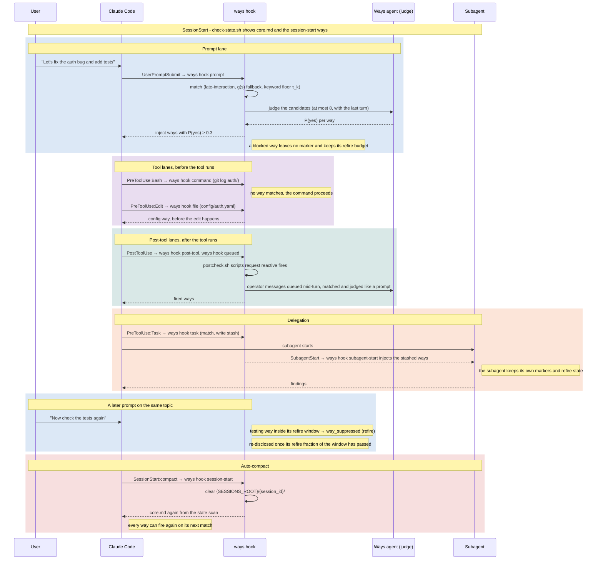

## Hook Flow

Every script under `hooks/ways/` that touches ways is a thin adapter for one `ways hook <event>` call (ADR-504 §11). The other hooks in the same `settings.json` block are shown in grey.

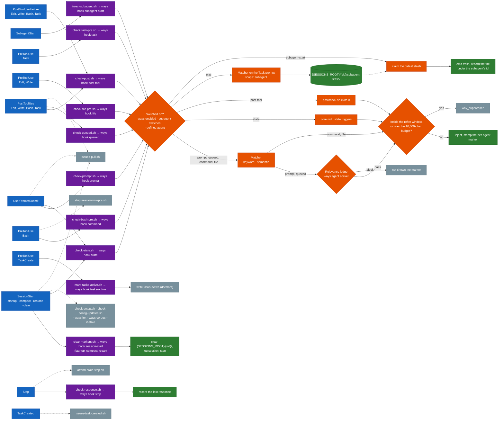

`check-setup.sh`, `check-config-updates.sh`, `ways init` and `ways corpus --if-stale` run on `startup` only (`ways init` also on `clear`). `check-queued.sh` scans for the main agent only, because operator messages are queued to it.

## Subagent Injection

A Task prompt is visible on PreToolUse:Task, but the subagent only exists at SubagentStart. A stash file bridges the two:

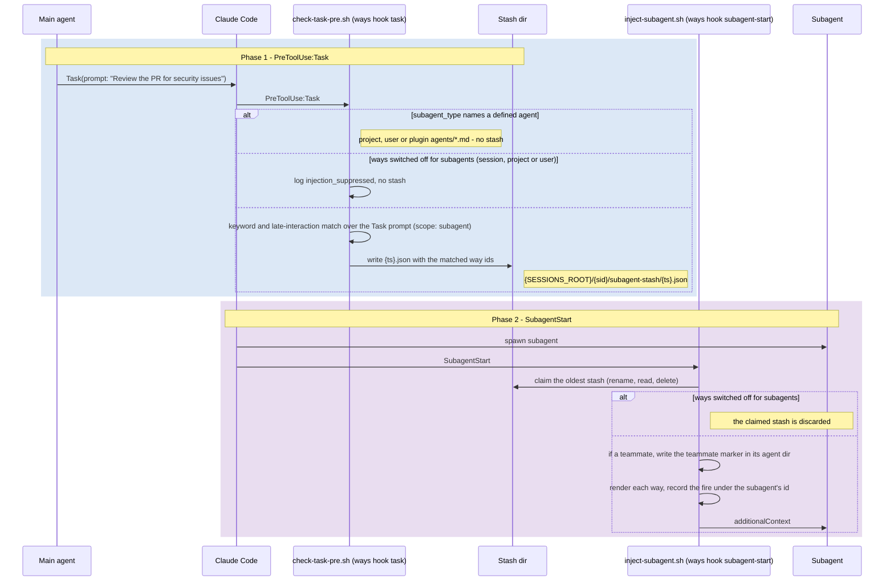

The stashed ways are emitted whatever the parent has already been shown. Each fire is then recorded under the subagent's own id, so the subagent's later hooks follow their own refire windows.

### Scope Filtering

The `scope` field controls where a way can inject:

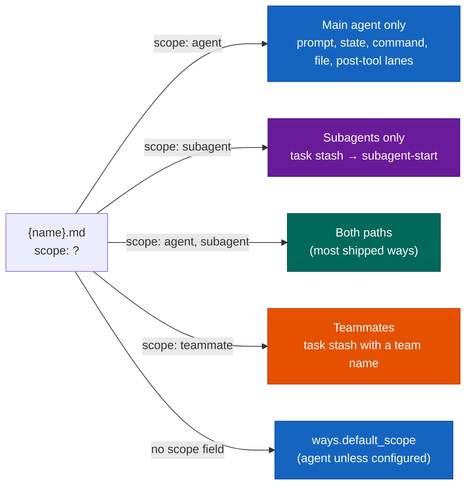

### Parallel Subagent Handling

Several Task calls in one message write separate stash files, consumed oldest first. Each SubagentStart claims its file by renaming it, so two subagents never take the same stash.

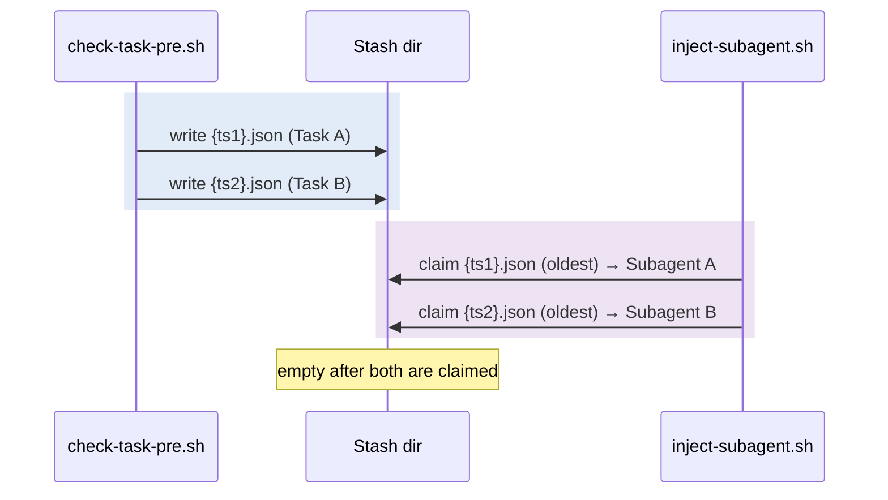

## Disclosure Cadence

Each (way, agent) pair in a session moves through these states. A way's `refire:` value is a fraction of the agent's context window (ADR-126): `once` 1.0, `rare` 0.4, `normal` 0.15, `frequent` 0.05, or a number.

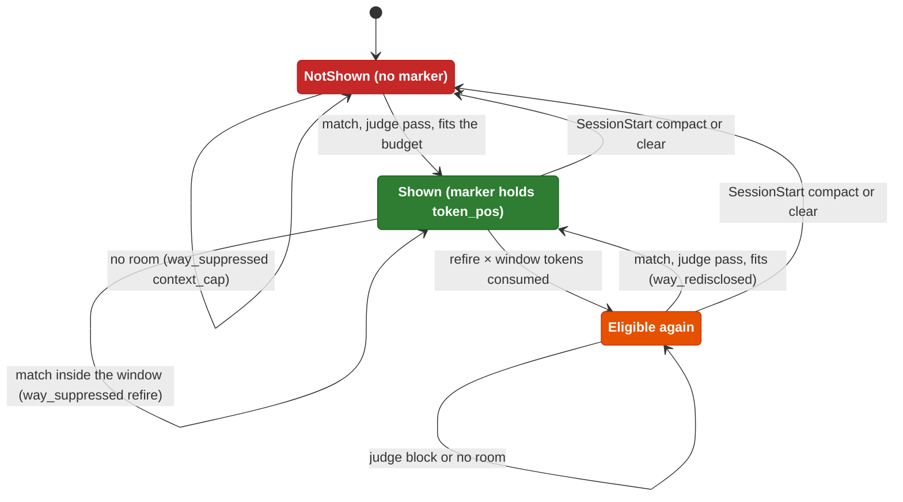

The marker is `{SESSIONS_ROOT}/{session_id}/ways/{way_id}/.marker.{agent_id}`. The judge runs on the prompt and queued lanes only, so the judge-block edges apply there. A `session-start` state way shows once per marker reset rather than on a refire window.

## Trigger Matching

How prompts and tool input reach a way:

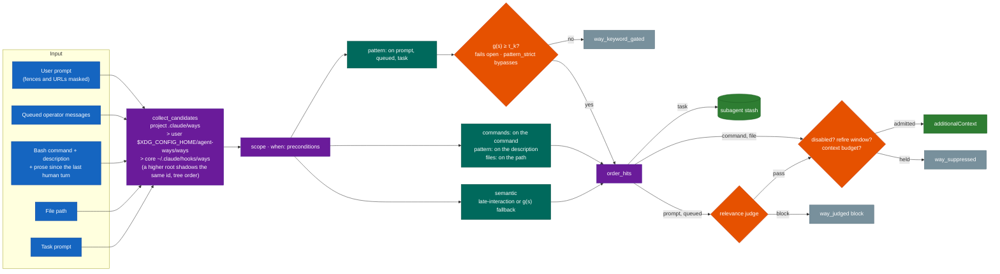

The bash semantic lane uses the single-vector scores only. The file lane is regex only. Disabled domains and ways are checked when a way is shown.

## Semantic Matching

The semantic channel on the prompt, queued and task surfaces is the ADR-160 late-interaction matcher. The single-vector calibrated gate (ADR-156) decides only when late-interaction cannot run. Its probabilities are computed on every scan, because the keyword floor and near-miss logging read them on both paths.

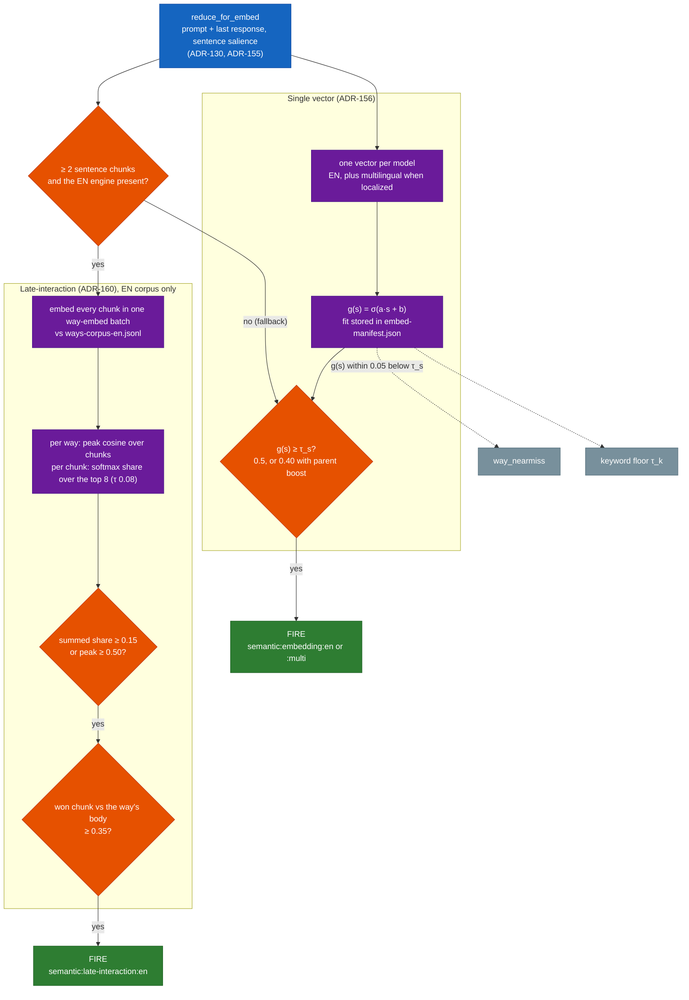

The late-interaction operating points are hand-set and uncalibrated. Parent boost lowers `τ_s`, so it has no effect when late-interaction decides. On a localized install the multilingual lane can fire only on the fallback path. [engine-reference.md](hooks-and-ways/engine-reference.md) states the rule with its sources.

## Relevance Gate and the Ways Agent

On the prompt and queued lanes, the ways the matcher would show are sent in one request to a hosted yes/no judge before any fire is recorded (ADR-196). The judge runs in the **ways agent**, one resident daemon per user on a Unix socket of mode 0600 (ADR-502). A hook starts it on demand. It exits when idle, and when its binary is replaced. It holds the provider key, so hooks never read one, and it does judging and key custody only. Matching stays in the `ways` process. `ways agent status` reports the running agent, `ways agent key` manages keys, and `ways settings` sets `gate.mode` (`enforce`, `shadow`, `off`) and `gate.engine`. No key file means no gate.

What the judge sees, its threshold, cap, timeout, cost and failure behaviour are explained in [the relevance judge](explanation/relevance-judge/relevance-judge-the-model.md).

## Telemetry & Tuning

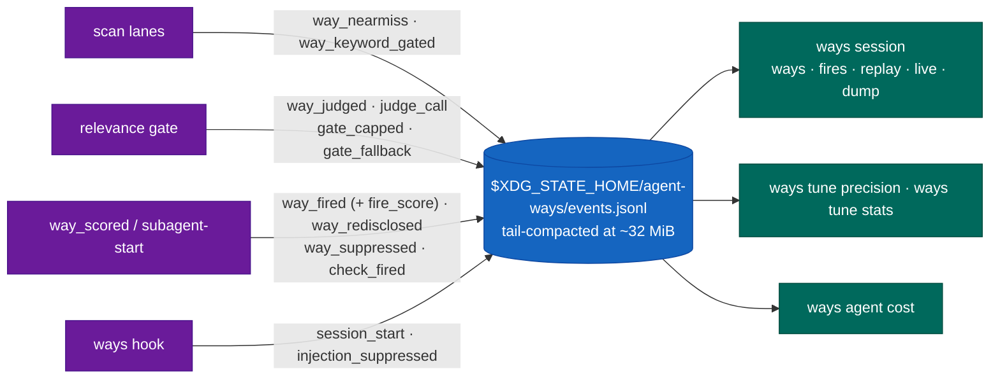

`fire_score` is the deciding score of the semantic channel that fired: the summed share for late-interaction, `g(s)` for the single-vector path. The `trigger` field says which. The tuning loop is described in [hooks-and-ways.md](hooks-and-ways.md#telemetry), and every event's fields in [reference/events.md](reference/events.md).

## Macro Injection

Ways with `macro: prepend|append` run a script that queries live state when the way is shown:

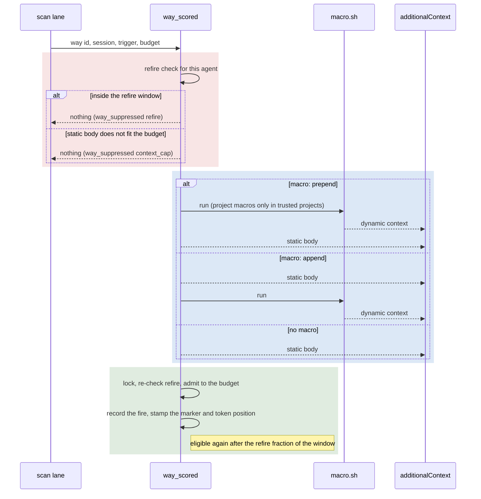

A project-local macro runs only if the project is listed in `~/.claude/trusted-project-macros`.

## Directory Structure

```
$XDG_DATA_HOME/agent-ways/hooks/ways/      # shipped ways, projected as ~/.claude/hooks/ways/
├── core.md                     # base guidance, shown by the state scan
├── macro.sh                    # core.md's macro: the Available Ways table
├── require-ways.sh             # shared by the adapters: runs ~/.claude/bin/ways hook <event>
│
├── clear-markers.sh            # SessionStart → ways hook session-start
├── check-state.sh              # SessionStart, UserPromptSubmit → ways hook state
├── check-prompt.sh             # UserPromptSubmit → ways hook prompt
├── check-bash-pre.sh           # PreToolUse:Bash → ways hook command
├── check-file-pre.sh           # PreToolUse:Edit|Write → ways hook file
├── check-task-pre.sh           # PreToolUse:Task → ways hook task
├── mark-tasks-active.sh        # PreToolUse:TaskCreate → ways hook tasks-active (dormant marker)
├── inject-subagent.sh          # SubagentStart → ways hook subagent-start
├── check-post.sh               # PostToolUse, PostToolUseFailure → ways hook post-tool
├── check-queued.sh             # PostToolUse → ways hook queued
├── check-response.sh           # Stop → ways hook stop
│
├── check-setup.sh              # SessionStart:startup → notice when the ways binary is missing
├── strip-session-link-pre.sh   # PreToolUse:Bash → deny publishing a session link (ADR-167)
├── attend-drain-stop.sh        # Stop → attend inbox --drain (ADR-172)
├── issues-pull.sh              # SessionStart, UserPromptSubmit, PostToolUse:Bash → gh-tasks pull (ADR-180)
├── issues-task-created.sh      # TaskCreated → reject unprefixed duplicates of mirrored issues (ADR-180)
├── check-bash-bound.py         # Bash guard (ADR-181), shipped but not wired
│
└── {domain}/{way}/{way}.md     # softwaredev, meta, documentation, ea, workstation, data, itops, ...
    ├── macro.sh                #   optional dynamic content
    ├── postcheck.sh            #   optional reactive firing on PostToolUse
    └── {child}/{child}.md      #   ways nest for progressive disclosure

$XDG_CONFIG_HOME/agent-ways/ways/          # your own ways, same layout, survive updates
$PROJECT/.claude/ways/                     # project ways, same layout, highest precedence
```

`check-config-updates.sh` sits one level up, in `hooks/`.

### Script Relationships

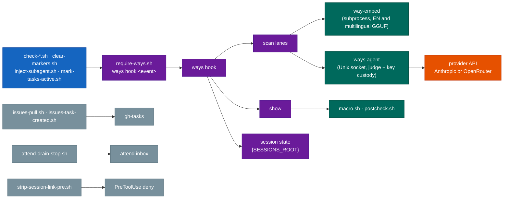

## Multi-Trigger Semantics

What happens when one prompt matches several ways:

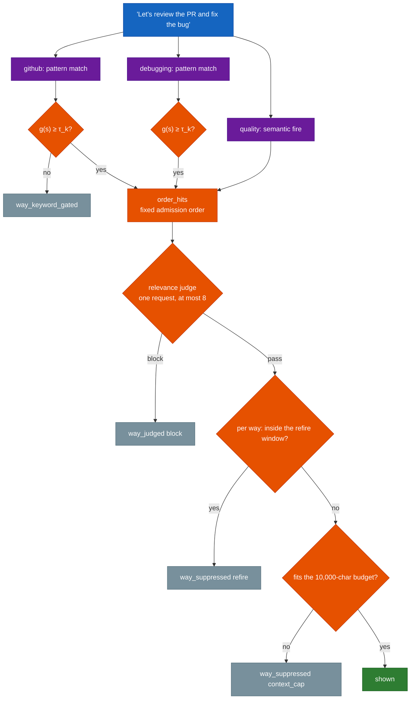

Each way keeps its own marker, so several ways can fire from one prompt and each re-discloses on its own `refire:` cadence. A child that fired only because its parent fired earlier in the same scan is withheld when that parent is not shown.

## Project-Local Override

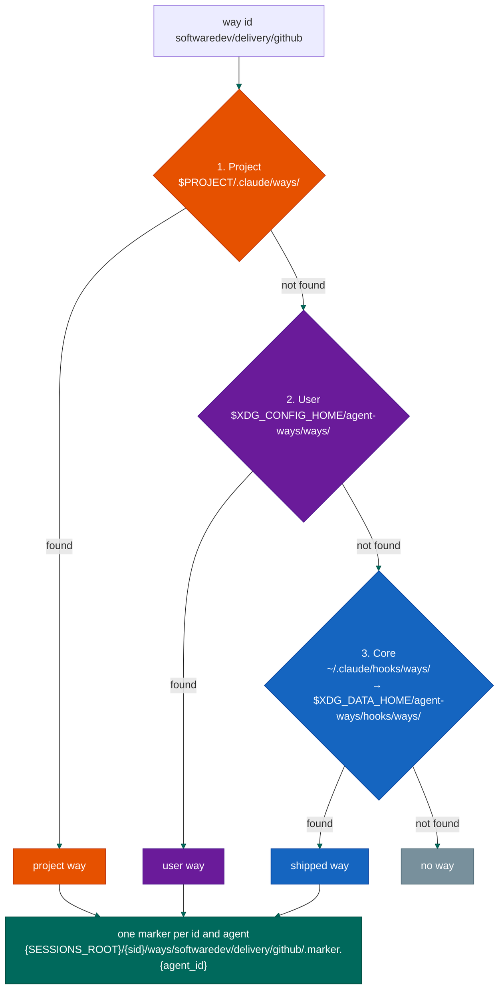

The first root that has the id shadows it in every root below (ADR-143), for matching and for rendering alike. Project macros and postchecks run only if the project is listed in `~/.claude/trusted-project-macros`.
