# ADR-172: Turn-boundary inbound delivery via a CLI-owned drain checkpoint

## Context

Authored messages (ADR-136's message lane — `attend send`/`reply`, `@Name`,
`#group`, `#open`) reach a session through one conduit: the `peers` sensor,
polling on a wall-clock cadence under Monitor. A message written to a
recipient's tray waits there until the next poll surfaces it, then rides the
notification bridge into a turn. That poll interval is a floor on delivery
latency.

Two regimes have different needs, because a Claude Code session is
**turn-gated** — it can only ingest an inbound message when something crosses
into the turn dimension (ADR-136: "the notification is the bridge"):

- **Idle** (turn finished, awaiting input): nothing the session itself runs
  can wake it. Only an in-flight conduit can — which is precisely what the
  Monitor-hosted sensor *is*. The poll interval is the unavoidable cost of
  waking an idle loop.
- **Active** (mid-turn, running tools): the session is right there, but an
  arriving message still waits for the next poll. Here the poll latency is
  pure lag — and there is a cheaper conduit available. A `Stop` hook fires at
  the exact moment a turn ends, before the session goes idle, and can inject
  text and force continuation. Draining pending messages there delivers them
  with **no poll latency**.

The general shape: inbound awareness is *afferent* — it must be carried across
the turn boundary by a conduit the loop can consume. The poller is the conduit
that can reach an *idle* loop; the turn boundary is a free, exact conduit for
an *active* one. Adding the second does not remove the first.

The latency observation surfaced during the ADR-171 identity work; ADR-171
supplies the stable key this delivery path depends on (`whoami --machine` →
`session_id` / `origin_path` / `resolved`), so a consumption record cannot be
keyed on a persona that shell-cwd drift or presentation churn could alias.

## Decision

**Deliver authored messages at the earliest turn boundary through a
CLI-owned atomic drain that records consumption on the stable identity tuple;
keep the poller as the idle-session conduit; and let a single seen-set keyed
on that tuple keep every conduit deliver-once.**

Concretely:

1. **A `Stop`-hook drain is the active-session fast path.** On turn end the
   hook pulls pending authored messages for this session and, if any, injects
   them and continues the turn — zero poll latency. The Monitor-hosted `peers`
   sensor is unchanged and remains the **idle-session** waker; this ADR adds a
   conduit, it does not replace one.

2. **The hook is a dumb invoker.** It shells out to a new attend-owned verb —
   `attend inbox --drain` (`--format hook`) — that atomically returns
   pending-for-this-session *and* records their consumption. The hook never
   reads attend-owned state. CLI remains the whole interface (ADR-124,
   ADR-136).

3. **One seen-set, two consumers.** The drain and the `peers` sensor share the
   single per-session seen-set ADR-136 already maintains — they do not keep
   parallel dedup stores. A message consumed by either conduit is marked seen
   once, so the two never double-deliver. ADR-136's deliver-once contract now
   holds *across* the poll and the turn-boundary paths.

4. **Consumption keys on the resolved tuple, and refuses to mark under an
   unresolved identity.** The seen-set (and every durable state ADR-171 names)
   keys on `(session_id ∩ origin_path)`, obtained via `attend whoami`, never
   the rendered display name. If `whoami` reports `resolved=false` (the
   `pid-<pid>` / process-cwd fallback), the drain records **nothing** and
   no-ops: marking consumption under an unstable id would alias sessions,
   corrupt the shared seen-set, and desync from purge-liveness. Under
   unresolved identity, Monitor remains the delivery path — a graceful
   degradation.

5. **Durability is preserved by construction.** The drain reaps nothing.
   Removal stays owned by ADR-136 project-liveness reaping and the ADR-170
   `/purge` human power tool. Because the drain's consumption record and
   purge both key on the same tuple and the same seen-set, they agree without
   coordinating: `/purge` cannot shred a message a live, resolved session has
   not yet consumed.

```mermaid
flowchart TD
    Msg[Authored message in this<br/>session's tray / room ledger]
    Msg --> Idle{Session state?}
    Idle -->|idle — nothing to interrupt| Poll[peers sensor under Monitor<br/>wall-clock poll]
    Idle -->|active — turn about to end| Hook[Stop hook → attend inbox --drain]
    Poll --> Seen[(one per-session seen-set<br/>keyed on session_id ∩ origin_path)]
    Hook --> Seen
    Seen --> Once[deliver-once across both conduits]

    classDef msg fill:#7c3aed,color:#fff,stroke:#4a5568
    classDef decision fill:#fbbf24,color:#1a1a1a,stroke:#4a5568
    classDef proc fill:#2d7d9a,color:#fff,stroke:#4a5568
    classDef store fill:#2d8e5e,color:#fff,stroke:#4a5568
    class Msg msg
    class Idle decision
    class Poll,Hook,Once proc
    class Seen store
```

The on-disk form of the drain's consumption record (extend the existing
seen-set store vs. a sibling ledger) is an implementation choice for the
follow-up PR; the contract above — atomic drain, shared seen-set, tuple key,
resolved-gate — is what this ADR fixes.

## Consequences

### Positive

- An actively-working session receives authored messages the instant its turn
  ends, instead of at the next poll — the latency the poll interval imposed on
  the active regime is gone.
- Deliver-once (ADR-136) is preserved across both conduits because they share
  one tuple-keyed seen-set; there is no second dedup store to diverge.
- CLI-is-contract holds: the hook is a thin invoker, and identity is obtained
  through `attend whoami` rather than by reaching into attend state.
- `/purge` (ADR-170) and the drain agree by construction — same tuple, same
  seen-set — so the human power tool cannot delete a message a live resolved
  session has not consumed, without either side consulting the other.
- Keying on the machine tuple makes consumption immune to display-name churn
  (the presentation layer ADR-171 deliberately separated from the key).

### Negative

- A `Stop` hook runs at every turn end, so the drain must be cheap: one
  memoized-identity shell-out, O(pending) work, and a fast no-op when the tray
  is empty. A slow drain would tax every turn.
- A second delivery conduit is more surface than one poller. The mitigation is
  that both feed a single seen-set — one source of truth for "seen" — so the
  cost is a second *reader*, not a second *bookkeeping*.
- The turn-boundary path still cannot wake an idle session; the two-conduit
  split (poller for idle, hook for active) is inherent to a turn-gated loop,
  not complexity this ADR could design away.

### Neutral

- Requires a new `attend inbox --drain` verb; `inbox` is read-only today
  (list + read-by-id over the never-reaped ledger). The verb adds the first
  consumption-recording path to that surface.
- Under unresolved identity the drain no-ops and Monitor delivers instead — a
  degradation, not a failure; the session still receives its mail.
- The three synchronized messaging docs (`skills/attend/SKILL.md`,
  `tools/sensor-disclosure/src/disclosures/messaging.md`,
  `hooks/ways/softwaredev/environment/attend/attend.md`) move in lockstep if
  this changes the messaging contract, per ADR-136.

## Alternatives Considered

- **Let the hook read the signal dir / seen-set directly.** Rejected: it
  violates CLI-is-contract (ADR-124/136) and makes the hook an *uncoordinated*
  second consumer racing the sensor — two readers mutating dedup state diverge.
  The verb keeps attend the single reader; the hook only invokes it.
- **Replace the Monitor poller with the Stop hook entirely.** Rejected: a hook
  has no in-flight call, and an idle turn-gated loop that already finished its
  turn has nothing to interrupt — so a hook cannot wake an idle session. The
  poller is the only conduit that reaches idle; the hook is strictly an
  active-regime accelerator.
- **A consumption checkpoint separate from the ADR-136 seen-set.** Rejected:
  two dedup stores over the same messages diverge; the drain would re-deliver
  what the sensor already surfaced, or vice versa. Reuse the one seen-set.
- **Lower the sensor poll interval instead.** Rejected: it burns wall-clock
  CPU for *every* session to shave latency only for *active* ones, and never
  reaches zero because the structural cost is the turn gate, not the interval.
  The turn boundary is free and exact.
- **Key consumption on the rendered name, or drain under an unresolved
  identity.** Rejected for the same reason ADR-171 rejects it: slot reuse
  aliases different sessions over time and an unresolved `pid-<pid>` id
  corrupts the shared seen-set and desyncs purge. Ordinal is presentation; the
  resolved tuple is the key.
- **Channels / MCP push as the delivery mechanism.** Considered: an external
  push channel is the one primitive that could wake an *idle* session without a
  persistent poller, and may later subsume the Monitor conduit. Out of scope
  here — it is a heavier, separately-gated capability; the turn-boundary drain
  is the cheap win that needs no new transport.
