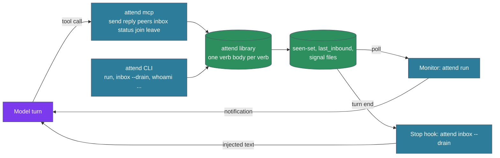

# ADR-187: Attend MCP server mode: outbound and queries as typed tools, inbound stays on Monitor and the Stop hook

## Context

An agent session reaches attend through one surface today: CLI verbs run from the Bash tool. Inbound messages arrive through two conduits, the Monitor-hosted `attend run` sensor loop for an idle session and the Stop-hook drain `attend inbox --drain` for an active one (ADR-172). The skill and the way both state that the CLI is the contract (ADR-124, ADR-136), and the same messaging guidance is held in lockstep across three sources: `skills/attend/SKILL.md`, the sensor-disclosure reheat `messaging.md`, and the attend way.

The lockstep exists because agents misuse the surface without repetition. Issues #536 and #538 name the classes seen in transcripts:

- running `attend run` from Bash, which blocks the tool call and discards notifications;
- reading or editing under `~/.cache/attend/` and `~/.config/attend/` to work around an unclear verb;
- shell metacharacters in message bodies, which the "always double-quote" rule and the glob-expansion fence in `cmd/send.rs` exist to catch;
- envelope flags (`--to`, `--channel`, `--re`) that have to be remembered and ordered before the trailing message.

The transcript audit behind #538 found that guidance carried in a tool's own description had the highest adherence of any placement. The three prose sources fire at session start, at reheat, and on the `attend` command trigger; a tool description is present whenever the tool is callable.

The MCP protocol revision of 2026-07-28 sets the boundary. The initialize handshake and sessions are removed; sampling, roots, and logging are deprecated; server-initiated requests are replaced by multi-round-trip responses to client requests. The one unsolicited server-to-client channel is `subscriptions/listen`, which carries list-change and resource-change notifications to the host. No path in the protocol places content into the model's turn. ADR-172 listed "MCP push as the delivery mechanism" as a possibility to revisit; the revision closes it.

Two adjacent threads shape the parameters. Issues #532 and #533 add structured envelope fields to every signal (`from_kind`, `from_id`, `on_behalf_of`, `to`), and the design note for them is merged at `docs/design-notes/attend-envelope-fields.md`. ADR-181 defines guard hooks as a PreToolUse class that ships deactivated, with default activation reserved for a further ADR under ADR-162's bar. The shipped `settings.json` allows `Bash(attend:*)` as one entry in the ADR-169 operational baseline, so an operator has no way today to allow queries while gating sends.

## Decision

**Attend runs as two roles. The perceiving role, the Monitor-hosted sensor loop and the Stop-hook drain, owns every piece of mutable session state. The acting role, the CLI message verbs and the MCP server, owns none and is a client of it. Outbound and queries become typed tools on an MCP server that shares one library with the CLI.**

1. **The split is forced by the protocol.** Under the 2026-07-28 revision a server can answer a client request and can notify the host of a changed list or resource. Neither reaches the model mid-turn or wakes an idle session. The two conduits ADR-172 fixed therefore remain the only inbound paths, unchanged in mechanism and in contract. The MCP server carries the direction the protocol supports: the model calling out.

2. **Tool set.** The server exposes `send`, `reply`, `peers`, `inbox`, `status`, `join`, and `leave`, named by the chat idiom ADR-173 chose. `run`, `inbox --drain`, `whoami --machine`, `tune`, `sensors`, `config`, `permissions`, and `cleanup` stay CLI; they are session infrastructure invoked by Monitor, by hooks, or by the operator (ADR-173 item 5). `keepwarm` (ADR-182), `scene`, `scenes`, `channels`, and `dissolve` stay CLI until use shows a reason to add them, and adding one follows item 3. `chat` stays CLI-only; it is a TUI with its own stdout. The deprecated `focus` alias of `--channel` (ADR-173) resolves in `cli.rs` before the library boundary, so the library and the tool schema know only `channel`.

3. **One library, two frontends.** The verb bodies now under `tools/attend/src/cmd/` move into a library target with typed request and response structs. `cli.rs` and the MCP server are thin frontends over it. Each verb carries one description string, and three renderings derive from it: clap help, the generated `docs/cli/attend.md`, and the MCP tool schema. A test asserts the three agree. The JSON document a verb emits under `--json` (ADR-185) and the structured content of its tool result are one shape.

4. **Shared state for `reply` and `inbox`.** `reply` threads to the record `sensor_peers::last_inbound` writes for the session. `inbox` lists every signal in the scan directories, as the CLI `inbox` list does today; only the drain consults the seen-set `attend-state` holds under ADR-172's merge semantics, and only the drain marks or filters by it. The MCP frontend reads the last-inbound record through the library and keeps no store of its own. The MCP `inbox` tool is read-only.

5. **Transport, and every call is a fresh invocation.** The server runs as `attend mcp` over stdio, launched by the client once per session. It is resident, and that is the one property it does not share with the CLI verbs, so each tool call behaves as one CLI invocation would: it derives the session id by the ADR-171 ancestry walk, verifies that a registration for that id exists in the instance registry the sensor loop maintains, adopts the registered tuple (persona and ordinal), reads the last-inbound record and channel membership from disk, performs the verb, and holds nothing in memory for the next call. No memoized tuple, no inbox cursor, no cached membership. The sensor loop can restart under Monitor's cap and re-register, and the next call sees the new registration. `status` reports the derived id, the registration found for it, and the `resolved` flag as read at call time. When ancestry resolves to a Claude session and no registration exists for it, because the loop has not registered yet or is not running, `send` and `reply` refuse with a cause naming `attend run`, matching the drain's refusal in ADR-172 item 4, so a persona the loop never allocated is never written to the bus.

6. **Permissions are per tool.** Each tool has its own permission name: `mcp__attend__send`, `mcp__attend__reply`, `mcp__attend__peers`, `mcp__attend__inbox`, `mcp__attend__status`, `mcp__attend__join`, `mcp__attend__leave`. The shipped `settings.json` allows all seven, which preserves the autonomy the skill grants today under `Bash(attend:*)`. The per-tool names are the operator's control over the MCP path: removing `mcp__attend__send` puts that tool behind a prompt for a session running an approval rule. While both frontends ship, `Bash(attend:*)` stays allowed for the CLI frontend, so the per-tool entry alone gates the MCP path only; a hard outbound gate also needs `Bash(attend send*)` and `Bash(attend reply*)` in `permissions.deny`. An unattended run confirms the seven entries are present, since a headless session has no prompt and an unallowed call fails. The ADR-184 reconciler registers the server in each enabled target and withdraws it with the target. The seven allow entries and the `mcpServers` block widen the ADR-169 operational baseline; this ADR amends ADR-169 item 1 to include them, written by the same three-way merge as the rest of the baseline.

7. **Where guidance lives.** The mechanical layer moves into the tool descriptions and parameter schemas: the send-versus-reply choice, on `send` ("starts a topic; use `reply` when answering the most recent peer message") and on `reply` ("threads to the most recent peer message; errors when the inbox is empty"), the scope parameters, the length budget, and `reply`'s empty-inbox behavior. The judgment layer stays in the way and the skill: autonomy to reply without asking, silence as a valid reply, and the two-conduit contract. Those sentences govern whether to call any tool at all, and a description is read once the model is already choosing one. The reheat shrinks to the judgment layer and the conduit contract. The quoting rule and the "never run `attend run` from Bash" line drop from the reheat for a session with the server connected; the server writes its own presence marker, a file under attend-state keyed on the session id, on start and removes it on exit, and the reheat reads that file to select the wording. The instance record stays sensor-loop-owned (item 11). The ban on reaching into attend-owned directories stays as one sentence in the way and the skill, because Read, Edit, and Write remain available to the model.

8. **The interim for CLI-only sessions.** The two PreToolUse denies #536 proposes ship as guard hooks under ADR-181's contract: exit 0 or 2, a closed list with a repair per entry, deactivated by default, tested in the suite. They live under `hooks/ways/`, the guard-class convention ADR-181's `check-bash-bound.py` set, as `hooks/ways/attend-guard-pre.sh`, and `attend permissions` reports whether they are wired. Neither misuse meets ADR-162's bar for default activation; a blocked Monitor launch and a read of a cache directory are recoverable and disclose nothing. A separate attend-owned activation switch would be a second activation state beside ADR-184's targets, and this ADR declines to add one. The scripts are marked interim in their headers and are removed when the MCP frontend is the default for agent sessions.

9. **Envelope fields are typed parameters.** `send` and `reply` take `message: string` and the optional `channel`, `to`, `broadcast`, and `on_behalf_of`. `from_kind` and `from_id` are set by the server from the connection identity and are never parameters, per #532. `inbox` and `peers` results carry the same fields as typed members of each row. The tool's `to` takes the grammar the envelope design note fixes: `*` for broadcast, `#<name>` for a channel, or a comma-separated set of canonical ids; a project path resolves at send time to the session ids of the live peers at that path, and that resolution is how the CLI's `--to PATH` maps into the same field. The field semantics, the id classes, and the wire format belong to the design note; this ADR fixes only that the fields cross the tool boundary as schema.

10. **The contract statement changes.** "CLI is the contract" becomes: the attend tool surface is the contract, meaning the MCP tools where the server is connected and the CLI verbs everywhere; attend-owned paths remain implementation detail.

11. **Ownership by role.** The sensor loop is the one process per session that holds the ADR-129 duplicate lock, registers and touches the instance record, writes the seen-set, writes the last-inbound record, and supplies the pid that liveness checks. An acting frontend, whether a one-shot `attend send` or the resident `attend mcp`, takes none of these. It appends signal files, writes channel membership on `join` and `leave`, and reads everything else. Identity is derived by both processes and registered by one: each derives the session id by ADR-171 ancestry; the sensor loop registers it and allocates the persona and ordinal (ADR-129); an acting frontend derives the same id, verifies the registration exists, and adopts the registered tuple. When ancestry resolves to a Claude session and no registration exists, because the loop has not registered yet or is not running, `send` and `reply` refuse with a cause naming `attend run`. The refusal is scoped to senders whose ancestry resolves to a Claude session: an agent session without its sensor loop cannot send, as it already cannot receive. A process with no Claude ancestry, a plain terminal, keeps the external path `identify_sender` in `cmd/send.rs` takes today (`$USER@<terminal>`, source kind external, which the envelope note renders as `from_kind: human`), and attend-chat's human sender is unchanged. The MCP server is driven by a model by construction, so when its own ancestry resolves to no session it refuses `send` and `reply` and the external path stays with the CLI. The two processes therefore never contend for a lock, never register twice, and never disagree on who the session is. Item 5 makes the resident server equivalent to the one-shot CLI: same reads at the same moment, nothing carried between calls. The library extraction in item 3 follows the same rule: verb bodies return values and frontends print, so nothing in the shared code writes to the stdout an MCP transport owns.

| State | Owner | Acting frontends |
|---|---|---|
| Duplicate lock (ADR-129) | sensor loop | never taken |
| Instance record and liveness pid | sensor loop | read |
| Seen-set (ADR-172) | sensor loop and drain | never touched |
| Last-inbound record | delivering conduit | read (`reply`) |
| Signal files | appended by acting frontends | append |
| Channel membership | acting frontends (`join`, `leave`) | atomic file write, as the CLI does today |
| MCP presence marker (under attend-state, keyed on session id) | acting frontend (`attend mcp`) | write on start, remove on exit |

12. **One state contract, then a trial.** The MCP verbs and the CLI message verbs keep one state contract: the same verb against the same disk state leaves the same disk state, whichever frontend ran it. A contract test runs each verb through both frontends against one seeded state directory and diffs the result. Once implemented, agent sessions switch to the MCP frontend for daily use while the CLI message verbs stay in the binary for comparison. What follows the trial is a later decision on the evidence of use; this ADR does not remove the CLI message verbs.

Reversibility: reversible. The CLI frontend stays whole. Removing the MCP frontend deletes the `mcp` subcommand and the settings entries. The library extraction in item 3 stands on its own merits and would remain.

## Consequences

### Positive

- For a session with the server connected, three misuse classes end structurally: there is no Bash surface for `attend run`, a typed `message` string has no shell to expand it, and the envelope is schema the client validates.
- The send-versus-reply guidance sits in the description of the tool being chosen, the placement the audit found agents follow most.
- An operator gains a per-tool gate on the MCP path. One permission entry separates "may read the bus" from "may write to it" there, which the single `Bash(attend:*)` entry could never do. While the CLI frontend ships beside it, a hard outbound gate adds two Bash deny entries, for `attend send` and `attend reply`.
- The CLI and MCP frontends cannot drift in behavior, because each verb has one body. The MCP `reply` threads to the same message the drain delivered, by construction.
- The reheat's disclosure budget shrinks to the judgment sentences.

### Negative

- Seven tool schemas sit in the context of every request for the session. Descriptions have to stay short, and the skill's messaging section has to shrink by at least as much.
- The library extraction is a refactor of `cmd/` that lands before any new capability, and two frontends mean two test surfaces over one body.
- A session without the server registered keeps every current failure mode. The guard hooks are opt-in, so the interim protection for those sessions is guidance unless the operator wires one settings line.
- The directory misuse loses only its Bash path. Read, Edit, and Write still reach `~/.cache/attend/`; the deactivated guard is the mechanical answer, and the one-sentence ban is the shipped one.
- Identity from pid ancestry assumes the client spawns the server in the session's process tree. A host that launches servers elsewhere gives the server no Claude ancestry, and `send` and `reply` refuse until it is fixed; the external sender path stays available through the CLI in a plain terminal.
- An agent session whose sensor loop has not registered yet cannot send through either frontend until it does. The refusal names `attend run`, and the first seconds after `/attend` are the window where it fires.

### Neutral

- ADR-172's open item on MCP push is closed by the protocol revision; this ADR records the closure.
- A presence marker file under attend-state, written and removed by the server, tells the reheat, the drain footer, and `attend status` that the MCP frontend is connected. The instance record is unchanged.
- The ADR-169 operational baseline grows by the seven `mcp__attend__*` allow entries and the `mcpServers` block, recorded as an amendment to ADR-169 item 1 in this ADR's frontmatter.
- #536 becomes moot for MCP sessions and survives as the deactivated guard for the rest.
- The `attend chat` TUI, `/purge`, scenes, and the signal file format are untouched. ADR-136's durability rules and ADR-173's vocabulary carry over as they stand.
- The three-source lockstep becomes a two-layer rule: one description source with three renderings for the mechanical layer, and the way plus the skill for the judgment layer, with the reheat quoting the judgment layer. The lockstep comment in each file is rewritten to say so.
- The skill's `allowed-tools` gains `mcp__attend__*`, and its pre-flight checks that the server is registered before choosing wording.

## Alternatives Considered

- **MCP for inbound as well, with the server delivering messages.** Unavailable. Under the 2026-07-28 revision the server can respond to a client request or notify the host of a changed list or resource. Neither reaches the model's turn or wakes an idle session. The Monitor line and the Stop-hook injection are the only paths that do.
- **Keep the CLI as the only frontend and add the #536 guards plus more reheat text.** Rejected. The guards cover the two mechanical misuses and leave the quoting and flag classes untouched, and the disclosure tax that motivated the audit continues.
- **An MCP server that shells out to the CLI.** Rejected. Results would arrive as text to parse, errors as exit codes to map, and the tool schema would be a hand-kept copy of the clap surface. The library call is typed and shares the description source.
- **Move every verb, including `run` and `inbox --drain`, into the server.** Rejected. `run` exists to feed Monitor's notification bridge, and the drain has to be invoked by the Stop hook at the turn boundary. Both are inbound machinery with no client-request shape.
- **One long-lived server per user over a network transport.** Deferred. Per-connection identity would need the client to declare its session, where a stdio child gets it from ancestry. Item 5's fresh-invocation rule, with identity derived and verified on every call, leaves the door open without paying for it now.
- **Activate the #536 guards by default.** Rejected under ADR-181: neither misuse produces an irreversible or disclosing outcome.
- **An attend-owned activation switch for the guards, such as a `permissions` sub-verb.** Rejected. ADR-184 makes the target the unit of activation; a second switch beside it would be a state the reconciler does not model.
- **Leave the three prose sources as they are and add the tool descriptions on top.** Rejected. That makes a fourth copy of the mechanical guidance and preserves the drift the lockstep comment exists to warn about.
