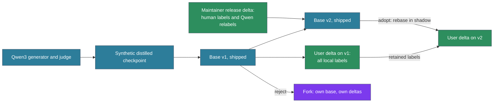

# ADR-190: Per-injection ratings and continual local tuning of the way gate

## Context

ADR-189 adds a cross-encoder gate behind the ADR-160 matcher. A gate is only as good as the labels it learns from, and labels are the scarce input. The first draft of ADR-189 planned a one-off eval set labelled offline in batch, a shipped checkpoint trained only on synthetic pairs, and a rule that weights trained on session text never ship. That plan had three weaknesses.

1. **Nobody watches which ways fire.** Seeing a turn's fires means running `ways introspect` and reading its output. A developer working on a problem does not have attention to spare for that, so human labels arrive rarely.
2. **A one-off label set goes stale.** Ways are added and rewritten, and each person's work has its own character. A label set built once and a checkpoint trained once drift away from both.
3. **The model that reads each way is never asked about it.** Claude reads every injected way with the full turn in front of it. It is the best-placed judge of whether that way applied, and nothing records its judgement. Ad hoc interviews with agents show the judgement already happens: Claude sets poorly fitting ways aside, and sometimes tells the person that a way was injected that does not fit. The judgement is made and then lost, or it surfaces as a remark the person has to read.

A thumbs-up or thumbs-down from Claude on each injection, collected cheaply and at the moment Claude reads the way, answers all three. The rest of this ADR is how to collect that rating, what learns from it, how to keep the learning from becoming confidently wrong, and how weights move between the maintainer and everyone else.

Two constraints shape the design beyond the engineering.

- **A self-report needs an outside check.** A model rating the context it was given drifts toward what it already believes when nothing independent checks it. Feedback loops of this kind are documented for language models (Pan et al., 2024), and model self-reports of what context they used are often rationalised after the fact. Every signal the loop learns from is either measured against an independent rater or anchored to human labels.
- **Anthropic's Usage Policy restricts training on Claude's outputs.** The policy (effective 15 September 2025) prohibits "utilization of inputs and outputs to train an AI model (e.g., "model scraping" or "model distillation") without prior authorization from Anthropic". It applies on every plan, and it is broader than the "competing models" wording of the Commercial Terms. A private relevance gate tuned by a user's own in-session flags is a narrow use, far from the capability extraction Anthropic's enforcement has targeted. Publicly released weights are a different matter. This ADR therefore keeps every Claude-derived label local, and builds shipped weights only from human labels and open-weight models whose licences place no restriction on output use (section 7). This is a reading of the policy, not legal advice, and section 7 lists the questions put to Anthropic.

**What is being built.** agent-ways is a method layer, a way of doing things that Claude Code lacks on its own. Its substance is the ways corpus, which people write and review. The learning in this ADR tunes when that layer speaks.
- **The corpus is authored.** Ways are guidance people write and edit. No model generates them, and no model is trained to produce them.
- **Most of the tuning is not a model.** Per-way misfire estimates, offsets, temperatures and thresholds are statistics about the corpus. They learn which guidance fits which work, not how to do the work.
- **The one learned component serves Claude.** The gate is a non-generative relevance classifier of 17–32M parameters. It cannot produce text or answer a question. Its only output is whether a piece of guidance reaches Claude. It adds to Claude and does not compete with it or copy what it can do.

That is the case this project makes to Anthropic (question 1 below). The Usage Policy's text still reads on any trained model, so section 7 keeps shipped weights free of Claude-derived labels until Anthropic answers.

## Decision

Collect a rating on every injection, learn from those ratings continuously on the user's machine, check the ratings against canaries and an independent rater, and ship a base checkpoint built without Claude-derived labels that each user personalises locally. This ADR replaces the labelling plan and the fine-tuning stage of the ADR-189 draft. ADR-189 keeps the daemon, the gate, the lanes and model selection.

### 1. The rating: thumbs-down is explicit, thumbs-up is silence

- **Nonce footer.** Every injected way, on every gated lane, ends with one line: `If this guidance does not apply to the current task, run flag <nonce>. No need to mention this.` The nonce is a short random token generated by `show::way_scored` when it emits the body, and recorded in the `way_fired` event beside the session, way and token position. The line costs about 20 tokens per injection. The footer and its purpose are documented in the README, so a person reading an injected way knows what the line is for.
- **Thumbs-down.** Claude flags an injection by calling the flag verb with the nonce, a few output tokens. The backend resolves the nonce to the exact injection, so the call carries nothing else. A nonce expires at the Stop hook, so a late flag is dropped and never attached to the wrong injection.
- **Thumbs-up.** An injection that reaches the Stop hook without a flag is unflagged. Silence is weaker evidence than a flag, and section 2 sets how much it counts.
- **Exempt ways.** A new frontmatter field, `flaggable: false`, marks ways whose job is to constrain, such as test gates, commit hygiene and governance. They get no footer, because a model asked to rate its own constraints will rate the inconvenient ones down.
- **Human thumbs-down.** `/misfire [way]` records a flag attributed to the person. It is intercepted at UserPromptSubmit and recorded by the hook, so it costs no model tokens and cannot be produced by the model. The implementation confirms that the hook sees the command before it is expanded.

**Transport.** The flag verb reaches the ways inbox by one of two paths, and both mark the sender from observation, never from a parameter.

| Path | Available | Sender attribution |
|---|---|---|
| `ways flag <nonce>` through Bash | Now. `Bash(ways:*)` is already allowed. | PostToolUse:Bash observes the call, so it is the model's by construction. |
| `flag(nonce)` tool on `attend mcp` | When ADR-187 ships | Set by attend from the connection identity (ADR-187 item 9). |

The ways binary never hosts an MCP server, which keeps hook start-up cost unchanged. Attend is the return path for the model's side of the loop. This ADR amends ADR-187 item 11 to add one row to its state table: a ways-owned flag inbox, appended by the attend `flag` verb and the `ways flag` CLI, and drained by `wayd` or by the next `ways scan` when the daemon is down.

### 2. Measuring how much silence is worth

Flags are a partial labelling of misfires: a flagged injection is a misfire, and an unflagged one is either fine or a misfire the evaluator missed. This is positive-unlabelled learning (Elkan & Noto, 2008), with "misfire" as the class that sometimes gets a label. What silence is worth depends on the evaluator's recall, the probability that a misfire gets flagged, written here as **r**.

Recall is not one number. Obvious misfires are caught more often than subtle ones near the threshold, which is exactly where the gate relies on silence most. A single r measured on easy cases would overstate recall where it matters and give silence too much weight there, which is the failure positive-unlabelled learning calls a violation of "selected completely at random" (Bekker & Davis, 2020). Recall is therefore estimated per score band, by two instruments.

| Band | Where | Recall measured by |
|---|---|---|
| Low | Ways the matcher scored far below the threshold | Canaries |
| Near | Injections within the near-miss band of the threshold | The independent rater |

#### Canaries (low band)

About one scan in fifty injects a canary: a real way from the corpus that plainly does not fit the turn, with the same footer and a nonce. The canary catch rate over the recent window is **r_low**. Canaries are logged as canaries, excluded from way statistics, and never used as training labels. The term here means a known-irrelevant injection, as in seeded-defect and gold-question quality control (Oleson et al., 2011). It is unrelated to the contamination strings that evaluation benchmarks also call canaries.

Canaries are drawn from the existing corpus so they cannot be told apart from real injections. A synthetic decoy would have its own style, and a rater that learns to spot gold items passes only those (Checco et al., 2018).

**Canary pool.** A way is eligible when all of these hold:
- It ships in the corpus. User-scope and project-scope ways are never canaries, so r_low stays comparable across users and base releases, and a person's own ways are never shown out of context.
- It is not `flaggable: false`, since a canary needs the footer.
- It has no `macro:`. A macro runs a script when the way is emitted, which adds cost and possible side effects to an injection that is known to be wrong.
- Its `scope` includes the lane's scope (agent, subagent or teammate), so the canary looks like a normal injection for that lane.
- Its domain is enabled.
- Its body is 200 words or fewer, and it is injected whole. Truncating a body would mark it as a canary, so length is limited by choosing short ways. At the time of writing, 42 of the 161 shipped ways meet the length limit and 41 of those have no macro.

**Selection for one scan.**
- The canary comes from the way family that scored lowest in this scan. A family is the first two segments of the way path (`softwaredev/code`, `meta/trust`), or the domain alone for a single-level domain. The top-level domain is too coarse: `softwaredev` alone holds 77 of the 161 ways.
- It is skipped if it, or any ancestor or descendant in the ADR-125 disclosure graph, fired or was shown in this session.
- It is skipped if its ADR-160 probability falls inside the near-miss band or above it. Once ADR-189's gate ships, its rerank probability must also be below 0.05.
- At most one canary per scan, and a way serves as a canary at most once per session. If no eligible way remains for the lane, the scan injects no canary.

**A canary leaves no trace on the real ways.** It bypasses the refire engine, markers, engagement stamps and the ADR-125 parent boost, so it never makes its own way or that way's children fire more easily later in the session. Its only record is the canary event.

**Unflagged canaries are recall probes.** A low score is the matcher's opinion, and the matcher is what this loop is correcting. An unflagged canary is either a lapse by the evaluator or a way the matcher scored far too low for a turn it fits. The second case is a missed fire, which ratings cannot otherwise reveal. The digest lists unflagged canaries as possible misses, with the turn context. Spot-checks during the human anchor-slice pass (section 5) separate lapses from misses. A confirmed miss becomes a positive anchor row for that way and lowers its threshold through the per-way estimate, so the loop can raise recall as well as cut misfires.

#### Independent rater (near band)

Known-irrelevant ways do not exist near the threshold, so canaries cannot measure recall there. A second rater, independent of Claude, reviews a sample of injections instead.

- **Who rates.** A local open-weight judge: a Qwen3 instruct model asked a yes/no relevance question, or `Qwen3-Reranker-4B` with a task instruction. Human spot-checks during the anchor-slice pass add to it. The judge runs on the user's machine while it is idle. It never uses Claude.
- **What it rates.** A sample of near-band injections from the recent window, flagged and unflagged alike, and a sample of near-band candidates the gate suppressed.
- **What it yields.**
  - **r_near**, by capture-recapture. With two independent raters, the overlap between their judgements estimates how many misfires both missed, which gives each rater's recall without canaries (Eick et al., 1992).
  - **Missed-fire labels.** Suppressed candidates the rater marks relevant are the missed fires that flags can never show.
  - **A drift check on Claude's own flagging.** A falling r_near with a steady r_low means the evaluator is missing subtle cases more often.

#### Label weights

Each label carries a weight. A flag is a positive (misfire) label. An unflagged injection is split between the two classes using the Elkan–Noto weight: it counts as a misfire with weight `w = ((1−r)/r) · (g/(1−g))` and as acceptable with weight `1−w`. Here r is the recall for the injection's band, and g is the current model's estimated probability that the injection would be flagged. `w` is clipped to [0, 1].

| Outcome | Label | Weight |
|---|---|---|
| Human flag | misfire | 1 |
| Model flag, corroborated | misfire | 1 |
| Model flag, not corroborated | misfire | 0.5 |
| Unflagged | split | misfire `w`, acceptable `1−w`, with r for its band |
| Exploration injection (section 4) | as rated | as above, with its injection probability recorded |
| Independent rater | as rated | 1, and used for r_near |
| Canary | none | measures r_low only |

A model flag is corroborated when an independent signal agrees: the way goes unused for the rest of the turn, the gate's own score was below `τ_r`, or the independent rater agrees.

**Reliability floor.** When either band's recall falls below 0.6, silence in that band is too noisy to learn from, and the Elkan–Noto weight grows unstable as r falls. Weight training and calibration refits pause for that band, and only human flags, independent-rater labels and exploration labels continue to update the per-way estimates. The loop learns less; it never learns from noise.

**Label records** hold the nonce, session, way, lane, token position, score band, the gate's query text, the ADR-160 scores, the rerank logit, the checkpoint id, the outcome, the sender, the weight and the **source**: `human`, `qwen_judge`, `claude_flag`, `claude_silence` or `canary`. They contain session text, so they live under the local state directory and are pruned when they fall out of the largest training window. The source field is what section 7's shipping rule reads.

### 3. What consumes the ratings, fastest first

| Speed | Consumer | What it does |
|---|---|---|
| Every rating | Per-way estimate | Beta estimate of the way's misfire rate, a score offset, and a temperature |
| Every rating | Bayesian last layer | Online Bayesian logistic regression over the frozen encoder's features |
| Weekly, or on reheat | Calibration | Refit of `a`, `b` and `τ_r` on the window |
| Window turnover, after enough labels | Personal delta | A LoRA adapter retrained on the window, blended by α |
| Periodic digest | Authoring feedback | The ways whose wording causes misfires |

Production systems that learn context selection train on data pooled across users and personalise through a light layer, such as per-route thresholds or per-user adjustments over a shared model. Per-user data here is sparse in the same way, so the light layers come first and the personal delta waits for evidence.

**Per-way estimate.** Each way's misfire rate is a Beta estimate, with a prior set from the shipped calibration so a new way starts neutral. A new frontmatter field, `misfire:`, sets the way's threshold, with a config default, in the same style as `refire:`.
- **Reheat.** When the lower credible bound of the misfire rate crosses the threshold, the way's temperature rises. That speeds up its offset learning rate and raises exploration on that way. This is a discounted Beta estimate, as in discounted Thompson sampling (Raj & Kalyani, 2017).
- **Anneal.** Temperature decays with each unflagged injection and with elapsed labels.
- **Bounds.** A way's offset moves only after a minimum number of labels, and it moves by a capped amount per day. The effective count of the discounted estimate has a floor, so a rarely shown way does not swing on one label.
- **Before the reranker exists**, the offset adjusts the ADR-160 threshold per way. Ratings start reducing misfires on the current matcher, and the loop is tested end to end before ADR-189's gate ships.

**Bayesian last layer.** Retraining only the final layer recovers most of the gain of full fine-tuning when the features are good (Kirichenko et al., 2023). A Bayesian layer over a frozen encoder is the neural-linear model (Riquelme et al., 2018). Each rating updates it in microseconds, and each decision comes with a mean and a variance.
- When the variance is high, the gate abstains and the ADR-160 decision stands. The abstention threshold is calibrated against canary and independent-rater labels, since neural-linear variance is not calibrated by itself.
- Exploration is covered in section 4.

**Personal delta.** A LoRA adapter on the reranker, retrained from the current base on the window when the window turns over. It is applied as `θ = (1−α)·θ_base + α·θ_delta` (WiSE-FT, Wortsman et al., 2022; the closest federated analogue is Ditto, Li et al., 2021), and α is the control between the shipped behaviour and personal flavour. A reheat raises α, and α anneals back as the evidence settles.
- **Minimum evidence.** No delta is trained until the window holds at least 2,000 ratings with both bands' recall above the floor, and at least 100 labels from humans or the independent rater. Until then the per-way estimates and the last layer carry all personalisation.
- **Averaging.** Successive deltas trained from the same base are averaged, and a delta joins the average only if it improves results on a validation split (a greedy soup). That split is held apart from the acceptance check, because a few hundred labels used both to pick soup ingredients and to accept the result would overfit.
- **Runtime.** Scaled LoRA on encoder architectures in the pinned llama.cpp is verified before this ships. If it does not work, the adapter is merged and the GGUF re-exported, which takes seconds at this model size.

**Window.** The window is measured in ratings, with a floor of 500 and a ceiling of 5,000. ADWIN (Bifet & Gavaldà, 2007) shortens it when recent labels stop matching older ones and lets it grow while they agree. A single cycle never shortens it by more than half. ADWIN assumes observations from one fixed process, and here the label stream depends on the current policy and on the evaluator's recall. A policy change or a drop in recall would look like drift. ADWIN therefore runs only on exploration and independent-rater labels, per way family, and resets when either band's recall moves by more than a set margin.

**Authoring feedback.** A way that misfires across unrelated contexts has a `description` or `vocabulary` that is too broad, and the fix is in the way. The digest lists the worst offenders with example contexts. Model flag rates on constraining ways are reported here as findings and never used for training. Way text stays the editable layer: the gate reads each way's text when it scores, so editing a way changes its behaviour without retraining.

### 4. Exploration and the acceptance check

**Exploration.** Ratings exist only for injected ways, so the gate injects a small share of the candidates it would suppress. Exploration concentrates where the gate is uncertain, using Thompson sampling over the last layer's posterior, mixed with a small uniform share.
- **Propensities.** Thompson sampling does not record the probability of its own choices, and those probabilities are what off-policy evaluation needs. Each decision's injection probability is computed from a fixed number of posterior draws and logged.
- **A floor.** The uniform share guarantees every candidate a minimum injection probability of 0.02. Without it, a concentrated posterior drives probabilities toward 0 and 1, and the variance of the off-policy estimate grows without bound.
- **Strict mode** decides from the posterior mean and explores only within a fixed budget.
- **Suppression is an outcome.** An injection left out and later confirmed irrelevant by the independent rater counts in the gate's favour. Showing fewer, better-fitting ways is a goal, not a side effect.

**Acceptance check.** A new calibration, α, or averaged delta goes live only if all of these hold. There is one model in service and no competing checkpoints.
- **Anchor set.** The result does not get worse on the anchor set: the shipped synthetic pairs across all ways, plus the human-labelled slice.
- **Perturbation stability.** Rephrasing the query, dropping a context turn, and reordering candidates flips decisions no more often than a fixed bound.
- **Off-policy estimate.** Recent ratings are reweighted by their logged injection probabilities to estimate how the candidate would have done had it been deciding. The estimate uses self-normalised inverse propensity scoring (Swaminathan & Joachims, 2015) with clipped weights, or a doubly robust estimator (Dudík et al., 2011). It must not be worse than the current model's, and its effective sample size must clear a floor. The estimate corrects for which ways were shown, not for bias in the ratings themselves, which is why the independent rater and the anchor set stay in the check.

Failures are logged with their evidence. The last few accepted states are kept, and `ways tune rerank --rollback` restores one.

### 5. Human anchor slice

A small human-labelled slice is the ground truth that the anchor set, both recall estimates and the acceptance check stand on. It has about 200 rows drawn from real injections, labelled by the maintainer once per base release. A second independent pass on a subset measures human agreement, which is the ceiling any reported accuracy is read against.

Existing transcripts where Claude remarked that an injected way did not fit are useful places to look for rows. Claude's remark only nominates a row. The maintainer assigns every label, and the label's source is `human`. Rows stay local. Curated, de-identified rows can graduate into `calibration_probes.jsonl` (ADR-158), and a graduated row contains no verbatim Claude response.

### 6. Weight lifecycle

- **The first base** is a synthetic distilled checkpoint. A Qwen3 instruct model generates turns for every way in the public corpus. `Qwen3-Reranker-4B`, given a task instruction, labels the pairs. A second Qwen3 judge settles the pairs where the teacher is unsure, and the maintainer labels the pairs they still disagree on. ADR-158's hard negatives are added. The synthetic pairs also ship as the anchor set, so none of them is generated or labelled by Claude.
- **Later bases** fold in a release delta built from the maintainer's sessions. It is trained only on labels whose source is `human`, and on maintainer contexts relabelled by the Qwen teacher. Claude's flags may choose which contexts go to the teacher, since a flag that only selects a context contributes no label. Once the release delta passes the acceptance check against the anchor set across **all** ways, it is merged into the next base at a chosen α. Evaluating across all ways keeps the base from improving the ways the maintainer uses while degrading the rest.
- **Training text in shipped weights.** Shippable rows keep the user's prompts and drop assistant responses from the query text. That keeps Claude's text out of shipped weights, at the cost of a small mismatch with the query the gate sees at runtime, which the acceptance check measures. A classifier that outputs one score is far harder to extract text from than a generative model, but it is not immune to tests of whether a given context was in its training set. Context snapshots pass a secret scan before they enter a shippable training run. The release carries a manifest of the training set's hashes, never its text.
- **Distribution.** Weights ship as a release asset through the path `download-model.sh` already uses. The repo commits only the manifest: base version, hash, lineage, anchor scores, and the licence of every model in the chain. A GGUF of 35 to 130 MB never enters the git history.
- **Adopting a new base is a rebase.** A LoRA delta is tied to the base it was trained on and does not carry over to a new one (the problem Trans-LoRA addresses; Wang et al., 2024). `wayd` therefore retrains the user's delta from the new base on the retained labels, scores the old and new pairs in shadow, and switches when the new pair passes the acceptance check. If it never does, the user stays on the old base and the digest says why. Each delta records the hash of the base it was trained against, so a mismatch triggers a rebase rather than mixing versions. The raw label records are what make a rebase possible, so they are kept for the full window, not only the trained delta.
- **User and project ways do not force a fork.** The reranker reads each way's text when it scores, so a new way is a new document that the base can score. Only the per-way estimates and flag history are keyed by way id, and they start neutral.
- **Rejecting a base is a fork.** A user who rejects base pushes maintains their own base and deltas. `ways tune rerank --base <path|release>` works without assuming the upstream base, and nothing in `wayd` names the maintainer's base.

### 7. Label provenance and shipped weights

Every label record carries its source (section 2). The rule:

- **Claude-derived labels stay local.** Rows whose source is `claude_flag` or `claude_silence` train only local state: per-way estimates, calibration, the last layer and the personal delta. They never leave the user's machine and never enter shipped weights.
- **A shippable training run refuses Claude-derived rows.** `ways tune rerank --release` reads the source field and fails if any `claude_*` row is present, unless a written authorisation from Anthropic is recorded in the release configuration.
- **Every model that generates or labels data for shipped weights is open-weight, with a licence that places no restriction on training from its output.** The release manifest records the licence chain. Qwen3, Qwen3-Reranker and the Ettin rerankers are Apache-2.0. A model under terms that restrict training on its output, including hosted models such as Jev, is not used for shipped weights.
- **Batch judging with Claude is out of scope.** A hindsight judge over traces, if added later, runs on a local open-weight model. Claude-based batch judging would also need an API key; a Max subscription covers ordinary individual use of Claude Code.

**Questions for Anthropic.** The answers could relax this section, and the source field keeps that option open without re-collecting data. The questions are held until the system has shown merit, because nothing in the rollout waits on them. They are sent when both of these hold:
- The local loop has shown that Claude's flags reduce misfires, measured against the human anchor slice.
- A base trained with Claude-derived labels, built and evaluated locally and never published, clearly beats the base built from open models and human labels on the anchor set across all ways.

The draft question is kept outside the repository, since it addresses Anthropic directly.
1. agent-ways is a method layer for Claude Code: human-authored guidance, statistics about when each piece fits, and one non-generative relevance classifier of 17–32M parameters that cannot produce text and exists only to choose which guidance reaches Claude. Does training that classifier on Claude's in-session relevance flags fall under "utilization of inputs and outputs to train an AI model"? If it does, can it be authorised for both local training and publicly released weights?
2. May each user train such a classifier locally on Claude's in-session flags from their own sessions?
3. May the maintainer publicly release weights whose labels include Claude flags from the maintainer's own sessions, and does the answer differ between a Max subscription and an API key?
4. Does Claude text used as input features, not labels, count as utilisation of outputs to train?
5. Is using Claude-derived labels for evaluation or model selection only, with no gradient updates, outside "train"?

### 8. Rollout

1. The nonce footer, `ways flag`, `/misfire`, canaries, the label records with their source field, and per-way offsets on the ADR-160 thresholds. This needs no reranker and no daemon.
2. The human anchor slice, the ADR-160 baseline measured against it, and the local independent rater for r_near.
3. ADR-189's daemon and gate in shadow, with the first base and the Bayesian last layer.
4. The gate on for the task lane, then the prompt and queued lanes, each when it passes the acceptance check on its own lane.
5. Personal deltas with annealed α and averaging, once the minimum evidence is met.
6. The first release delta folded into a base, and rebase on adoption.
7. The `flag` tool on `attend mcp` once ADR-187 ships.

## Consequences

### Positive

- **Every injection is rated** by the model that read it with the full turn, for about 20 tokens, with no human attention required. The flag replaces the remark Claude sometimes makes today about a poorly fitting way, so the judgement is recorded and the person no longer has to read it.
- **Silence has a measured value in each score band.** Canaries and the independent rater turn "unflagged means fine" from an assumption into per-band numbers that set their own weight and can pause learning.
- **The loop has an outside check.** The independent rater measures near-threshold recall, finds missed fires, and catches drift in Claude's flagging, so the loop does not rest on Claude's self-report alone.
- **Learning is continuous and cheap.** The last layer and per-way estimates update on every rating. Heavier training runs only when enough evidence exists, while the machine is idle.
- **The loop starts before the reranker.** Per-way offsets on the ADR-160 matcher deliver value at rollout step 1.
- **Uncertainty is visible.** The gate abstains where its posterior is wide, and exploration goes where labels are missing.
- **Each person's gate takes on the character of their work**, while the shipped base keeps everyone on common ground.
- **Shipped weights carry no Claude-derived labels**, and the release manifest shows the licence chain that makes them clean.
- **Misfires point at their cause.** The authoring digest turns persistent misfires into wording fixes.

### Negative

- **A footer on every injection.** About 20 tokens each, and a line of meta-instruction in guidance text.
- **Canaries add context noise.** A canary body is at most 200 words, about 250 tokens, at about one scan in fifty. That averages to about 5 tokens per scan, and an unflagged canary may occasionally be followed.
- **The independent rater costs local compute.** A Qwen3 judge runs over a sample of each window while the machine is idle.
- **More machinery.** A flag inbox, label records, per-way estimates, a Bayesian layer, an independent rater, LoRA training, averaging, and an acceptance check are each small, and together they are a real maintenance surface.
- **Shipped bases learn less from real use** than they would with Claude-derived labels. Human labels and Qwen relabels are the only real-session signal they receive, until Anthropic's answer says otherwise.
- **Shipped bases carry the maintainer's prompts through training.** The secret scan and hash manifest reduce that risk and do not remove it.
- **Rebasing costs compute on every base release** for each adopter.

### Neutral

- Exploration adds bounded, logged randomness to gate decisions in the uncertain region. Strict mode removes it outside a fixed budget.
- The frontmatter gains `flaggable:` and `misfire:`.
- "Sub-harness", meaning agent-ways as a layer between Claude Code and the person using it, and the adopter and forker roles it implies, are left to a follow-up ADR that also touches installation (ADR-184) and releases.

## Prior Art

No system found at the time of writing combines a per-injection nonce the agent can flag, silence counted as acceptance, runtime canaries that measure what silence is worth, and a per-user gate trained from the agent's flags. The pieces exist separately.

- **SkillRanker** (github.com/Dicklesworthstone/skillranker). A Claude Code UserPromptSubmit hook that ranks skills with Jev, keeps a local ledger with an ID per suggestion, and takes `sr feedback EVENT_ID --verdict not-useful`. It has a shadow mode, calibrated thresholds and Beta priors. Its event IDs are not shown to the agent, labels come from an assessor, and it deliberately does not treat silence as a label, which is the position this ADR answers with canaries and the independent rater.
- **hippo-memory** (github.com/kitfunso/hippo-memory). The agent runs `hippo outcome --bad` to weaken memories it was given. Ratings apply to the last recall as a batch, with no nonce and no meaning for silence.
- **ACE, Agentic Context Engineering** (arXiv 2510.04618). A separate reflection pass marks each playbook entry as helpful or harmful, and counters drive curation.
- **Cursor semantic search.** An LLM judges, after the fact, which context would have helped at each step of agent traces, and those judgements train a hosted retriever. It is the closest production example of an LLM supervising context selection, and the model for the independent rater's missed-fire labels.
- **REPLUG LSR** (Shi et al., 2023). The language model's own likelihoods supervise the retriever.

Methods cited above: Elkan & Noto (2008) and Bekker & Davis (2020) on positive-unlabelled learning; Oleson et al. (2011) and Checco et al. (2018) on gold questions; Eick et al. (1992) on capture-recapture; Pan et al. (2024) on feedback loops in language models; Raj & Kalyani (2017) on discounted Thompson sampling; Riquelme et al. (2018) on neural-linear bandits; Kirichenko et al. (2023) on last-layer retraining; Wortsman et al. (2022) on WiSE-FT and model soups; Li et al. (2021) on Ditto; Wang et al. (2024) on Trans-LoRA; Bifet & Gavaldà (2007) on ADWIN; Swaminathan & Joachims (2015) on self-normalised estimators; Dudík et al. (2011) on doubly robust evaluation.

## Alternatives Considered

- **One-off eval set labelled in batch** (the ADR-189 draft). Replaced. It goes stale as ways and habits change, and it never asks the model that read the way.
- **No shipped personalised weights** (the ADR-189 draft's rule). Replaced by release deltas trained on human labels and Qwen relabels, with a secret scan, hash manifest and all-ways acceptance check. Shipping only synthetic weights would leave every user starting far from real use.
- **Canaries from the lowest-scoring ways as the only recall measure.** Replaced by per-band recall. Easy misfires are caught more often than subtle ones, so one canary-based rate overstates recall near the threshold, where silence carries the most weight.
- **Silence weighted by recall alone.** Replaced by the Elkan–Noto weight, which also uses the model's own estimate for the injection.
- **Claude as generator or judge for shipped weights.** Rejected under Anthropic's Usage Policy. Local open-weight models do the same work with no restriction on output use. Section 7 keeps the question open with Anthropic.
- **Champion/challenger elections between checkpoints.** Replaced by interpolation and averaging. Repeated elections on one anchor set select for that set's quirks, and a population of challengers multiplies the chances of a lucky winner. One blended model, checked against anchors and an off-policy estimate, uses the same evidence without those failure modes.
- **A standing "rate this way" instruction without a nonce.** Rejected. A flag that does not name its injection cannot be matched when a turn injects several ways.
- **A marker in the response text, parsed by the Stop hook.** Rejected. It needs no tool call, but the marker lands in text the person reads.
- **Explicit thumbs-up.** Rejected. It doubles the calls for the common case and adds little once per-band recall measures what silence is worth.
- **Jev as the rater.** Rejected for the reasons in ADR-189: hosted, nondeterministic, and it would see transcript text on every prompt. Its terms on training from its output were not verified, which also rules it out as a labeller for shipped weights.
