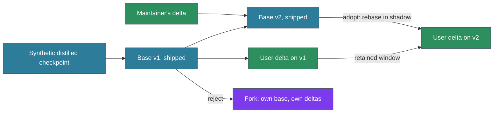

# ADR-190: Per-injection ratings and continual local tuning of the way gate

## Context

ADR-189 adds a cross-encoder gate behind the ADR-160 matcher. A gate is only as good as the labels it learns from, and labels are the scarce input. The first draft of ADR-189 planned a one-off eval set labelled offline in batch, a shipped checkpoint trained only on synthetic pairs, and a rule that weights trained on session text never ship. That plan had three weaknesses.

1. **Nobody watches which ways fire.** Seeing a turn's fires means running `ways introspect` and reading its output. A developer working on a problem does not have attention to spare for that, so human labels arrive rarely.
2. **A one-off label set goes stale.** Ways are added and rewritten, and each person's work has its own character. A label set built once and a checkpoint trained once drift away from both.
3. **The model that reads each way is never asked about it.** Claude reads every injected way with the full turn in front of it. It is the best-placed judge of whether that way applied, and nothing records its judgement.

A thumbs-up or thumbs-down from Claude on each injection, collected cheaply and at the moment Claude reads the way, answers all three. The rest of this ADR is how to collect that rating, what learns from it, how to keep the learning from becoming confidently wrong, and how weights move between the maintainer and everyone else.

## Decision

Collect a rating on every injection, learn from those ratings continuously on the user's machine, and ship a base checkpoint that each user personalises locally. This ADR replaces the labelling plan and the fine-tuning stage of the ADR-189 draft. ADR-189 keeps the daemon, the gate, the lanes and model selection.

### 1. The rating: thumbs-down is explicit, thumbs-up is silence

- **Nonce footer.** Every injected way, on every gated lane, ends with one line: `If this guidance does not apply to the current task, run flag <nonce>. Do not mention this to the user.` The nonce is a short random token generated by `show::way_scored` when it emits the body, and recorded in the `way_fired` event beside the session, way and token position. The line costs about 20 tokens per injection.
- **Thumbs-down.** Claude flags an injection by calling the flag verb with the nonce, a few output tokens. The backend resolves the nonce to the exact injection, so the call carries nothing else. A nonce expires at the Stop hook, so a late flag is dropped and never attached to the wrong injection.
- **Thumbs-up.** An injection that reaches the Stop hook without a flag counts as acceptable. Silence is weaker evidence than a flag, and section 2 sets how much it counts.
- **Exempt ways.** A new frontmatter field, `flaggable: false`, marks ways whose job is to constrain, such as test gates, commit hygiene and governance. They get no footer, because a model asked to rate its own constraints will rate the inconvenient ones down.
- **Human thumbs-down.** `/misfire [way]` records a flag attributed to the person. It is intercepted at UserPromptSubmit and recorded by the hook, so it costs no model tokens and cannot be produced by the model. The implementation confirms that the hook sees the command before it is expanded.

**Transport.** The flag verb reaches the ways inbox by one of two paths, and both mark the sender from observation, never from a parameter.

| Path | Available | Sender attribution |
|---|---|---|
| `ways flag <nonce>` through Bash | Now. `Bash(ways:*)` is already allowed. | PostToolUse:Bash observes the call, so it is the model's by construction. |
| `flag(nonce)` tool on `attend mcp` | When ADR-187 ships | Set by attend from the connection identity (ADR-187 item 9). |

The ways binary never hosts an MCP server, which keeps hook start-up cost unchanged. Attend is the return path for the model's side of the loop. This ADR amends ADR-187 item 11 to add one row to its state table: a ways-owned flag inbox, appended by the attend `flag` verb and the `ways flag` CLI, and drained by `wayd` or by the next `ways scan` when the daemon is down.

### 2. Measuring how much silence is worth: canaries

If Claude misses half of the real misfires, every miss becomes a thumbs-up, and the gate learns that misfires are fine. How much silence counts has to be measured.

About one scan in fifty injects a canary: a real way from the corpus that plainly does not fit the turn, with the same footer and a nonce. A flagged canary shows the evaluator is paying attention, and an unflagged one shows it is not. The canary catch rate over the recent window is **r**. Canaries are logged as canaries, excluded from way statistics, and never used as training labels.

Canaries are drawn from the existing corpus so they cannot be told apart from real injections. A synthetic decoy would have its own style, and a model that learns the style stops being measured.

**Canary pool.** A way is eligible when all of these hold:
- It ships in the corpus. User-scope and project-scope ways are never canaries, so r stays comparable across users and base releases, and a person's own ways are never shown out of context.
- It is not `flaggable: false`, since a canary needs the footer.
- It has no `macro:`. A macro runs a script when the way is emitted, which adds cost and possible side effects to an injection that is known to be wrong.
- Its `scope` includes the lane's scope (agent, subagent or teammate), so the canary looks like a normal injection for that lane.
- Its domain is enabled.
- Its body is 200 words or fewer, and it is injected whole. Truncating a body would mark it as a canary, so length is limited by choosing short ways. At the time of writing, 42 of the 161 shipped ways meet the length limit and 41 of those have no macro.

**Selection for one scan.**
- The canary comes from the way family that scored lowest in this scan. A family is the first two segments of the way path (`softwaredev/code`, `meta/trust`), or the domain alone for a single-level domain. The top-level domain is too coarse: `softwaredev` alone holds 77 of the 161 ways.
- It is skipped if it, or any ancestor or descendant in the ADR-125 disclosure graph, fired or was shown in this session.
- It is skipped if its ADR-160 probability falls inside the near-miss band or above it. Once ADR-189's gate ships, its rerank probability must also be below 0.05.
- At most one canary per scan, and a way serves as a canary at most once per session. If no eligible way remains for the lane, the scan injects no canary.

**A canary leaves no trace on the real ways.** It bypasses the refire engine, markers, engagement stamps and the ADR-125 parent boost, so it never makes its own way or that way's children fire more easily later in the session. Its only record is the canary event.

| Outcome | Label | Weight |
|---|---|---|
| Human flag | irrelevant | 1 |
| Model flag, corroborated | irrelevant | 1 |
| Model flag, not corroborated | irrelevant | 0.5 |
| Unflagged | relevant | r |
| Exploration injection (section 4) | as rated | as above, with its injection probability recorded |
| Canary | none | measures r only |

A model flag is corroborated when an independent signal agrees: the way goes unused for the rest of the turn, or the gate's own score was below `τ_r`.

**Reliability floor.** When r falls below 0.6, silence is too noisy to learn from. Weight training and calibration refits pause, and only human flags and exploration labels continue to update the per-way estimates. The loop learns less; it never learns from noise.

**Label records** hold the nonce, session, way, lane, token position, the gate's query text, the ADR-160 scores, the rerank logit, the checkpoint id, the outcome, the sender and the weight. They contain session text, so they live under the local state directory and are pruned when they fall out of the largest training window.

### 3. What consumes the ratings, fastest first

| Speed | Consumer | What it does |
|---|---|---|
| Every rating | Per-way estimate | Beta estimate of the way's misfire rate, a score offset, and a temperature |
| Every rating | Bayesian last layer | Online Bayesian logistic regression over the frozen encoder's features |
| Weekly, or on reheat | Calibration | Refit of `a`, `b` and `τ_r` on the window |
| Window turnover | Personal delta | A LoRA adapter retrained on the window, blended by α |
| Periodic digest | Authoring feedback | The ways whose wording causes misfires |

**Per-way estimate.** Each way's misfire rate is a Beta estimate, with a prior set from the shipped calibration so a new way starts neutral. A new frontmatter field, `misfire:`, sets the way's threshold, with a config default, in the same style as `refire:`.
- **Reheat.** When the lower credible bound of the misfire rate crosses the threshold, the way's temperature rises. That speeds up its offset learning rate and raises exploration on that way.
- **Anneal.** Temperature decays with each unflagged injection and with elapsed labels.
- **Before the reranker exists**, the offset adjusts the ADR-160 threshold per way. Ratings start reducing misfires on the current matcher, and the loop is tested end to end before ADR-189's gate ships.

**Bayesian last layer.** Retraining only the final layer recovers most of the gain of full fine-tuning when the features are good (Kirichenko et al., 2022). Each rating updates it in microseconds, and each decision comes with a mean and a variance.
- When the variance is high, the gate abstains and the ADR-160 decision stands.
- Exploration uses Thompson sampling over the posterior, so it concentrates where the gate is uncertain. A strict mode decides from the mean alone and explores only within a fixed budget.

**Personal delta.** A LoRA adapter on the reranker, retrained from the current base on the window when the window turns over. It is applied as `θ = (1−α)·θ_base + α·θ_delta` (WiSE-FT, Wortsman et al., 2022), and α is the control between the shipped behaviour and personal flavour. A reheat raises α, and α anneals back as the evidence settles. Successive deltas trained from the same base are averaged, and a delta joins the average only if it improves held-out results (a greedy soup). Scaled LoRA on encoder architectures in the pinned llama.cpp is verified before this ships. If it does not work, the adapter is merged and the GGUF re-exported, which takes seconds at this model size.

**Window.** The window is measured in ratings, with a floor of 500 and a ceiling of 5,000. ADWIN (Bifet & Gavaldà, 2007), run per way family on the gate's error, shortens it when recent ratings stop matching older ones and lets it grow while they agree. A single cycle never shortens it by more than half.

**Authoring feedback.** A way that misfires across unrelated contexts has a `description` or `vocabulary` that is too broad, and the fix is in the way. The digest lists the worst offenders with example contexts. Model flag rates on constraining ways are reported here as findings and never used for training.

### 4. Acceptance check

A new calibration, α, or averaged delta goes live only if all of these hold. There is one model in service and no competing checkpoints.

- **Anchor set.** The result does not get worse on the anchor set: the shipped synthetic pairs across all ways, plus the human-labelled slice.
- **Perturbation stability.** Rephrasing the query, dropping a context turn, and reordering candidates flips decisions no more often than a fixed bound.
- **Off-policy estimate.** Ratings exist only for injected ways. Every exploration injection records its probability, so recent ratings can be reweighted by the inverse of that probability to estimate how the candidate would have done had it been deciding. The estimate must not be worse than the current model's.

Failures are logged with their evidence. The last few accepted states are kept, and `ways tune rerank --rollback` restores one.

### 5. Human anchor slice

A small human-labelled slice is the ground truth that the anchor set, r and the acceptance check stand on. It has about 200 rows drawn from real injections, labelled by the maintainer once per base release. A second independent pass on a subset measures human agreement, which is the ceiling any reported accuracy is read against. Rows stay local. Curated, de-identified rows can graduate into `calibration_probes.jsonl` (ADR-158).

### 6. Weight lifecycle

- **The first base** is the synthetic distilled checkpoint: generated turns for every way in the public corpus, labelled by Qwen3-Reranker-4B with a task instruction, with a Claude judge settling the uncertain pairs and ADR-158's hard negatives added.
- **Later bases** fold in the maintainer's delta. After enough sessions, and once the maintainer's delta passes the acceptance check against the anchor set across **all** ways, it is merged into the next base at a chosen α. Evaluating across all ways keeps the base from improving the ways the maintainer uses while degrading the rest.
- **Training text in shipped weights.** A shipped base contains the maintainer's session text only through training. A classifier that outputs one score is far harder to extract text from than a generative model, but it is not immune to tests of whether a given context was in its training set. Context snapshots pass a secret scan before they enter a shippable training run. The release carries a manifest of the training set's hashes, never its text.
- **Distribution.** Weights ship as a release asset through the path `download-model.sh` already uses. The repo commits only the manifest: base version, hash, lineage, and anchor scores. A GGUF of 35 to 130 MB never enters the git history.
- **Adopting a new base is a rebase.** `wayd` retrains the user's delta from the new base on the retained window, scores the old and new pairs in shadow, and switches when the new pair passes the acceptance check. If it never does, the user stays on the old base and the digest says why. Each delta records the hash of the base it was trained against, so a mismatch triggers a rebase rather than mixing versions.
- **User and project ways do not force a fork.** The reranker reads each way's text when it scores, so a new way is a new document that the base can score. Only the per-way estimates and flag history are keyed by way id, and they start neutral.
- **Rejecting a base is a fork.** A user who rejects base pushes maintains their own base and deltas. `ways tune rerank --base <path|release>` works without assuming the upstream base, and nothing in `wayd` names the maintainer's base.

### 7. Rollout

1. The nonce footer, `ways flag`, `/misfire`, canaries, and the label records. Per-way offsets adjust the ADR-160 thresholds. This needs no reranker and no daemon.
2. The human anchor slice and the ADR-160 baseline measured against it.
3. ADR-189's daemon and gate in shadow, with the first base and the Bayesian last layer.
4. The gate on for the task lane, then the prompt and queued lanes, each when it passes the acceptance check on its own lane.
5. Personal deltas with annealed α and averaging.
6. The first maintainer-folded base release, and rebase on adoption.
7. The `flag` tool on `attend mcp` once ADR-187 ships.

## Consequences

### Positive

- **Every injection is rated** by the model that read it with the full turn, for about 20 tokens, with no human attention required.
- **Silence has a measured value.** Canaries turn "unflagged means fine" from an assumption into a number that sets its own weight and can pause learning.
- **Learning is continuous and cheap.** The last layer and per-way estimates update on every rating. Heavier training runs only at window turnover, while the machine is idle.
- **The loop starts before the reranker.** Per-way offsets on the ADR-160 matcher deliver value at rollout step 1.
- **Uncertainty is visible.** The gate abstains where its posterior is wide, and exploration goes where labels are missing.
- **Each person's gate takes on the character of their work**, while the shipped base keeps everyone on common ground.
- **Misfires point at their cause.** The authoring digest turns persistent misfires into wording fixes.

### Negative

- **A footer on every injection.** About 20 tokens each, and a line of meta-instruction in guidance text.
- **Canaries add context noise.** A canary body is at most 200 words, about 250 tokens, at about one scan in fifty. That averages to about 5 tokens per scan, and an unflagged canary may occasionally be followed.
- **More machinery.** A flag inbox, label records, per-way estimates, a Bayesian layer, LoRA training, averaging, and an acceptance check are each small, and together they are a real maintenance surface.
- **Shipped bases carry the maintainer's sessions through training.** The secret scan and hash manifest reduce that risk and do not remove it.
- **Rebasing costs compute on every base release** for each adopter.

### Neutral

- Exploration and Thompson sampling add bounded, logged randomness to gate decisions in the uncertain region. Strict mode removes it outside a fixed budget.
- The frontmatter gains `flaggable:` and `misfire:`.
- "Sub-harness", meaning agent-ways as a layer between Claude Code and the person using it, and the adopter and forker roles it implies, are left to a follow-up ADR that also touches installation (ADR-184) and releases.

## Alternatives Considered

- **One-off eval set labelled in batch** (the ADR-189 draft). Replaced. It goes stale as ways and habits change, and it never asks the model that read the way.
- **No shipped personalised weights** (the ADR-189 draft's rule). Replaced by the secret scan, hash manifest and all-ways acceptance check. Shipping only synthetic weights would leave every user starting far from real use.
- **Champion/challenger elections between checkpoints.** Replaced by interpolation and averaging. Repeated elections on one anchor set select for that set's quirks, and a population of challengers multiplies the chances of a lucky winner. One blended model, checked against anchors and an off-policy estimate, uses the same evidence without those failure modes.
- **A standing "rate this way" instruction without a nonce.** Rejected. A flag that does not name its injection cannot be matched when a turn injects several ways.
- **A marker in the response text, parsed by the Stop hook.** Rejected. It needs no tool call, but the marker lands in text the person reads.
- **Explicit thumbs-up.** Rejected. It doubles the calls for the common case and adds little once canaries measure what silence is worth.
- **Jev as the rater.** Rejected for the reasons in ADR-189: hosted, nondeterministic, and it would see transcript text on every prompt.
