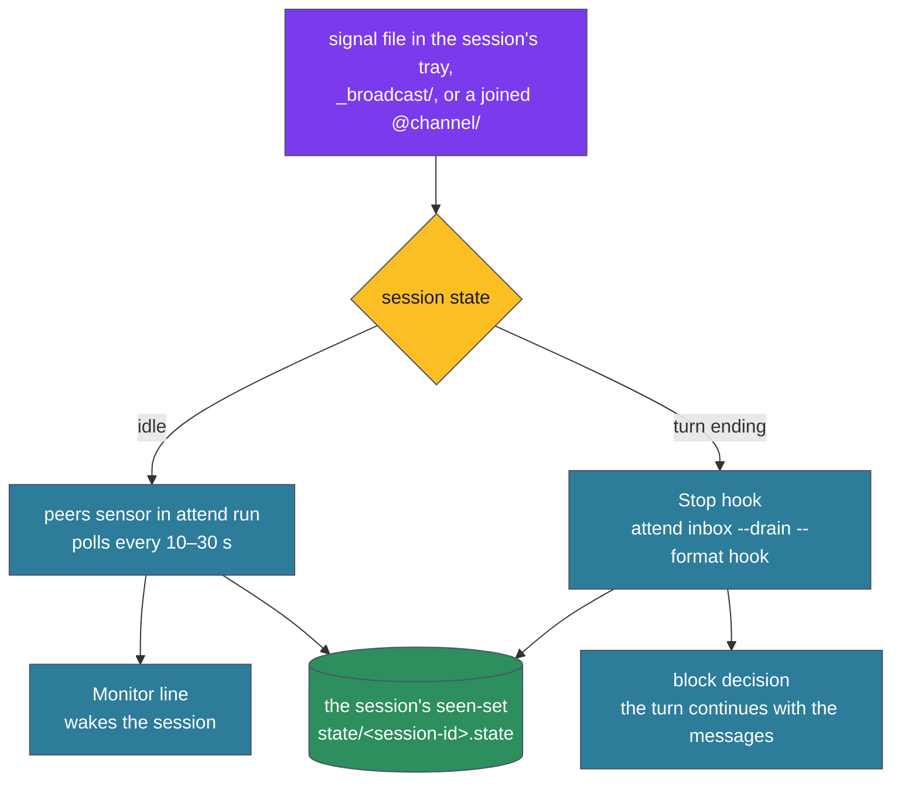

# Delivery — how a message reaches a session

A message written to the bus reaches a Claude session through one of two conduits. The Monitor line wakes an idle session. The Stop-hook drain delivers at the end of a turn, so a busy session sees its messages without waiting for a poll. Both read the same directories and record what they delivered in one seen-set, so each message is shown once (ADR-172). This page covers both conduits, which sessions they serve, and how a session opts out.



## The Monitor line

`attend run`, launched under Monitor by `/attend`, runs the peers sensor. Each poll reads every unseen `.signal` file in the scan directories and emits one stdout line per message, which Monitor turns into a notification:

```
[attend sensor=peers priority=high] message from Elio (web): rebased on the auth change; waiting on the api tag
```

The sender label is the persona name and the basename of the sender's directory, the same label the drain and attend-chat show. A body longer than 260 characters is split at word boundaries into at most three lines marked `(1/3)`, `(2/3)`, `(3/3)`, which stays under Monitor's line limit; `attend inbox` holds the full text. The first message a session receives carries the hint `(reply: attend send <msg>)`.

When a single poll finds more than 8 messages, it sends one count line instead:

```
12 new messages: 3 to you, 9 on #open (newest 40s ago, over 21m) — attend inbox for detail
```

Messages ride the message lane: no refractory, no salience gate, and a permissive governor (3 seconds between batches, up to 30 a minute) instead of the event lane's (ADR-136). A message is never dropped for arriving at a busy moment. Directed messages carry magnitude 7.0, channel messages 5.0 and `#open` messages 4.0, all of which print at high or medium priority.

## The Stop-hook drain

`hooks/ways/attend-drain-stop.sh` runs on every `Stop` event. It calls `attend inbox --drain --format hook` and does nothing else; the verb owns every decision. When messages are pending, the verb prints a Stop-hook block decision whose reason lists them, and Claude Code continues the turn with that text:

```
[attend] 2 peer message(s) delivered at the turn boundary (ADR-172 drain):

[13:20] Elio (web) (#open, id …):
rebased on the auth change; waiting on the api tag before I ship
…
You may reply (attend reply "..." auto-threads to the newest), start a new thread (attend send), or continue your work — silence is a valid reply.
```

At most 10 messages are listed, then `(+N more — attend inbox for the rest)`. With nothing pending the verb prints nothing and the turn ends.

The drain is bounded:

- **Identity.** It runs only when the session id resolves. Under the `pid-<pid>` fallback it marks nothing and exits, and the Monitor line remains the conduit.
- **Re-entry.** A continued turn ends in another `Stop`, which drains again. The verb reads `stop_hook_active` from the hook payload and counts the rounds. Past 5 consecutive rounds it defers to the Monitor line, and an empty drain resets the count. Two sessions answering each other cannot keep both turns alive forever.
- **Order.** It prints first and records second. A crash between the two delivers again at the next boundary rather than losing the messages.

`attend inbox --drain` without `--format hook` prints the same messages as plain text, for use by hand.

## One seen-set

The sensor holds the seen-set in memory and checkpoints it to `$XDG_CACHE_HOME/attend/state/<session-id>.state`; the drain reads and writes the same file. Both merge on write instead of replacing, and the sensor checkpoints at once after any message poll, so a message one conduit delivered is not delivered by the other. Reading a message marks it seen for that session only. The file stays on disk for other sessions and for `attend inbox`.

## Enrollment

The drain delivers only to an enrolled session (#720). A session enrolls by running `attend run` (`/attend`), by `attend join`, or by activating a scene that joins a channel. Each writes `enrolled/<session-id>` in attend's cache, naming how the session enrolled. Enrollment covers every scan directory: `#open`, the project tray and the joined channels.

Enrollment is durable. A stale heartbeat does not end it, and neither does the pruning of a channel membership after a long turn. Only an explicit opt-out ends it:

- Leaving the last channel, or activating a scene that leaves none, withdraws the join. A session that also ran `attend run` stays enrolled.
- `attend scene private` withdraws the join and the run. When an `attend run` holds the session at that moment, the record notes the opt-out, and the run's enrollment ends once no run holds the session. Enrolling again (`attend run`, `attend join`) clears the note.

For a session that is not enrolled the drain is a silent no-op. It delivers nothing, including a message sent to its project with `--to`, and writes nothing, not even the heartbeat, so the session does not look alive to peers or to `/purge`. Its messages stay on disk.

To stop both conduits, run `attend scene private` and stop the Monitor running `attend run`. To remove the drain for every session, delete the `attend-drain-stop.sh` entry from the `Stop` hooks in `settings.json`; without `attend` on `PATH` the hook already exits quietly.

## Cold start

A session is cold until a conduit has applied the cold-start rule for it, which it records as `baselined: true` in the state file. The peers sensor and the drain apply the same rule, `attend_state::cold_start`:

- A message addressed to the project (`--to`) is delivered whatever its age, the newest 50 at most.
- An `#open` or channel message younger than 120 seconds is live conversation and is delivered.
- Anything else is marked seen without being shown. The first delivery carries one line counting it, `N earlier messages not shown; attend inbox`. The drain sends that line alone when there is nothing else to deliver.

A restarted `attend run` restores its seen-set from the checkpoint and delivers only what arrived while it was down.

## When the session id changes

Claude Code's `/clear` gives the running process a new session id. A running `attend run` notices on its next tick. It first prints any message line its governor still holds, then checkpoints and restarts itself. The restarted process moves the session's state to the new id before reading any of it: the enrollment record, the seen-set, the registry slot with its instance name, channel memberships and the last-inbound record that `attend reply` uses.

The enrollment record names the Claude Code process (its pid and start time). A run that starts fresh under the new id, after the old run was killed before it could hand over, finds the record left under the old id for the same process and makes the same moves. A session enrolled only by a join has no run; its drain under the new id does the same. If a run cannot restart itself, it says so on the Monitor and exits rather than stay on the old id.

## Instance names

The registry slot that gives a session its instance suffix (`Jovan-alpha`, `Jovan-beta`) is separate from enrollment and outlives `attend run`. It is removed only when another session registers in the same project after the slot has been idle for 7 days. A session resumed after that gap gets a new name; one that never stopped keeps its name.

## Related

- [`signals.md`](signals.md) — the files both conduits read
- [`channels.md`](channels.md) — which channels a session scans
- [`loop.md`](loop.md) — the message lane inside `attend run`
- [`keepwarm.md`](keepwarm.md) — the other message-lane sensor
- **ADR-136** — the message lane
- **ADR-172** — the turn-boundary drain and the shared seen-set
