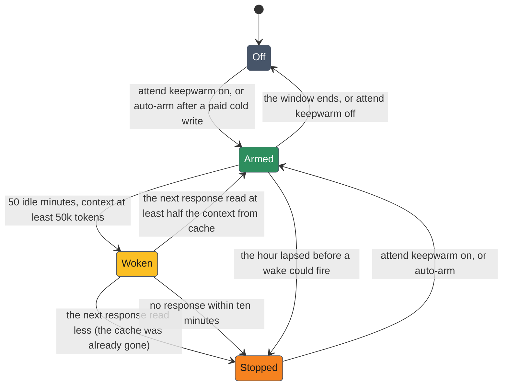

# Keepwarm — holding the prompt cache across idle time

Claude Code caches a session's prompt on the one-hour cache tier. Each request reads the cached prefix and restarts the hour. A request that arrives after the hour has lapsed writes the whole prefix again at the cache-write rate: on a 200k-token session that is dollars, against cents for a warm turn. Keepwarm is an attend sensor that, while armed, wakes an idle session once at 50 idle minutes so the next request reads the cache instead of rewriting it (ADR-182).

The wake is an ordinary Monitor notification. Claude Code turns it into a turn over the full context, and that request reads the cache and restarts the hour.

## When to arm it

Arm it before leaving a large session idle that you will come back to: lunch, a meeting, a long build in another window. It is not worth arming for a small context or for a session you will not return to. It is off by default, because every wake costs a cache read on an API key and an unknown share of the rate limit on a subscription.

```bash
attend keepwarm on          # arm for 6 hours
attend keepwarm on 90m      # arm for a window: 6h, 90m, 2h30m
attend keepwarm off         # disarm
attend keepwarm status      # the card below; also what bare `attend keepwarm` prints
```

These verbs act on the Claude session that runs them, so run them from inside the session (the agent's Bash tool, or `!` in the prompt). Outside a session they print `keepwarm: no Claude session owns this process, nothing to warm` and exit 1. The sensor itself runs inside `attend run`, so attend must be running under Monitor for anything to wake.

**Auto-arm.** When the sensor sees a paid cold write (below) on a context of at least 50k tokens, it arms three hours on its own if no window already covers them. A session that has paid one rewrite has shown it comes back, and the second rewrite is not paid that day.

## What a wake looks like

With a window armed, the context at 50k tokens or more, and 50 minutes since the last assistant response in the transcript, the sensor emits one line:

```
[attend sensor=keepwarm priority=medium] keepwarm: 50m idle, the prompt cache lapses in 10m on 182k tokens. Reply with one word and no tools.
```

The idle clock is the session transcript, not attend: any response resets it, whether it answered the user, a peer message, a drained inbox message, a scheduled wakeup, or keepwarm itself. There is one wake per idle stretch.

Keepwarm rides the message lane with the peers sensor, so the action-potential refractory never holds the wake back.

## The agent's side

A line beginning `keepwarm:` asks for one word and no tools. It is not a prompt to investigate, summarize or check anything. The turn it produces is the whole point, and anything more is billed output. The same sentence is in the three guidance files agents read: the attend skill, the runtime disclosure, and the attend way.

## How it stops



The verdict comes from the first response after the wake. A cache read of at least half the previous context means the cache was warm and the window stays armed. Anything less means the cache had already lapsed, so the sensor disarms and records why rather than keep paying for rewrites. What the response wrote does not count, since a real turn landing beside the wake can append a large tool result to a warm prefix.

## Status

`attend keepwarm status` reads the transcript through `ways context` and the sensor's ledger:

```
model       claude-opus-5
state       warm, 38m left
context     182400 tokens
cold cost   $1.82 to re-write it (warm turn $0.09)
keepwarm    on, 5h12m left · wake in 28m
break-even  up to 20 wakes at the read rate cost one cold write, about 16h40m of idle at one wake per 50m
session     1 cold write paid, $1.64
```

| Line | Meaning |
|---|---|
| `state` | `warm` with the time left on the cache hour, `COLD` with the time since the last request, or no request yet |
| `cold cost` | what rewriting the current context would cost, and what one warm turn costs |
| `keepwarm` | `on` with the window left and the next wake; `stopped` with the reason; or `off` |
| `break-even` | how many wakes cost the same as one rewrite, and how much idle time that covers; left out for a model with no price |
| `session` | the cold writes this session has paid and their total |

`attend status` shows the `keepwarm` line on its own.

## The cost model

A cold write is a response whose cache write is at least half the previous context and whose cache read is under half of it, with the previous context over 20k tokens. The sensor records each one with its price. A large tool result appended to a warm prefix writes a lot but reads the whole prefix, so it does not count.

Prices are a dated table in `tools/sensor-keepwarm/src/lib.rs`: cache read, one-hour cache write and output per million tokens, by model family, from list prices of September 2026. A model not in the table prices as `n/a`. On a subscription the dollars are a yardstick for the arithmetic, not a bill.

Each wake adds a user line and an assistant line to the transcript, on the order of a hundred tokens. A six-hour window adds under a thousand.

## Turning it off

`attend keepwarm off` disarms the current session. To remove the sensor from every session:

```bash
ways settings set attend.sensors.keepwarm.enabled false
```

or in `~/.config/attend/config.yaml`:

```yaml
sensors:
  keepwarm:
    enabled: false
```

A disabled sensor neither wakes nor auto-arms. The arm file and the ledger live under `$XDG_CACHE_HOME/attend/keepwarm/`; only the `attend keepwarm` verbs and the sensor read them.

## Related

- [`sensors.md`](sensors.md#keepwarm) — the sensor's defaults beside the other built-ins
- [`delivery.md`](delivery.md) — the message lane keepwarm shares with the peers sensor
- [`configuration.md`](configuration.md) — the `sensors.keepwarm` keys
- **ADR-182** — the decision
