# Signals — wire format, storage, lifecycle

Signals are attend's on-disk messaging primitive — the transport underneath its workspace awareness. Everything that flows between sessions — peer messages sent with `attend send`, notifications rendered into the conversation via Monitor, human-typed lines in `attend chat` — is mediated by signal files on the local filesystem. This page covers the wire format, how signals are organized on disk, and the full lifecycle from arrival to deletion.

## The wire format

Every signal is one pipe-delimited record in a `.signal` file:

```
from|project|cwd|message
```

A threaded reply, as `attend reply` writes it (ADR-120):

```
from|project|cwd|re:signal-id|message
```

**Field-by-field:**

- **`from`** — identifier of the sender, in the form `<kind>:<identity>`. Kinds seen in practice:
  - `claude:<session-id>` — a Claude Code session, identified by its 36-char session UUID
  - `external:<user>@<terminal>` — a human, sending from attend-chat or with `attend send` from a terminal outside any Claude session
- **`project`** — the last segment of the sender's directory (e.g., `api-service`). Used in display, not routing.
- **`cwd`** — absolute path of the sender's working directory. The receiver's chip and label show its basename, and the cleanup sweep reads it to decide whether a `#open` or channel signal's project is still live.
- **`re:signal-id`** — present only on a threaded reply. `attend reply` writes it, pointing at the newest message the session received; `attend send` has a hidden `--re <id>` flag for the same. One level only, no reply to a reply. The id is the parent's filename stem and must match `[A-Za-z0-9_-]+`, so prose that happens to start with `re:` round-trips as a plain message. The field is recorded on the wire, but no conduit renders threads: the Monitor line, the drain and attend-chat show a reply as an ordinary message.
- **`message`** — the payload. Free text, usually the actual content the sender wants the receiver to see.

The parser splits the leading fields on `|` and keeps the rest as the message, so a `|` inside the message survives.

**Encoding and length.** UTF-8, with no length limit on disk. The Monitor line splits a long message into at most three parts (see [`delivery.md`](delivery.md#the-monitor-line)); `attend inbox <id>` prints the whole message.

## Storage layout

Signal files live under attend's cache, `$XDG_CACHE_HOME/attend/signals/` (`~/.cache/attend/signals/` when `XDG_CACHE_HOME` is unset), in a flat two-level hierarchy:

```
~/.cache/attend/signals/
├── _broadcast/                                   # #open
│   ├── claude-0b6f3d2e-…-1790949600123456789-0.signal
│   └── external-aaron-kitty-1790949642000000000-0.signal
├── _groups.yaml                                  # channel state
├── _last_banner                                  # startup banner fingerprint
├── @deploy/                                      # a channel
│   └── claude-7c41a9e0-…-1790949700000000000-1.signal
├── -home-aaron-Projects-api-service-1x2k9q/      # a project tray
│   └── claude-7c41a9e0-…-1790949650000000000-0.signal
└── -home-aaron-Projects-infra-3hv0zp/            # another project tray
    └── ...
```

Three kinds of subdirectories:

1. **`_broadcast/`** — `#open`. Every enrolled session scans it, whatever its project or channels.
2. **`@<name>/`** — a channel. Only its members scan it (see [`channels.md`](channels.md)).
3. **A project tray** — named by `claude_sessions::attend_key`: Claude Code's project slug for the directory, a `-`, and a base-36 hash of the full path. The hash keeps two paths with the same slug (`/srv/my proj` and `/srv/my-proj`) apart. Every session in that directory reads the tray, and `attend send --to <path>` writes to it.

**Reserved names:**

- Anything starting with `_` (e.g., `_broadcast`, `_groups.yaml`, `_last_banner`) is a system file or dir, never interpreted as a project dir. Cleanup never removes these directories or non-`.signal` files; it can remove individual `.signal` files inside `_broadcast/` (see Phase 5).
- Anything starting with `@` is a channel dir. The whole directory is removed when the channel is dissolved, or when a leave, kick, unpin, or dead-member prune leaves it with no members and unpinned (see "Channel directories" under the lifecycle).

## Filename convention

`agent_identity::signal_filename` names a signal `<sender>-<unix-nanos>-<seq>.signal`:

- **`<sender>`** — the `from` field with every character outside `[A-Za-z0-9_-]` replaced by `-`, so `claude:0b6f…` becomes `claude-0b6f…` and `external:aaron@kitty` becomes `external-aaron-kitty`.
- **`<unix-nanos>`** — nanoseconds since the epoch at write time.
- **`<seq>`** — a per-process counter, so two writes in the same nanosecond still get distinct names.

The stem is the signal's id: `attend inbox <id>` reads it, and `re:` points at it. Scans and cleanup only touch `.signal` files. `attend inbox` and attend-chat order messages by file mtime.

## Atomic writes

Signals are written atomically via the classic write-then-rename pattern:

1. Writer creates `<filename>.tmp` with the content
2. Writer renames `<filename>.tmp` → `<filename>` (atomic on any POSIX filesystem)

Readers that see `<filename>` are guaranteed to read complete, consistent content. Readers ignore `.tmp` files. This prevents a reader from catching a half-written signal mid-disk-flush.

`_groups.yaml` uses the same pattern (this was the fix for issue #16 — before, it was written with a plain `fs::write` and concurrent writers could corrupt it). Any tool or sensor that writes to the signals base should follow this pattern.

## The full lifecycle

```mermaid
flowchart LR
    Create[attend send<br/>or attend-chat]
    Write[write .tmp<br/>rename to .signal]
    Scan[peers sensor or drain<br/>reads unseen files]
    Present[Monitor line or<br/>Stop-hook drain]
    Seen[marked seen<br/>file stays on disk]
    Cleanup[cleanup sweep<br/>every 10 min]
    Delete[file removed<br/>when its project is gone]

    Create --> Write
    Write --> Scan
    Scan --> Present
    Present --> Seen
    Seen --> Cleanup
    Cleanup --> Delete

    classDef core fill:#7c3aed,stroke:#4a5568,color:#ffffff
    classDef process fill:#2d7d9a,stroke:#4a5568,color:#ffffff
    classDef store fill:#2d8e5e,stroke:#4a5568,color:#ffffff

    class Create core
    class Write,Seen store
    class Scan,Present,Cleanup process
    class Delete store
```

A signal's journey from creation to deletion. Signals carry authored messages, so they ride attend's message lane: they are delivered once and never aged out (ADR-136). A signal leaves the disk in one of three ways: the cleanup sweep removes it when the project that owns it is gone, channel housekeeping removes its whole `@<name>/` directory (for example when the channel is dissolved, or left empty and unpinned), or an operator purges the channel (see "Channel directories" and "Purge" below).



**Phase 1 — creation.** The sender (an agent with `attend send` or `attend reply`, or a human in attend-chat) builds the line and writes it atomically to the scope directory. `--channel <name>` writes to `@<name>/`, `--to <path>` to that project's tray, and no flag to `_broadcast/`. attend-chat writes one file per addressed recipient.

**Phase 2 — scanning.** The peers sensor in `attend run` (every 10 to 30 seconds) and the Stop-hook drain (at each turn end) scan the session's project tray, `_broadcast/` and every joined `@<name>/`. A file not in the session's seen-set is read, parsed and added to it. A cold start applies the cold-start rule instead of replaying the backlog.

**Phase 3 — presentation.** The peers sensor prints unseen messages as Monitor lines, and the drain hands them to the ending turn. [`delivery.md`](delivery.md) covers both conduits, enrollment, the cold-start rule and what happens when the session id changes. A human running attend-chat sees every message as it lands.

**Phase 4 — retention.** Reading a signal marks it seen in that session's own seen-set; it does not delete the file. The file stays on disk for other peers and for `attend inbox`. Nothing removes a signal because of its age.

**Phase 5 — auto-cleanup.** Every `cleanup.interval` seconds (default 600, ten minutes), the attend loop sweeps the signals base when `cleanup.enabled` is true. A project is live while `~/.claude/projects/<encoded-cwd>/` exists. The sweep removes every signal in a project-scope directory whose project is gone, and removes a signal in `_broadcast/` or an `@group/` directory when the project named by its sender `cwd` field is gone. It then removes project directories left empty. The sweep never removes `_broadcast/` or an `@group/` directory.

**Phase 6 — manual cleanup.** The operator can run `attend cleanup` at any time to run the same sweep immediately. Flags:

- `--dry-run` / `-n` — list what would be removed without deleting
- `--all` — remove every signal regardless of project liveness

**Channel directories.** Membership changes remove signals independently of the sweep. attend removes a whole `@<name>/` directory, signals included, in these cases: `dissolve`; a `leave`, `kick`, or `unpin` that leaves the channel with no members and unpinned; the prune of dead members, for every channel it empties that is not pinned; and an `@<name>/` directory that `_groups.yaml` has no entry for, once it is older than a grace window. A pinned channel keeps its directory with no members. The code is `Groups::leave`, `kick`, `unpin`, `dissolve` and `cleanup_stale_with` in `tools/attend-groups/src/lib.rs`.

**Purge.** attend-chat's `/purge` deletes one channel's history on request. It keeps files younger than 90 seconds and any file a live session has not yet marked seen.

## Disk lifetime and presentation

A signal's time on disk and its presentation are separate:

| | Disk | Presentation |
|---|---|---|
| **Ends when** | The owning project leaves `~/.claude/projects/`; for a channel signal, also when its `@<name>/` directory is removed or the channel is purged | The session has marked the signal seen |
| **Controlled by** | `cleanup.enabled`, `cleanup.interval`; channel membership and `--pin` | The session's seen-set, persisted in its checkpoint |
| **Scope** | Shared by every session | Per session |

Nothing about a signal decays with age.

## Reading signals in tooling

The signal directory layout is stable and designed to be read by external tools. If you're building something that wants to observe what's flowing through the signal bus, the conventions are:

- Only read `*.signal` files. Everything else is reserved or transient.
- Parse the pipe-delimited format. The `re:` field is optional; handle its presence or absence.
- Order by file mtime.
- Don't delete files you didn't write. Auto-cleanup handles retention.

Reading from `_broadcast/` gives you cross-agent visibility. Reading from `@<name>/` gives you a channel tap. Reading from an encoded cwd gives you per-project history.

## Related

- **ADR-113** — the original attend design, including signal dir conventions
- **ADR-118** — channels, the `@<name>` directories
- **ADR-120** — attend-chat and the `re:` threading field
- **ADR-136** — the message lane: delivery, retention, and cleanup by project liveness
- **ADR-172** — the Stop-hook drain
- [`delivery.md`](delivery.md) — the Monitor line and the Stop-hook drain
- [`channels.md`](channels.md) — channel membership and lifecycle
- [`tui.md`](tui.md) — attend-chat
- [`loop.md`](loop.md) — where the peers sensor runs
