# Signals — wire format, storage, lifecycle

Signals are attend's on-disk messaging primitive — the transport underneath its workspace awareness. Everything that flows between sessions — peer messages sent with `attend send`, notifications rendered into the conversation via Monitor, human-typed lines in `attend chat` — is mediated by signal files on the local filesystem. This page covers the wire format, how signals are organized on disk, and the full lifecycle from arrival to deletion.

## The wire format

Every signal is a single-line, pipe-delimited record in a `.signal` file:

```
from|project|cwd|message
```

With threading extensions (when the `re:` field is present, per ADR-120):

```
from|project|cwd|re:signal-id|message
```

**Field-by-field:**

- **`from`** — identifier of the sender, in the form `<kind>:<identity>`. Kinds seen in practice:
  - `claude:<session-id>` — a Claude Code session, identified by its 36-char session UUID
  - `external:<user>@<terminal>` — a human sending via `attend chat` or `attend send` from a terminal
  - Future kinds (e.g., `script:<name>` for automated ops) follow the same pattern
- **`project`** — human-readable project name (e.g., `api-service`, `bosectl-qt`). Used in display formatting, not routing.
- **`cwd`** — absolute path of the sender's current working directory. This is the ground truth for "who am I" — signals scope to encoded-cwd directories, so cwd determines where a signal goes and where it comes from.
- **`re:signal-id`** — optional threading field. Present only when the sender explicitly marked this signal as a threaded reply (via `attend send --re <id>`); unthreaded sends emit the 4-field legacy form unchanged. One level of threading only — no reply-to-reply. The signal ID is the original signal's filename stem and must match `[A-Za-z0-9_-]+`; that char class is also the parser's discriminator fence, so legacy prose that happens to start with "re:" (e.g., a reply quoting an email header) round-trips as a plain message.
- **`message`** — the payload. Free text, usually the actual content the sender wants the receiver to see.

Fields are pipe-delimited with no escaping. If your message contains a literal `|`, you need to escape it yourself at emit time — in practice this almost never happens because peer messages are prose.

**Encoding and length.** UTF-8. Monitor's per-line buffer is the practical length limit for messages — see [`skills/attend/SKILL.md`](../../skills/attend/SKILL.md) for the ~400 character ceiling note. Longer messages aren't truncated on disk, only in the Monitor notification line — recipients can always read the full file via `attend inbox <id>`.

## Storage layout

Signal files live under `~/.cache/attend/signals/` in a flat two-level hierarchy:

```
~/.cache/attend/signals/
├── _broadcast/                               # broadcast scope
│   ├── claude-abc123-1743280000.signal
│   └── aaron-1743280042.signal
├── _groups.yaml                              # focus group state (ADR-118)
├── _last_banner                              # startup banner fingerprint dedup
├── @deploy/                                  # named focus group
│   └── claude-abc123-1743280100.signal
├── @infra/                                   # another focus group
│   └── aaron-1743280200.signal
├── -home-aaron-Projects-api-service/         # encoded cwd (project scope)
│   ├── claude-def456-1743280000.signal
│   └── claude-abc123-1743280050.signal
├── -home-aaron-Projects-infra/               # another project scope
│   └── ...
└── -home-aaron--claude/                      # the agent-ways project itself
    └── ...
```

Three kinds of subdirectories:

1. **`_broadcast/`** — the reserved broadcast dir. Every agent with attend running sees signals here regardless of their project or focus group membership.
2. **`@<name>/`** — focus group directories (ADR-118). Only sessions that have joined that group (via `attend join <name>`) receive signals from here.
3. **`-<encoded-cwd>/`** — project-scope directories. The cwd encoding replaces `/`, `_`, and `.` with `-` to produce a filesystem-safe name. A session working in `/home/aaron/Projects/api-service` writes to and reads from `-home-aaron-Projects-api-service/`.

**Reserved names:**

- Anything starting with `_` (e.g., `_broadcast`, `_groups.yaml`, `_last_banner`) is a system file or dir, never interpreted as a project dir. Cleanup never removes these directories or non-`.signal` files; it can remove individual `.signal` files inside `_broadcast/` (see Phase 5).
- Anything starting with `@` is a focus group dir. The whole directory is removed when the group is dissolved, or when a leave, kick, unpin, or dead-member prune leaves it with no members and unpinned (see "Group directories" under the lifecycle).

## Filename convention

Signal filenames are `<sender-id>-<timestamp>.signal`:

```
claude-abc123-1743280000.signal
aaron-1743280042.signal
```

- **`<sender-id>`** — for claude sessions, the session UUID (sometimes truncated); for humans, a simple username
- **`<timestamp>`** — Unix seconds at emit time
- **`.signal`** — the file extension. Cleanup and scan paths only touch `.signal` files; anything else in a signal directory is left alone.

Filenames are sortable by timestamp when the sender ID is consistent — useful for chronological ordering within a single sender's history, though the TUI and `attend inbox` use the file's mtime for the authoritative order across senders.

## Atomic writes

Signals are written atomically via the classic write-then-rename pattern:

1. Writer creates `<filename>.tmp` with the content
2. Writer renames `<filename>.tmp` → `<filename>` (atomic on any POSIX filesystem)

Readers that see `<filename>` are guaranteed to read complete, consistent content. Readers ignore `.tmp` files. This prevents a reader from catching a half-written signal mid-disk-flush.

`_groups.yaml` uses the same pattern (this was the fix for issue #16 — before, it was written with a plain `fs::write` and concurrent writers could corrupt it). Any tool or sensor that writes to the signals base should follow this pattern.

## The full lifecycle

```mermaid
flowchart LR
    Create[attend send<br/>or attend chat]
    Write[write .tmp<br/>rename to .signal]
    Scan[peer sensor scans<br/>reads unseen files]
    Present[present to agent<br/>via Monitor]
    Seen[marked seen<br/>file stays on disk]
    Cleanup[cleanup sweep<br/>every 10 min]
    Delete[file removed<br/>when its project is gone]

    Create --> Write
    Write --> Scan
    Scan --> Present
    Present --> Seen
    Seen --> Cleanup
    Cleanup --> Delete

    classDef core fill:#7c3aed,stroke:#4a5568,color:#ffffff
    classDef process fill:#2d7d9a,stroke:#4a5568,color:#ffffff
    classDef store fill:#2d8e5e,stroke:#4a5568,color:#ffffff

    class Create core
    class Write,Seen store
    class Scan,Present,Cleanup process
    class Delete store
```

A signal's journey from creation to deletion. Signals carry authored messages, so they ride attend's message lane: they are delivered once and never aged out (ADR-136). A signal leaves the disk in one of two ways: the cleanup sweep removes it when the project that owns it is gone, or group housekeeping removes its whole `@<name>/` directory, for example when the group is dissolved or left empty and unpinned (see "Group directories" below).



**Phase 1 — creation.** The sender (an agent via `attend send`, or a human via `attend chat`) constructs the `from|project|cwd|message` line — or `from|project|cwd|re:signal-id|message` if `--re <signal-id>` was passed to mark the send as a threaded reply — and writes it atomically to the right scope directory. Routing flags pick the directory: `--channel <name>` (deprecated alias `--focus`) → `@<name>/`, `--to <path>` → the encoded path, and no flag (or `--broadcast`) → `_broadcast/`. The threading flag composes with any routing flag.

**Phase 2 — scanning.** Every peer sensor poll (default 30 seconds), `sensor-peers` walks its scan directories: its own project scope, `_broadcast`, and every `@group` the session has joined. A file whose path is not in the session's seen-set is read, parsed, and added to the seen-set. On a session's first scan with no restored checkpoint, every existing file is added to the seen-set without being shown, so a fresh start does not replay the backlog. A session that restarts restores its seen-set from its checkpoint and surfaces only the files that arrived while it was down.

**Phase 3 — presentation.** Unseen messages from one poll are emitted as Monitor notification lines. If a single poll finds more than 8, they are coalesced into one digest line that gives the count, and `attend inbox` holds the detail. The message lane skips the salience gate and the action-potential refractory, and it uses a permissive governor with a flat cooldown instead of the event lane's governor, so a message is never dropped for arriving at a busy moment. The agent sees the notification; the human (if running `attend chat`) sees the message in the TUI.

A second conduit delivers the same messages at the turn boundary. A Stop hook runs `attend inbox --drain`, which reads the same scan directories and the same persisted seen-set, so a message surfaced by one conduit is not repeated by the other (ADR-172). On a cold start with no seen-set on disk, the drain marks the backlog seen without delivering it, except for messages younger than 120 seconds, which it delivers (`tools/attend/src/cmd/inbox.rs:352, 434-443`).

**Phase 4 — retention.** Reading a signal marks it seen in that session's own seen-set; it does not delete the file. The file stays on disk for other peers and for `attend inbox`. Nothing removes a signal because of its age.

**Phase 5 — auto-cleanup.** Every `cleanup.interval` seconds (default 600, ten minutes), the attend loop sweeps the signals base when `cleanup.enabled` is true. A project is live while `~/.claude/projects/<encoded-cwd>/` exists. The sweep removes every signal in a project-scope directory whose project is gone, and removes a signal in `_broadcast/` or an `@group/` directory when the project named by its sender `cwd` field is gone. It then removes project directories left empty. The sweep never removes `_broadcast/` or an `@group/` directory.

**Phase 6 — manual cleanup.** The operator can run `attend cleanup` at any time to run the same sweep immediately. Flags:

- `--dry-run` / `-n` — list what would be removed without deleting
- `--all` — remove every signal regardless of project liveness

**Group directories.** Group membership changes remove signals independently of the sweep. attend removes a whole `@<name>/` directory, signals included, in these cases: `dissolve`; a `leave`, `kick`, or `unpin` that leaves the group with no members and unpinned; the prune of dead members, for every group it empties that is not pinned; and an `@<name>/` directory that `_groups.yaml` has no entry for, once it is older than a grace window. A pinned group keeps its directory with no members (`tools/attend-groups/src/lib.rs`: `leave` 184-197, `kick` 208-230, `unpin` 245-258, `dissolve` 263-277, prune 389-399, orphan sweep 410-448).

## Disk lifetime and presentation

A signal's time on disk and its presentation are separate:

| | Disk | Presentation |
|---|---|---|
| **Ends when** | The owning project leaves `~/.claude/projects/`, or, for a group signal, its `@<name>/` directory is removed (dissolve, or left empty and unpinned) | The session has marked the signal seen |
| **Controlled by** | `cleanup.enabled`, `cleanup.interval`; group membership and `--pin` | The session's seen-set, persisted in its checkpoint |
| **Scope** | Shared by every session | Per session |

Salience decay by age applies to the event lane (git, process, and similar sensors), not to signals. See [`salience.md`](salience.md) for that mechanism.

## Reading signals in tooling

The signal directory layout is stable and designed to be read by external tools. If you're building something that wants to observe what's flowing through the signal bus, the conventions are:

- Only read `*.signal` files. Everything else is reserved or transient.
- Parse the pipe-delimited format. The `re:` field is optional; handle its presence or absence.
- Respect the mtime ordering — creation timestamps in filenames aren't always the same as the file's effective age after atomic rename.
- Don't delete files you didn't write. Auto-cleanup handles retention.

Reading from `_broadcast/` gives you cross-agent visibility. Reading from `@<name>/` gives you a focus-group tap. Reading from an encoded cwd gives you per-project history.

## Related

- **ADR-113** — the original attend design, including signal dir conventions
- **ADR-118** — focus groups, `@<name>` directories
- **ADR-120** — `attend chat`, the `re:` threading field
- **ADR-136** — the message lane: delivery, retention, and cleanup by project liveness
- [`loop.md`](loop.md) — where signals are scanned and emitted in the loop
- [`tui.md`](tui.md) — how the TUI reads and writes signals
- [`focus-groups.md`](focus-groups.md) — `@<name>` dir management in detail
- [`salience.md`](salience.md) — salience decay on the event lane
