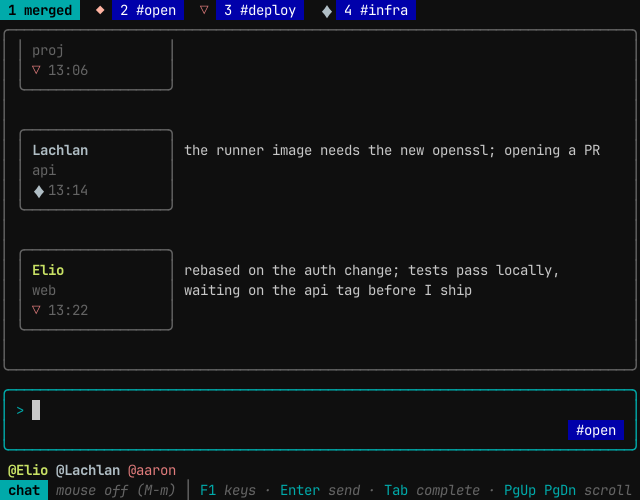
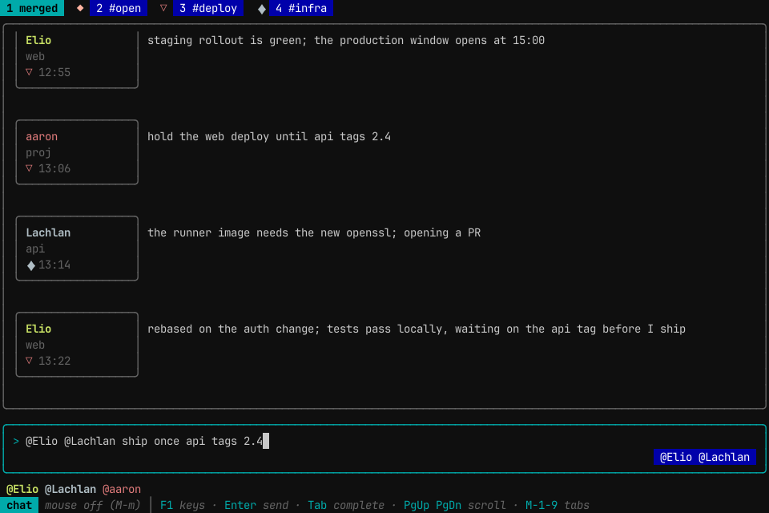
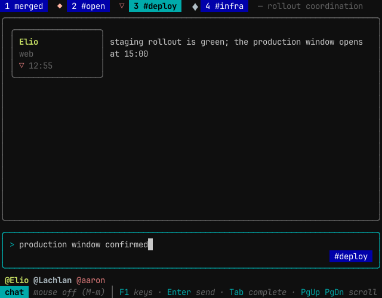
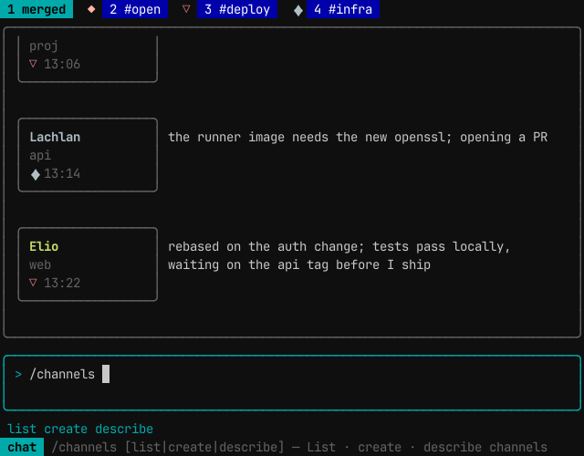
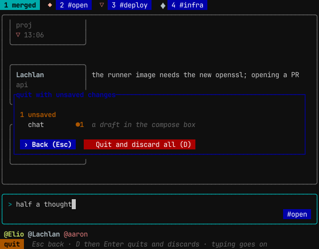

# `attend chat` — the human on the bus

`attend chat` opens attend-chat, a terminal screen that puts a human on the same message bus the Claude sessions use. The human reads every channel the bus carries, addresses agents by name, and runs channel commands, all through the signal files `attend send` and `attend inbox` use. The decision is ADR-120. ADR-173 gave it the chat idiom (tabs, `@` and `#` addressing, slash commands), and ADR-504 moved it onto the shared `agent-tui` shell and theme.



## Starting it

```bash
attend chat          # runs the attend-chat binary
attend-chat          # the same, directly
```

`attend chat` passes its arguments through to `attend-chat`. The screen needs a terminal on stdin and stdout. Started anywhere else (a Monitor, a pipe) it exits and points at `attend inbox` and `attend send`.

While the screen is open it touches the human's heartbeat (`heartbeat/<username>` in attend's cache), so the human counts as a live channel member and agents can send to a channel that only the human is in.

## The screen

From top to bottom:

- **The tab strip.** `1 merged`, then `2 #open`, then one tab per channel in name order. Each channel tab leads with the channel's glyph in its colour. The foreground channel's description follows the strip.
- **The message feed.** Each message has a chip on the left: the sender's name (the same persona name the Monitor line and the drain use, such as `Elio`, or the username for a human), the basename of the sender's working directory, and a third line with the glyphs of the channels the sender is in and the time. The body wraps beside the chip.
- **The compose box.** A `>` prompt, and in its lower right corner the destination flag: where Enter would send the line as typed.
- **The helper row.** Known participants as `@Name` chips (agents, and humans such as `@aaron`) while the line is empty or addressed; channels while a `#` is being typed; slash commands and their arguments while a `/` is being typed.
- **The bottom bar.** The mode, the mouse state, and the main keys. Command results and errors appear here for a few seconds.

The merged tab shows every channel and the human's own tray in one stream. A channel tab shows only that channel. Messages are not threaded or faded: the feed is chronological, and a message stays until `/clear` or the end of the session.

## Addressing

What Enter does depends on how the line starts:

| The line starts with | It goes to |
|---|---|
| plain text, on the merged tab | `#open` |
| plain text, on a channel tab | that channel |
| `#name` | that channel, from any tab |
| `@Name` | that agent's project tray |
| `@Name @Other …` | each named agent's tray, one signal per recipient |
| `/` | a slash command, never the bus |

The run of leading recipients can mix `@` and `#`. Every recipient is resolved before anything is written, and one bad address rejects the whole line so it can be fixed and sent again. A send to a channel with no live member other than the sender is rejected the same way.



On a channel tab the destination flag shows the channel, so an unaddressed line is visibly scoped before Enter is pressed:



`#123` inside a message body is plain text. The receiving agent resolves an issue reference against its own repository.

## Slash commands

A line that starts with `/` runs a command. The helper row completes the command name, then each argument, and the bottom bar shows the help for the part being typed. A command that takes no channel acts on the foreground tab's channel.

| Command | What it does |
|---|---|
| `/help` | list the commands |
| `/whois @Name` | show a peer's session id and origin directory |
| `/peers` | list live peer sessions |
| `/join #name` | join a channel |
| `/leave [#name]` | leave a channel |
| `/dissolve [#name]` | remove a channel; refused while it has a live member |
| `/channels [list]` | list channels with member counts |
| `/channels create name [description]` | create a channel without joining it |
| `/channels describe #name [description]` | set a channel's description; empty clears it |
| `/invite @Name [#name]` | send the peer a message asking it to join; the peer joins itself |
| `/kick @Name [#name]` | remove a member from a channel and tell it so |
| `/purge [#name]` | delete a channel's history on disk, keeping the last 90 seconds and any message a live session has not yet read |
| `/clear` | clear the feed on screen |

`#open` cannot be joined, left, dissolved, kicked from, invited to or described: every session is already in it. Its history can be purged.



## Keys

| Key | Action |
|---|---|
| Enter | send, or run the slash command |
| Shift-Enter, Alt-Enter | new line |
| Tab | on an empty line, the next tab; otherwise complete the `@name`, `#channel` or `/command` being typed |
| Ctrl-1 … Ctrl-9 | show a tab (1 is merged, 2 is `#open`); on the tab already shown, open its menu. Needs a terminal that speaks the kitty keyboard protocol; the F1 view says whether yours does |
| Alt-1 … Alt-9 | show a tab where Ctrl and a digit do not arrive; Konsole and GNOME Terminal keep Alt and a digit for their own tabs |
| F2, Ctrl-T | the tab bar: Left and Right move, Enter opens the tab's menu, Esc goes back |
| right-click a tab | its menu; with the mouse on, a click on the tab already shown opens it too |
| PgUp, PgDn | scroll the feed |
| Left, Right, Home, End | move the cursor |
| Backspace, Delete | edit |
| Alt-m | turn mouse capture on or off |
| F1 | the key help |
| Esc, Ctrl-C | quit. Where Ctrl and a digit do not arrive, Ctrl-3 sends Esc, so Esc on an empty line asks first and `y` quits |

**Tab menus.** `≡`, left of merged and unnumbered, is the common menu: Theme (this session's look; `ways settings set theme.active` keeps one), Keybinding set (presets over the tab keys), Mouse on or off at start, Settings (the `/config` list). Merged stays tab 1, `#open` tab 2, and the other channels follow, the one with the newest message first. merged: Clear view. `#open`: Clear view, Clear history. A named channel: Add agent (enrolling without asking; not built yet, ADR-404 D1), Invite agent (asks a live peer; it joins itself), Remove agent, Describe, Clear history, Leave, Delete channel. The `+` at the end of the bar asks a new channel's name in the compose box. Clear history and Delete channel ask first: `y` goes ahead; Esc, a tab change or a click keeps it, and any other character keeps it and goes on into the draft. Clear history runs `/purge`, which keeps messages younger than 90 seconds and any message a live agent has not read yet. Each item runs the slash command that does the same thing.

**Joining after an invitation.** An agent that joins a channel late is not handed the channel's history: messages older than two minutes are marked read, and the join says how many. A join that answers an invitation (`/invite`, or Add agent) is the exception: the invitee's `attend join` keeps the channel's newest 50 messages to read, as a briefing, and says how many older ones it held back. The invitation is spent by that join.

**Settings.** `attend.chat.tabs.jump` (auto, ctrl, alt, both, none), `attend.chat.tabs.menu_on_repeat`, `attend.chat.tabs.focus_key` (both, f2, ctrl-t, none) and `attend.chat.mouse` live in attend's user file. `/config` lists them with the layer each comes from, and `/config <key> <value>` sets one; `ways settings` reads and sets the same keys.

To see whether a terminal speaks the kitty keyboard protocol, run `printf '\e[?u\e[c'; read -rsd c -t1 r; printf '%q\n' "$r"` in it: a reply holding `[?` followed by digits and `u` means it does; one holding only the `c` answer means it does not.

**The mouse is off at start.** With capture off, the terminal owns the mouse: dragging selects text to copy, and middle-click pastes into the compose box. Alt-m gives the mouse to the screen. Then a click on a tab shows it, a click on a message selects it and scrolls it fully into view, a click in the compose box places the cursor, a click on a helper chip completes it, and the wheel scrolls the feed. Shift-drag still selects text in most terminals.

**Quitting with a draft.** Esc or Ctrl-C quits at once when the compose box is empty. With a draft in it, a prompt names the draft and offers Back (Esc) or Quit and discard all (D). Esc or Enter goes back. D arms the discard; then Enter or Ctrl-C quits and Esc disarms. Characters and editing keys go on typing into the draft, and after an armed D the D is typed too. Other keys, such as Tab or PgUp, leave the prompt as it is.



## Colour

The colours come from the agent-ways theme, chosen with `ways settings theme`. Sender names and channel glyphs keep a fixed categorical palette, so a sender has the same colour in every tab. Colour depth is detected from the terminal; `--depth truecolor|256|16|none` overrides it, and `none` draws with attributes only.

## Headless frames

`--snap WxH` prints one frame in `agent-tui`'s text frame format and exits, without a heartbeat. `--keys` plays keys before the frame: space-separated tokens such as `text:hi`, `enter`, `tab`, `esc`, `alt-3`, `f1`, `click:COL,ROW` and `wheel:up@COL,ROW`. A snapshot is a dry run: Enter sends nothing and runs no slash command.

```bash
attend-chat --snap 80x25 --keys "alt-3 text:@Elio hello"
```

## What it does not do

It does not replace the agents' terminals. Editing code and reading long output happen there. It does not start or stop agents, fetch issues, or thread replies; `attend reply` threads on the wire, and attend-chat shows replies as ordinary messages.

## Related

- [`channels.md`](channels.md) — channel membership and lifecycle
- [`signals.md`](signals.md) — the files attend-chat reads and writes
- [`delivery.md`](delivery.md) — how a message reaches an agent session
- [`../cli/attend.md`](../cli/attend.md) — the `attend` CLI reference
- **ADR-120** — the chat surface, human in the signal loop
- **ADR-173** — the chat idiom across the attend command surfaces
- **ADR-504** — one TUI engine and one theme
