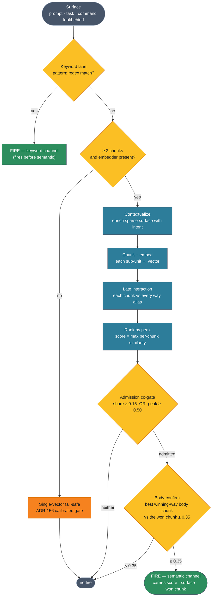
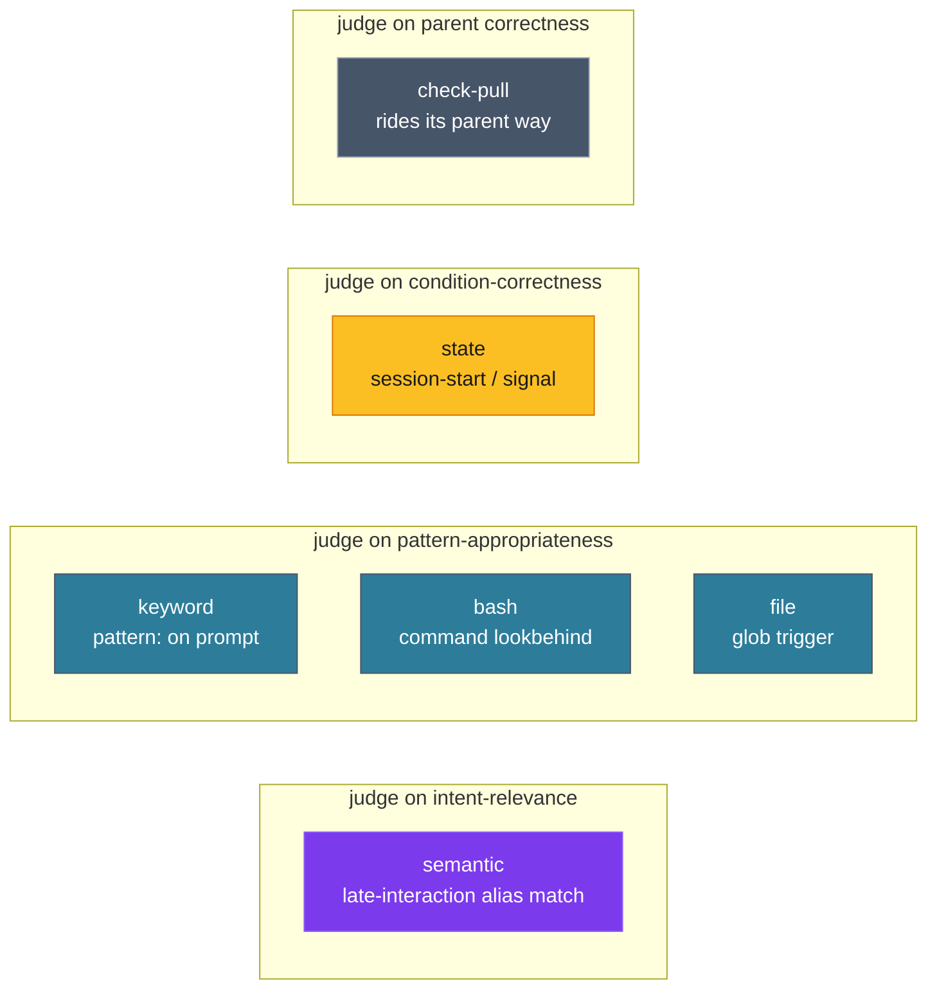

# Late-interaction matching — the flow

A visual companion to **ADR-160** (chunked late-interaction matching with
softmax-share gating). It diagrams two things this session settled by watching
the matcher run: the **per-surface evidence pipeline** that decides a semantic
fire, and the **multi-channel fire model** that explains why most fires you see
are *not* semantic.

## The evidence pipeline (one surface → fire / no-fire)

The pipeline is **lenient where it ranks** (a way is admitted on its strongest
single-chunk evidence) and **strict where it confirms** (the winning way's own
body must corroborate the chunk it won). Everything downstream of *Chunk* is the
late-interaction path; a surface too sparse to chunk, or a session with no
embedder, takes the single-vector fail-safe instead.

**Why the co-gate.** `share = Σ softmax-mass / n_chunks` caps a way that owns one
of N topics at ≈1/N, so on a topic-diverse prompt a specific single-chunk match
dilutes below any fixed share gate. Admitting on a decisive `peak ≥ 0.50`
recovers that match; the strict `body-confirm ≥ 0.35` then carries precision so
the looser admission does not leak noise. (`SOFTMAX_TAU = 0.08`, `TOP_K = 8`.)

## The multi-channel fire model

A way can fire through several channels, and **the channel decides how to judge
the fire** — not one rubric fits all. Keyword fires before semantic; a
session-start trigger fires on the session lifecycle, not on intent at all.

The trap a naive relevance classifier falls into: judging a **state** fire
(`meta/localize`, `softwaredev/freshness` at session start) by task-relevance.
Those fire *every* session start to run a gated check; the right question is
"did the gated macro surface — or correctly stay silent?", not "is this relevant
to what we're doing." An automated fire-evaluator has to route each fire to its
channel's rubric before scoring it.

## Reading it live

- `ways introspect fires --session <id>` — semantic fires only, score · surface ·
  way, lowest-score first. The suspect tail is `--max-score 0.55`.
- `ways introspect dump --session <id>` — every fire with its `trigger_channel`,
  the input to the channel-aware evaluation above.
- `ways match "<multi-sentence query>"` — authoring diagnostic: peak / share /
  confirm / outcome / won-chunk per candidate, without writing to the events log.
