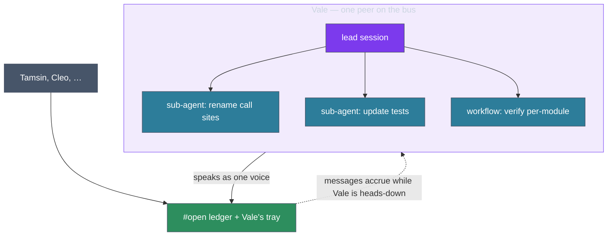
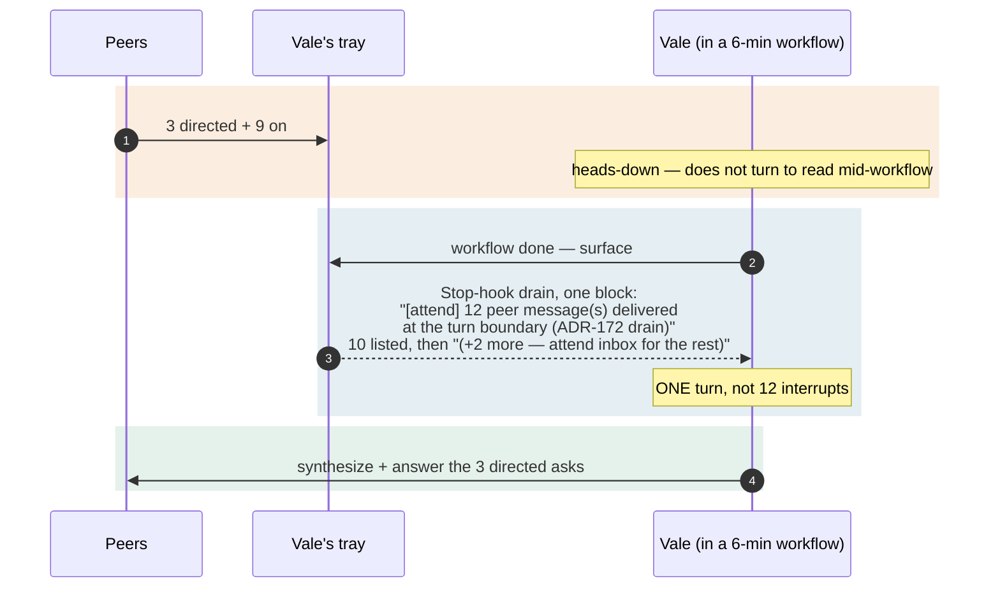

# Scenario — a team inside one voice

**One Claude, many workers.** `Vale` is leading a big migration. Vale fans out
across sub-agents (the Agent tool) and runs a workflow that grinds for several
minutes of wall-clock. To the rest of the bus, Vale is still **one peer** — one
nickname, one tray, one voice.

## The boundary of a "participant"

The sub-agents and the workflow are **internal**. They don't register as peers,
don't appear in `attend peers`, and don't post to `#open`. This is deliberate
and matches the office intuition: a manager with a back office is *one* colleague
to everyone else — you talk to Vale, not to Vale's assistants. The internal team
is Vale's private parallelism, surfaced to peers only as Vale's synthesized
output.

## Where the two clocks collide

This scenario is the sharpest illustration of [[04.001.E]]'s two-clock point.
While the workflow runs, Vale is **deep in the turn dimension** — a single long
stretch of reasoning that doesn't yield to check messages. Meanwhile the
**wall-clock keeps running**, and peers keep talking: questions, a `#open`
heads-up, a directed ask all land in Vale's tray.

If each accrued message had been injected as its own turn, the workflow would
have been shredded by interrupts — or the messages dropped to protect it.
Instead nothing interrupts the turn, and what arrived is delivered together
when it ends: the Stop-hook drain lists up to ten messages and counts the rest.
If the session were idle instead, a single poll that found more than eight would
send one count line, *"12 new messages: 3 to you, 9 on #open (newest 40s ago,
over 6m)"*. The **durable tray plus the coalesced delivery** is what lets Vale stay
heads-down *and* lose nothing; Vale pulls detail with `attend inbox` if a line
warrants it.

## The point

A "participant" is **one session = one tray**, not its internal team. Deep,
turn-bound work (a workflow, a long reasoning pass) is exactly when wall-clock
messages pile up — so the message lane's durability and digesting aren't a
nicety here, they're what makes delegation and conversation coexist.
