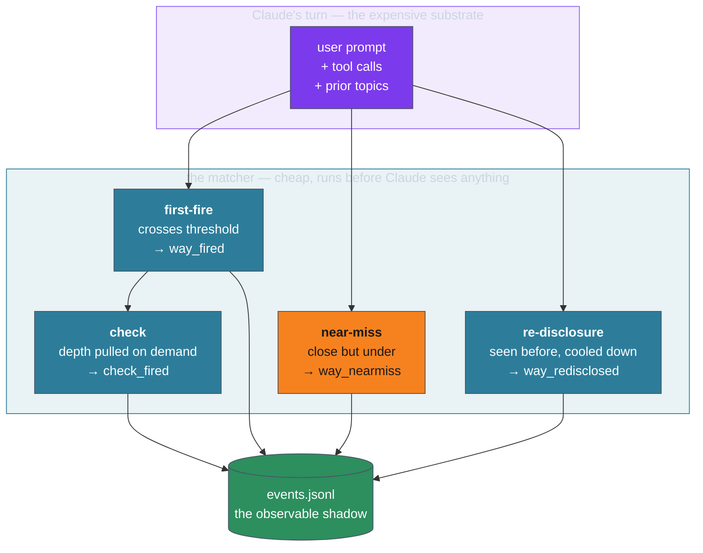

# How ways works — the model

When ways is doing its job, you don't notice it. A premise lands in Claude's
context at the moment it's relevant, Claude reasons with it, and the work moves
on. Nothing announces itself. That invisibility is the design working — but it
makes the system hard to *believe in*, because the help leaves no mark on the
conversation you can point to.

It does leave a mark somewhere else. **Every time a way fires, the cheap
substrate writes a line to `~/.claude/stats/events.jsonl`.** That append-only
record is the observable shadow of the cognitive loop: a turn-by-turn account of
which premises surfaced, why, and when. This cluster is about reading that
shadow — what it records, what it reveals about how ways helps, and how to pull
it out for a session of your own ([[01.019.E]]) or walk a real long one
([[01.018.E]]).

For the *design* — substrate separation, progressive disclosure, the ledger, the
awareness layer — read [the cognitive loop](../../cognitive-loop.md). This page
sits one level lower: not how the system is built, but how you *watch it run*.

## The five things the record captures

Each line is one event with a timestamp, a session id, a project, and a trigger.
Five event types, and each one is a distinct kind of help made visible:

| Event | What it means | What it tells you |
|-------|---------------|-------------------|
| `way_fired` | A premise crossed its threshold and was injected | The system decided this guidance was relevant *here* |
| `way_redisclosed` | An already-seen way surfaced again after its cooldown | The premise had faded from attention and was refreshed |
| `check_fired` | A depth-on-demand sub-way pulled in under a fired way | Claude got *more* detail because the situation warranted it |
| `way_nearmiss` | A way scored close to its threshold but did **not** fire | The boundary — what the system *almost* surfaced, and held back |
| `session_start` | A session began | The anchor every other event hangs off |

The first four are the load-bearing ones, and they map onto four distinct
behaviours worth understanding separately.

## Four behaviours, made observable

**First-fire — precision matching.** A way fires the first time its trigger
matches: a keyword in the prompt, a semantic embedding score over threshold, a
file being edited, a bash command about to run, a context-threshold crossed.
The trigger type is recorded verbatim (`keyword`, `semantic:embedding:en`,
`semantic:embedding:multi`, `state`, `bash`, `file`, `check-pull`). The mix of
trigger types across a session is the clearest single signal of *how* ways is
reaching Claude — a session dominated by `semantic` fires is being steered by
meaning; one dominated by `bash` and `file` is being steered by what Claude is
physically doing.

**Re-disclosure — habituation.** Once a way has fired, it is marked disclosed
and won't fire again until its cooldown — measured in *tokens of context
consumed*, not turns or wall-clock — expires ([[ADR-104]]). When the trigger
recurs after the cooldown, the way re-surfaces fresh as a `way_redisclosed`
event. This is the mechanism that keeps a long session from either drowning in
repeated guidance or silently losing premises it surfaced eighty turns ago. The
ratio of re-disclosures to first-fires is the signature of session *length*: a
short session is almost all first-fires; a multi-day session re-discloses its
core premises many times over. The cadence of that re-disclosure is itself
tunable from this data ([[ADR-123]]).

**Near-miss — the threshold boundary.** When a way scores within a small margin
of its effective threshold but doesn't clear it, the matcher records the
would-be fire — its English and multilingual scores, both thresholds, and the
margin by which it missed ([[ADR-134]]). Near-misses are the only window onto
*false silence*: the guidance that almost helped and was held back. They are
invisible in the conversation and invisible in the TUI replay; the JSON dump
([[01.019.E]]) is the only way to see them. A way that near-misses constantly is
a vocabulary-tuning opportunity; a near-miss right before a mistake is a
threshold set too high.

**Check — depth on demand.** Some ways are trees: a parent premise fires, and
under it sit *checks* — finer-grained sub-ways that pull in only when their own
trigger matches in the window the parent opened. A `check_fired` event means
Claude didn't just get "think about code quality," it got the specific
sub-premise about, say, performance or supply-chain, because that's what the
moment called for. Checks are how progressive disclosure goes *deep* without the
parent way having to carry every detail at all times.

## Why the record is trustworthy

The events are written by the same code path that does the matching, at the
moment the decision is made — not reconstructed after the fact, not inferred from
the transcript. The `fire_score` on a first-fire is the exact embedding score
that cleared the threshold; the near-miss scores are the exact scores that
didn't. This is persistence of a decision already made, not new computation
([[ADR-134]]). What you read back is what actually happened.

The one caveat worth holding: re-disclosure thresholds shown in a *replay*
reflect each way's curve as it stands *today*, because the curve lives in the
way's frontmatter, not in the event line. If you've retuned a curve since the
session ran, the replay shows the new value. Everything else — what fired, when,
at what score, against what threshold — is frozen at the moment it happened.

## Where this sits

- **The design behind all of this:** [the cognitive loop](../../cognitive-loop.md)
  and the ADRs it cites.
- **The same model in a real long session:** [[01.018.E]] walks a 97-hour,
  78-way session and shows each of the four behaviours in its actual numbers.
- **Pulling the record yourself:** [[01.019.E]] covers `ways list`, `ways stats`,
  and `ways rethink --json` — what each shows and what the data means.
