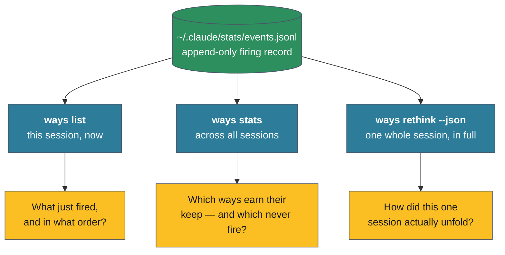

# Reading the session data yourself

[[01.017.E]] explains *what* the event record captures; [[01.018.E]] walks one
session through it. This page is about getting the record into your own hands —
which command answers which question, and what the data means once you have it.

Everything here reads the same append-only log the matcher writes to,
`~/.claude/stats/events.jsonl`, plus each session's transcript for token
positions. Nothing here changes state; these are all observation commands. (For
the full command reference, see [the ways CLI reference](../../reference/ways-cli.md).)

## Three lenses, three questions



**`ways list` — what fired this session, right now.** Run after a turn to see the
table of ways that have fired so far: epoch, match distance, trigger type,
re-disclosure eligibility, and which agent received each. This is the live view —
the immediate "did the way I expected actually fire?" check. Add `--json` for the
machine-readable form.

**`ways stats` — which ways earn their keep.** Aggregates fires across sessions
into a ranked frequency chart with a trigger-type breakdown. This is the lens for
*the corpus*, not a session: it surfaces the ways that fire constantly (candidates
for tuning down) and the dead vocabulary that never fires at all (candidates for
re-authoring or removal). Scope it with `--days N`, `--global`, or run it inside a
project to scope to that project.

**`ways rethink --json` — one whole session, in full.** This is the deep lens, and
the one built for programmatic reading. Where the interactive `ways rethink`
*animates* a session's timeline in a TUI, `--json` dumps the entire reconstructed
timeline as a single document — no terminal required, so it runs in scripts and
headless contexts where the animation can't. It is also the **only** view that
surfaces near-misses; the animation omits them.

## What the dump contains

```
ways rethink --json                   # most recent session in scope
ways rethink --session <id> --json    # a specific session
```

The output is one JSON object with four parts:

| Field | Contents |
|-------|----------|
| top-level | `session`, `project`, `context_window_k` |
| `summary` | epoch count, duration, distinct ways, total fires, re-disclosures, checks, near-misses, the trigger breakdown, and the top ways by fire count |
| `frames` | the turn-by-turn timeline — each frame has its epoch, timestamp, token position, the cumulative set of active ways (with per-way trigger, fire epoch, check count, and new / re-disclosed flags), and a `new_events` list of what changed that turn |
| `near_misses` | every way that scored close but didn't fire — with its English and multilingual scores, both thresholds, the margin, and the epoch it occurred in |

The `summary` is the at-a-glance shape of the session — the five numbers that open
[[01.018.E]] come straight from it. The `frames` are the replay. The `near_misses`
are the part you can't see any other way.

## Reading it with jq

The dump is built to be sliced. A few recipes, each framed by the question it
answers:

```bash
# The shape of the session at a glance
ways rethink --session <id> --json | jq '.summary'

# How was this session steered? (trigger mix)
ways rethink --session <id> --json | jq '.summary.trigger_breakdown'

# What fired turn by turn — just the changes, not the running totals
ways rethink --session <id> --json \
  | jq '.frames[] | select(.new_events|length>0) | {epoch, token_position_k, new_events}'

# Which ways almost fired most often? (tuning candidates)
ways rethink --session <id> --json \
  | jq '.near_misses | group_by(.way)
        | map({way: .[0].way, near_misses: length})
        | sort_by(-.near_misses)'

# The closest misses — smallest margin first (threshold-too-high candidates)
ways rethink --session <id> --json \
  | jq '[.near_misses[]] | sort_by(.margin) | .[:10]'
```

## What the numbers mean

A few readings that turn raw fields into judgement:

- **Re-disclosures ≫ first-fires** is the signature of a *long* session — premises
  refreshed across context pressure and compaction, exactly as
  [[ADR-104]] intends. A session that's nearly all first-fires was short.
- **A trigger mix dominated by `semantic`** means the session was steered by
  *meaning* — Claude's intent matched ways without anyone having anticipated the
  keyword. A mix dominated by `bash`/`file` means it was steered by what Claude
  physically did. Neither is wrong; they're different shapes of work.
- **A way with many near-misses and few fires** is brushing the work without
  matching it — a vocabulary-tuning opportunity. **A near-miss with a tiny margin
  right before a mistake** is a threshold set too high. Both feed the empirical
  tuning loop ([[ADR-134]]); `ways tune-curves` and `ways tune-precision` read the
  same log to suggest the adjustments.
- **`context_window_k`** anchors every token figure. The same way re-discloses far
  more often in a 200K window than a 1M one, because the token-gated cooldown is a
  fraction of the window — so always read fire counts against the window size.

## Where this fits

The event log is the *telemetry* layer — fine-grained, per-fire, recent (it
tail-compacts past ~32 MiB, so it forgets its oldest tail). It is not the durable
memory of the project; that's the **session ledger** ([[ADR-112]]), which records
*what was understood* rather than *what fired*. The two are complementary: the
ledger is the journal, the event log is the instrument trace. This cluster is
about the instrument trace — for the journal and the rest of the architecture,
read [the cognitive loop](../../cognitive-loop.md).
