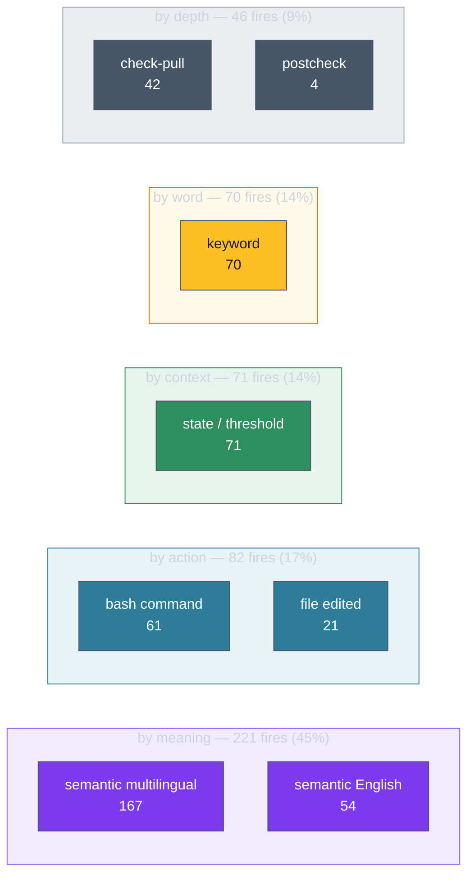

# A long session, read through ways

The model in [[01.017.E]] describes four behaviours in the abstract. This page
takes one real, recorded session and shows all four in their actual numbers —
the kind of session ways was built for, long enough that every mechanism gets
exercised.

The session: ninety-seven hours of work on a knowledge-graph project, spread
across many sittings under a one-million-token context window. Pulled with
`ways rethink --session <id> --json`, its summary reads:

```
epochs            342        distinct ways      78
duration          97h        total fires       490
re-disclosures    276        checks fired       95
near-misses       821
```

Those five numbers already tell the story the conversation can't: across 342
turns the record logged roughly **1,700 events** — 861 times surfacing a premise
(fires, re-disclosures, and checks) and **821 times deciding to stay quiet** at
the threshold's edge. The help is as much in what it held back as in what it
surfaced.

## Turn one: orientation before a word is typed

The very first event, at token position zero, is `softwaredev/freshness` firing
on a `state` trigger — before the user's first prompt is even matched. Nothing
semantic happened yet; the way fired because the *situation* (a fresh session in
a project with derived artifacts) matched a state condition. This is ways doing
the cheapest, earliest thing it can: orienting Claude to the project's standing
concerns before the work defines itself.

## The trigger mix: how this session was steered

Across all 490 fires, the trigger breakdown is:



Nearly half of all guidance reached Claude through **meaning** — the matcher
embedding the prompt and finding ways whose vocabulary scored over threshold.
This is the layer that needs no keyword to have been anticipated: Claude
describing intent in its own words, and the right premise surfacing anyway. The
rest is split across what Claude *did* (bash/file), where the session *was*
(state/threshold), exact *words*, and ways pulling in their own *depth*
(check-pull). A session steered this way isn't following a script; it's being
met where it is.

## Re-disclosure: the same premise, kept alive for 97 hours

`softwaredev/delivery/branching` fired once and then **re-disclosed 19 times**.
Each refresh happened after roughly 100K tokens of context had passed since the
last one — its token-gated cooldown ([[ADR-104]]). But the token positions where
it re-disclosed aren't a clean rising line; they sawtooth:

```
172K → 317K → 431K → 549K → 180K → 277K → 223K → 360K → ...
```

That drop from 549K back to 180K is a **compaction**. Over 97 hours the context
window filled and was distilled many times; each time, the token counter fell,
and the branching premise — having survived in the ledger and the matcher's
bookkeeping but faded from the working window — re-surfaced fresh on the far
side. This is the single clearest picture of why long sessions need
re-disclosure at all: without it, the premise Claude saw at hour two would be
gone by hour twenty, buried or compacted away, and nothing would bring it back.
The `delivery/github` way tells the same story (17 re-disclosures), as do
`freshness`, `meta/memory`, and `compaction-checkpoint` (13–15 each) — the
session's standing concerns, refreshed on a cadence the cheap substrate manages
so Claude doesn't have to.

By the final turn, all 78 distinct ways had been disclosed at least once. (In the
record, a frame's active set is *cumulative* — every way that has ever fired
stays listed, with flags marking what was new or re-disclosed that turn; what
changed each turn is the short `new_events` list, not the running total.)

## Checks: going deep only when the moment asked

The session fired 95 checks. The `softwaredev/code` check alone fired **44
times** — every time Claude was working in code under the broad code-quality
premise, the matcher pulled the specific sub-premise that fit. Behind it:
`makefile` and `architecture/design` (8 each), `deps` (8), `performance` (7),
`supplychain` (6), `security` (5), `migrations` (5). None of these were carried
in Claude's context the whole time. They arrived when the work touched their
subject and left the running set otherwise — depth on demand, not depth always.

## Near-misses: the 821 decisions to stay quiet

The largest single category of events isn't a fire at all — it's the **821
near-misses**, ways that scored close to their threshold and were held back. They
cluster tellingly:

| Near-missed way | Times | What it means |
|-----------------|-------|---------------|
| `code/security/injection` | 27 | Injection-risk guidance hovered at the edge all session |
| `code/supplychain/sourceaudit` | 27 | Source-audit depth kept almost-qualifying |
| `code/security/auth` | 25 | Auth guidance, repeatedly near the line |
| `environment/config` | 25 | Config-handling premise, just under |

These are deep, specialized ways whose vocabulary kept *brushing* the work
without quite matching it. That's the matcher being honest about precision: it
would rather stay silent than fire `security/injection` into a session that only
glancingly touched the topic. But the record makes the trade-off *visible* — and
that's the point. A concrete example from this session: at epoch 26,
`architecture/adr/migration` logged a `way_nearmiss` — its multilingual relevance
probability `prob_multi` landed at **0.4812** against the global semantic fire
threshold **τ_s = 0.5**, a `margin` of **0.0188** below it (inside the
`near_miss_margin` of 0.05, which is what marks the score a near-miss rather than
plain silence). It missed by under two hundredths. If that miss sat right before a
migration mistake, it's evidence the way's alias undershoots on genuinely
migration-shaped prompts — a signal to edit its vocabulary and re-measure, not to
move a threshold: firing is the global τ_s on the calibrated `g(s)`, and there is
no per-way threshold to raise (see
[engine-reference.md](../../hooks-and-ways/engine-reference.md)). If the session
never did a migration, it's the precision discipline working exactly as intended.
Either way, you can now *see it* and decide — which is the whole basis of the
empirical tuning loop ([[ADR-134]]).

## What the session shows

Read end to end, the record makes a claim the conversation never could: ways
helped this session not by issuing instructions but by *managing attention* over
ninety-seven hours — surfacing the right premise on a state trigger before work
began, meeting Claude's intent through meaning 221 times, refreshing the
half-dozen standing concerns across every compaction, going deep into code
specifics 95 times only when the work asked, and staying silent 821 times when
it didn't. To pull this same record for a session of your own, see [[01.019.E]].
