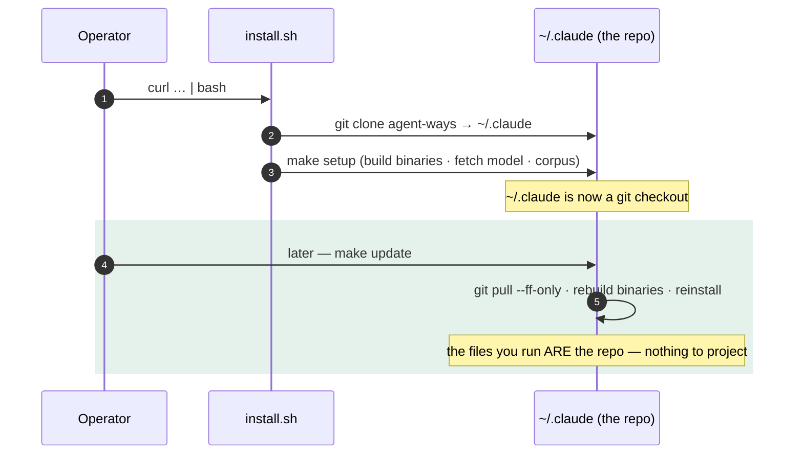

# Scenario — the in-place install

> ⚠️ **Historical (pre-1.0).** The in-place topology — `~/.claude` *is* the git clone — is
> **superseded** by the 1.0 native projection ([[ADR-142]]). A pre-1.0 in-place clone
> migrates to the projection with `ways migrate`; see the
> [Migration Guide](../../migration-1.0.md). Kept as a record of how the model evolved.

**A greenfield machine: no existing `~/.claude` worth keeping.** The simplest, default
shape — the repo *is* your config dir, and `git pull` is the entire update story.

## How it plays out

## What each move is doing

- **The installer clones straight into `~/.claude`.** Because nothing valuable was
  there, the directory simply *becomes* the repo. No projection step exists — there's
  nothing to copy from one place to another.
- **`make update` is pull + rebuild + reinstall.** It pulls the latest commits,
  rebuilds the binaries that changed, and re-runs install. One command, because there's
  only one copy of everything.
- **Drift is impossible by construction.** The files Claude Code loads and the files in
  the repo are the *same files*. `git status` in `~/.claude` is the truth; there is no
  "installed but stale" state to detect.
- **The update checker just runs git in place.** It classifies the clone (or fork) and
  nudges you when you're behind upstream — no markers, no indirection.

## The point

This is the topology to choose when you can. Its whole virtue is that there's nothing
to keep in sync: one repo, one update command, no second moving part. It's the baseline
the other topology ([[01.016.E]]) has to work to match — and the reason the in-place
shape stays the default. The decision context is [[ADR-140]]; the conceptual overview
is [[01.014.E]].
