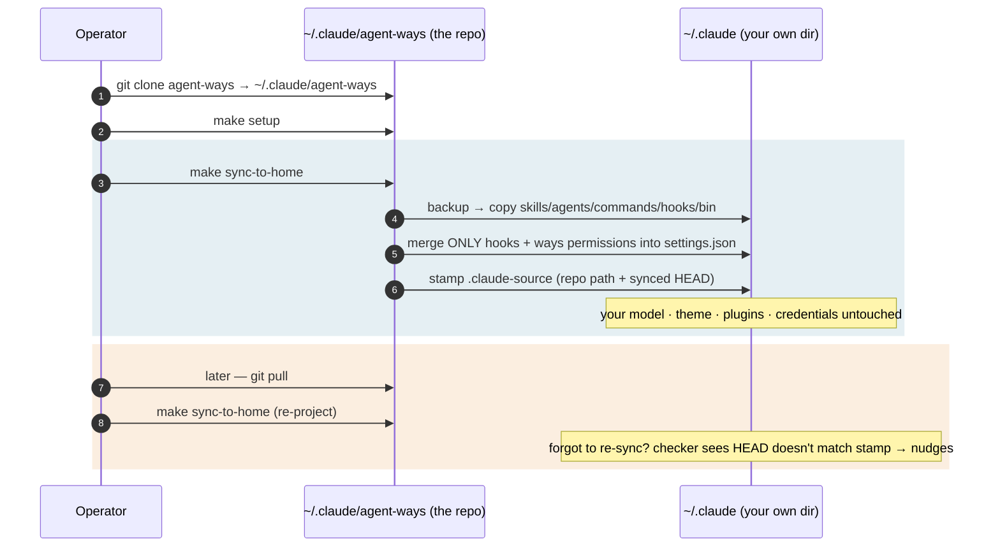

# Scenario — the subdirectory install

> ⚠️ **Historical (pre-1.0).** The subdirectory topology (`make sync-to-home`) existed to
> keep an existing `~/.claude` intact. The 1.0 native projection ([[ADR-142]]) does that by
> default, so this topology is **superseded** — `ways migrate` moves an existing subdirectory
> install to the projection. That command left the binary in 1.9.0 ([[ADR-179]]) and now runs
> from the `ways-v1.8.3` tag. See the [Migration Guide](../../migration-1.0.md). Kept as a
> record of how the model evolved.

**An operator who already has a `~/.claude` they value installs agent-ways without
giving it up.** The repo lives in a subdirectory; `make sync-to-home` *projects* its
outputs up into the existing `~/.claude`, which stays the operator's own directory.
This is the non-destructive path the installer's conflict menu offers first.

## How it plays out

## What each move is doing

- **The repo never touches `~/.claude` wholesale.** `make sync-to-home` copies the
  repo-owned trees in and merges *only* the hooks block and ways permissions into your
  existing `settings.json`. Your model, theme, plugins, and credentials are never read
  or rewritten. It backs up first, to `~/.claude/backups/`.
- **Projection is deterministic, and it's a `make` target.** The logic lives in a real
  script behind `make sync-to-home`, not in prose a command improvises — so it's the
  same every run, testable, and runnable without an agent. The `/sync-to-home` skill is
  just a thin wrapper that drives it with consent and a report.
- **Copy is the default; symlink is the opt-in.** `make sync-to-home` *copies* — robust
  everywhere, including Windows and low-privilege machines ("it copied files in" is a
  model that survives). `make sync-to-home-link` *symlinks* the trees instead, so a
  future `git pull` is the whole update with no re-sync — at the cost of symlink
  fragility where they need admin/developer-mode.
- **Copies don't delete, so a manifest prunes orphans.** A way or skill removed
  upstream would otherwise linger in `~/.claude` forever. The sync records what it
  projected and, next run, removes only files a prior projection wrote that are gone
  from source — never your own files in the same shared directories.
- **The cost of this topology is the second step — so the install makes it
  observable.** `make sync-to-home` stamps a `.claude-source` marker with the repo's
  path and the HEAD it projected. Because `~/.claude` isn't itself a repo, the update
  checker follows that marker to the real repo to check "behind upstream," and compares
  the repo's current HEAD to the stamp to catch "pulled but not synced." Drift that
  would otherwise be silent becomes a nudge.

## The point

The operator keeps everything they had and still gets agent-ways, fully. The price is
honest — one extra command per update — and the system refuses to let that price turn
into silent rot: it nudges when you're behind *and* when you've pulled but not
re-synced. That observability is what earns the subdirectory shape its place as a
first-class topology rather than a fragile workaround. The simpler sibling is
[[01.015.E]]; the model is [[01.014.E]]; the decision is [[ADR-140]].
