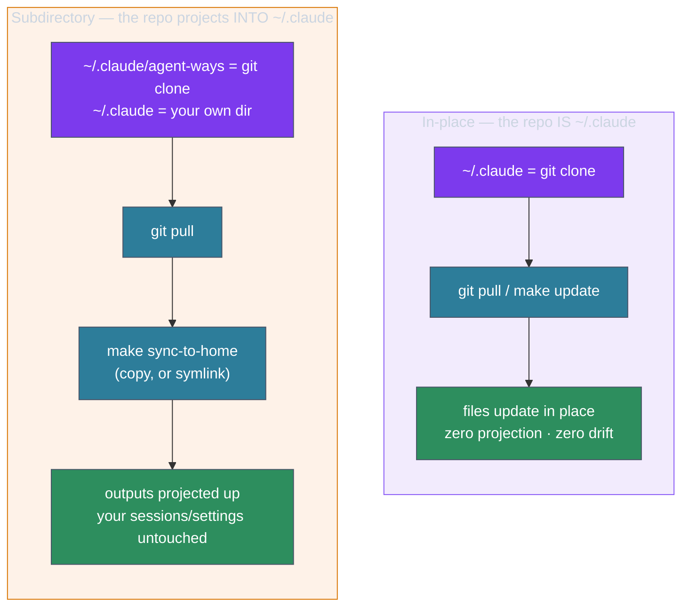

# The two install topologies — the model

> ⚠️ **Historical (pre-1.0).** agent-ways 1.0 supersedes *both* topologies below with a
> single **native projection**: `~/.claude` becomes a thin projection of an XDG app whose
> source lives in `$XDG_DATA_HOME/agent-ways` ([[ADR-142]]). There is no longer a topology
> *choice* to make. This page is kept as a record of how the model evolved — for installing
> or migrating today, see the [Migration Guide](../../migration-1.0.md) and
> [install-guide](../../install-guide.md).

agent-ways can live in your `~/.claude` in one of two shapes. They are not two
products — they are two *topologies* of the same install, and which one you're on
decides exactly one thing day to day: **how you update.** Everything else — ways,
skills, the binaries — behaves identically.

## The invariant, and the one place it bends

The original, default shape holds a simple invariant: **the repo *is* your
config.** `~/.claude` is the git clone. That's why `git pull` is the whole update,
why `git status` tells the truth, and why there's no such thing as "drift" — the
files you run *are* the files in the repo.

That invariant is also a wall for one kind of adopter: someone who already has a
`~/.claude` they care about — sessions, credentials, their own `settings.json` —
and won't turn it into a clone of someone else's repo. For them the invariant
bends: the repo moves into a *subdirectory*, and its outputs are **projected** up
into `~/.claude`, which stays their own directory.

## How to pick

- **Greenfield, or you want the least to reason about → in-place.** One repo, one
  command, no drift. This is the default and what the installer does when `~/.claude`
  is empty.
- **You already have a `~/.claude` you value → subdirectory.** Non-destructive: your
  config stays yours. The cost is a two-step update (`git pull` *then*
  `make sync-to-home`) — which the install surfaces and nudges you about, so a missed
  sync can't silently rot.

Within the subdirectory topology there's a second, smaller choice — **copy vs
symlink** — covered in [[01.016.E]].

## Why two and not one

Forcing every adopter onto the in-place shape would have meant telling the
existing-config user to clobber or move their directory aside — a destructive choice
at the worst moment. Supporting both, as first-class and *observable*, is what lets
the framework reach people who'd otherwise bounce off the install. The decision and
its trade-offs are recorded in [[ADR-140]]; the two day-to-day experiences are walked
through in [[01.015.E]] (in-place) and [[01.016.E]] (subdirectory).
