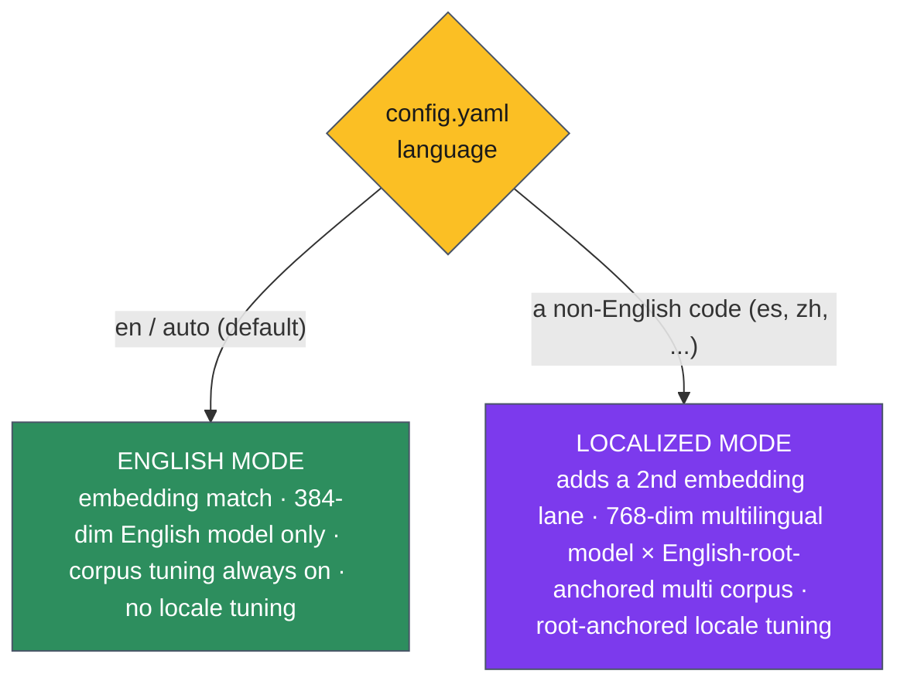

# Adopter localization — the model

This is the **explanation** companion to [[ADR-139]] (the decision to shelve
maintainer-maintained i18n and make localization adopter-run) and the evidence record
[[ADR-183]] (the tuning mechanics). The ADR argues *why*;
these pages show *how the system behaves* for a real adopter — from a fresh install,
through switching languages, to the steady state.

If you read nothing else, read this page, then [[01.011.E]] (the language switch). The
numbered scenarios are independent — pick the one that matches your situation.

## The one distinction everything hangs on

agent-ways runs in one of two **modes**, and a single flag decides which.

- **English mode** is the default and the 99% case. The English corpus is still built
  and **tuned** — a new way, or a way whose `description`/`vocabulary` materially
  changes, recomputes its embedding and re-verifies its match and sibling
  discrimination (the semantic-intent decision belongs to the English root either way).
  What is **dormant** is the *locale* layer: nothing extra downloads, the heavier
  multilingual model is never loaded at match time, and there is no locale-alias tuning.
- **Localized mode** is what an adopter opts into. It is **explicit work**, performed
  once by the `ways-localize` skill, that flips the flag and builds the localized layer
  on top of the unchanged English root.

## Two flags, and the operator between them

Localization touches **two** different configs, and conflating them is the most common
confusion:

| Flag | Lives in | Means | Written by | Read by |
|---|---|---|---|---|
| `language` | Claude Code `settings.json` | CC's **response** language | the operator, or ways-localize as its last step | Claude Code |
| `language` | agent-ways `config.yaml` (`ways.language`) | ways **intl mode** | **`ways-localize`** | corpus build · matcher · tuning |

Nothing connects them automatically. Setting CC to Spanish changes how Claude answers
and leaves ways in English mode. It must never, by itself, trigger a 127 MB model
download and a translate-everything pass; localization is deliberate, consented work.
The operator bridges the two by asking for ways in their language, which triggers the
`ways-localize` skill ([[01.011.E]]).

## The English root never moves

Whatever the mode, **English is the source of truth.** A localization is a *derivation*
validated against the English root, never a co-equal sibling — that is what keeps a
multilingual install from becoming a free-for-all with no fixed meaning. The mechanics
(root-anchored fidelity, the mode gate, the match-compute saving) are in
[[01.013.E]] and [[ADR-183]].

## The scenarios

| # | Scenario | The thing it shows |
|---|----------|--------------------|
| [[01.010.E]] | The English-native install | The default path — nothing to flag, nothing to do |
| [[01.011.E]] | The language switch | Operator asks → consent → ways-localize → localized |
| [[01.012.E]] | Steady-state authoring | English root + one localization, maintained together |
| [[01.013.E]] | The mode gate | The mechanism: one flag, two modes, root-anchored tuning |
