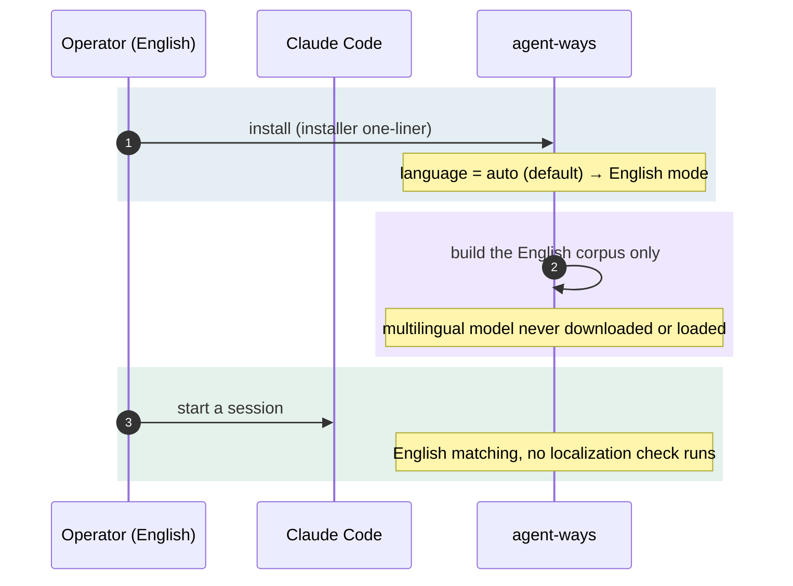

# Scenario — the English-native install

**An English-speaking operator, Claude Code in English, installs agent-ways.** This is
the default and the overwhelming-majority case. The point of the scenario is that
**nothing happens**, and that the nothing is by design.

## How it plays out

## What each move is doing

- **English mode is the default.** ways' `language` setting ships as `auto`, which
  means English mode, as do `en` and an unset value. There is no step to opt into;
  English is the built state.
- **The build is English-only.** The installer fetches one model, the 384-dim English
  model, and builds one corpus. The 127 MB multilingual model is fetched on demand,
  and nothing has demanded it.
- **Nothing checks for a mismatch.** ways does not compare its language with Claude
  Code's. An operator who later wants another language asks for it
  ([[01.011.E]]).

## The point

The default install pays nothing for a capability it does not use. An English operator
never sees a localization prompt, never downloads a second model, and never pays
multilingual match compute. The adopter-run model ([[ADR-139]]) puts the cost on
whoever asks for the benefit.
