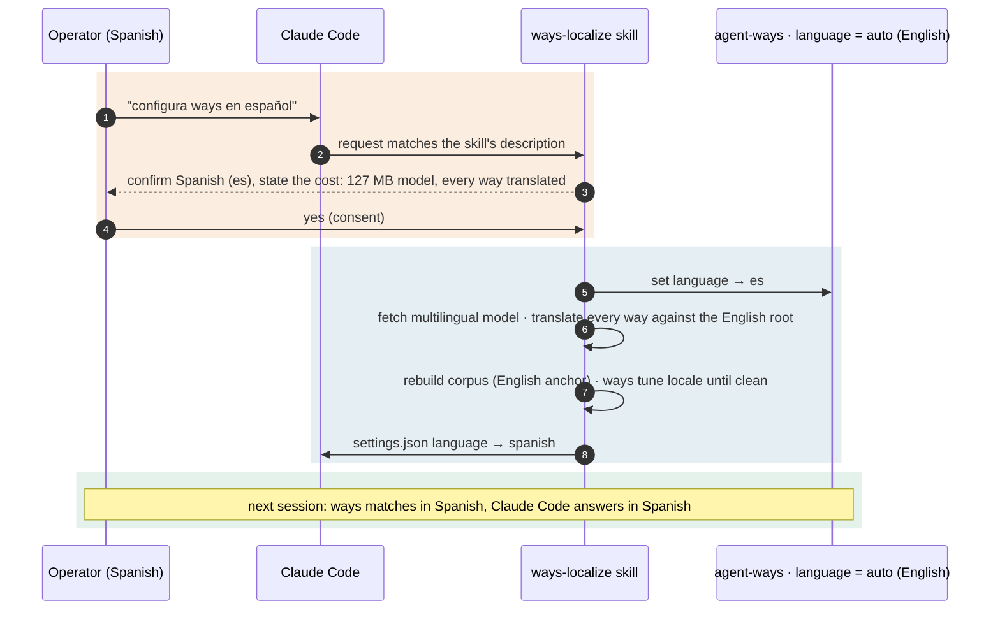

# Scenario — the language switch

**A Spanish-speaking operator wants ways in Spanish.** This is the path the
adopter-run design exists to serve: the operator asks, the `ways-localize` skill
confirms the cost, and only on consent does ways localize itself.

## How it plays out

## What each move is doing

- **The operator asks; nothing asks for them.** ways does not watch Claude Code's
  language. Setting `settings.json language: spanish` on its own changes Claude
  Code's replies and leaves ways in English mode. The request "set up ways in
  Spanish", in any language, is what starts localization: the `ways-localize`
  skill's description is written to match it. There is no automatic cascade from
  "CC is Spanish" to a model download and a translation pass.
- **The skill asks permission before the heavy part.** Localization is expensive: a
  127 MB model download, a translate-every-way pass and a tuning loop. The skill
  confirms the language against the registry, states that cost, and waits for a yes.
- **On consent, `ways-localize` does the work and flips the flag.** It sets ways'
  `language` to `es`, fetches the multilingual model, translates each way's
  `description` and `vocabulary` against the **English root**, rebuilds the corpus
  with the English anchor, and runs `ways tune locale` until the Spanish layer is
  clean: aligned to the root, with no collisions (see [[01.013.E]]).
- **Claude Code follows last.** The skill sets Claude Code's own `language` to
  `spanish` and reports in Spanish. Both take effect next session.

## The point

The operator gets a localized experience when they ask for one, pays its cost
themselves as the beneficiary, and is the native speaker best placed to judge the
result. After this, the install sits in localized steady state ([[01.012.E]]).
