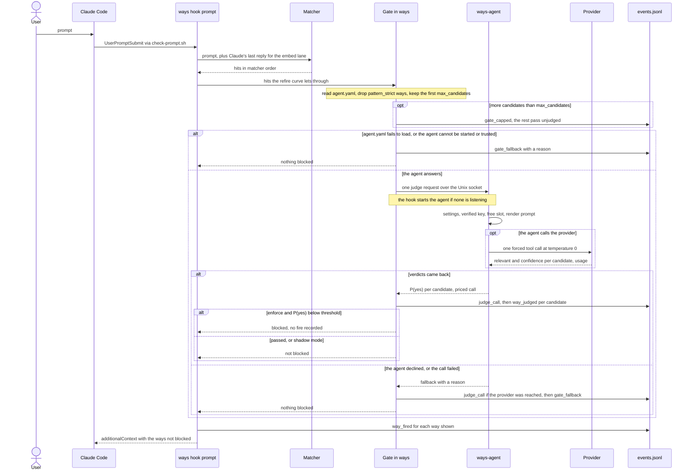

# The relevance judge — the model

The matcher picks ways by their words and embeddings. It can tell that a prompt touches a way's vocabulary. It cannot tell whether the conversation is doing that way's work. Measured on live sessions, about one injected way in ten was relevant, and the matcher's own score separated the relevant fires from the rest no better than chance. A hosted model asked "is this guidance relevant to the most recent turns, yes or no" separated them well. The evidence is [ADR-195](../../architecture/ways/ADR-195-evidence-a-yes-no-relevance-judge-over-live-way-fires.md) and the probe behind it, [the yes/no relevance gate probe](../../research/yesno-relevance-gate/README.md). The decision to build the gate is [ADR-196](../../architecture/ways/ADR-196-a-yes-no-relevance-gate-on-way-injection-judged-by-a-hosted-model.md).

So a second stage sits between matching and injection. The matcher proposes candidates and the judge can veto them. The judge never adds a way the matcher did not pick, and when it cannot answer, the matcher's decision stands.

This set has three pages:

- this one, on where the judge sits, what it judges, and how it fails;
- [what the judge sends and what it costs](what-the-judge-sends-and-costs.md): the text that leaves the machine, key custody, the agent process, and spend;
- [watching and tuning the judge](watching-and-tuning-the-judge.md): whether it is on, the events, the session screen, and the settings worth tuning.

## The flow

Step by step:

1. On each prompt, Claude Code runs `check-prompt.sh`, which calls `ways hook prompt`. The hook reads the reply that the Stop hook recorded for the previous turn and passes it to the matcher with the prompt.
2. The matcher's keyword and embedding lanes produce hits, and they are ordered: explicit triggers first, parents before children, siblings by score.
3. Hits that the refire curve would hold back are dropped before the gate. They would not be shown, so they are not sent.
4. The gate reads `agent.yaml`. With no engine named and no key file for any provider, or with `gate.mode: off`, it stops here and logs nothing.
5. Ways marked `pattern_strict` are not judged. The rest are taken in matcher order up to the profile's `max_candidates`. Any overflow is logged as `gate_capped` and passes unjudged.
6. The hook sends one request to the ways agent over a Unix socket, starting the agent if none is listening. The request carries the conversation turns and, for each candidate, the way's path and description.
7. The agent re-reads its settings, confirms the key passed its last check, waits for a free provider slot, and renders the prompt.
8. The agent makes one call to the provider, Anthropic or OpenRouter, that forces a `record_judgements` tool answer at temperature 0. Each candidate gets `relevant` and `confidence`, which become P(yes): the confidence of a yes, or one minus the confidence of a no.
9. The hook logs the call as `judge_call` and each verdict as `way_judged`. In enforce mode, a way with P(yes) below the threshold is blocked.
10. Blocked ways are skipped before their fire is recorded, so no `way_fired` line is written and the way keeps its refire budget. The rest are injected as `additionalContext`.

## What it judges

The judge covers two lanes, both of which carry text the operator typed:

- the prompt lane (`UserPromptSubmit`);
- the queued-message lane: messages typed while Claude is working, which never reach `UserPromptSubmit` and are scanned at the next `PostToolUse` ([ADR-161](../../architecture/ways/ADR-161-queued-mid-turn-operator-messages-as-an-aggregated-scan-surface.md)). This lane has no assistant reply to send.

The judge does not cover the command, file, task, state and subagent lanes, the session-start core, or any way marked `pattern_strict`. A Monitor notification that arrives as a prompt is skipped before matching, so it is never judged.

`ways scan prompt` runs the same path as the hook. With a key configured, each run calls the judge, may be billed, and logs its events under the session it names.

## Modes

`gate.mode` decides what a verdict does:

| Mode | Judges | Blocks | Logs |
|---|---|---|---|
| `enforce` | yes | P(yes) below threshold | `way_judged` with `verdict: block` |
| `shadow` | yes | nothing | `way_judged` with `verdict: would_block` |
| `off` | no | nothing | nothing |

`enforce` is the default. Adding a provider key turns the gate on: once the key has passed a check, the next judged prompt enforces. ADR-196 §6 treats a working key as the operator's approval to gate. Shadow mode makes the same provider calls as enforce; [what leaves the machine](what-the-judge-sends-and-costs.md#what-leaves-the-machine) says how to stop them.

## Threshold and cap

Each engine profile carries its own threshold, because each model's confidence sits on its own scale. The shipped profiles use 0.3 for Claude Haiku 4.5, the operating point ADR-195 measured. A verdict with P(yes) at or above the threshold passes.

A judge call takes about 0.6 s plus 0.1 s per candidate, so a request carries at most `max_candidates` ways (8 in the shipped profiles), in matcher order ([ADR-197](../../architecture/ways/ADR-197-cap-the-candidates-the-relevance-gate-judges-per-request.md)). Overflow passes unjudged, with two exceptions that follow the ways tree:

- an unjudged way whose ancestor the judge blocked is blocked with it, logged as `way_judged` with `reason: ancestor` and the ancestor's id;
- a way that fired only on its parent's boost is withheld when the parent is not shown, and when the judge blocked that parent the block is logged for the child the same way.

The agent's deadline is the profile's `timeout_ms` (2,000 ms shipped), and the agent's wait for a provider slot counts against it. The hook reads the reply for `timeout_ms` plus 1.5 s, so the agent's own fallback arrives first. Starting an agent comes before that read and can take up to 1.5 s more, so a prompt that has to start the agent can wait about `timeout_ms` plus 3 s.

## How it fails

Every failure leaves the matcher's decision standing: the candidates are shown as if there were no judge. The failures differ in where they happen, whether anything reaches a provider, and what gets logged. The tables list every reason the hook can log in a `gate_fallback` event. `ways agent status` counts the agent's reasons by the part before the colon.

Before any request, two cases log nothing:

- no engine is named and no provider has a key file, which `ways --help` and `ways status` report (see [is it on?](watching-and-tuning-the-judge.md#is-it-on));
- `gate.mode` is `off`.

Before the agent, in the hook:

| Reason | Meaning | What happens |
|---|---|---|
| `config: …` | `agent.yaml` does not parse, `gate.mode` is invalid, or the engine is a profile of your own that does not build | Gate off, nothing sent until the file is fixed. The hook prints the error on stderr. Any other change that does not build is dropped with a stderr line, and the gate runs: a shipped profile as shipped, a profile of your own left out. |
| `agent_missing` | The `ways-agent` binary was not found beside `ways`, in `~/.claude/bin`, or on `PATH` | Counts as a failed start. |
| `agent_start: …` | The agent was started but did not listen within 1.5 s | Starts are not retried for 5 minutes. |
| `agent_start_backoff` | A start failed in the last 5 minutes | `ways agent load` clears the back-off. |
| `connect: …` | The socket exists but refused the hook for another reason, such as permissions | A new agent would not fix it, so none is started. |
| `agent_untrusted: …` | The socket or its directory is not the user's alone | The hook refuses to use it. |
| `encode: …` | The request could not be serialized | |
| `unsupported_platform` | Not a Unix system | The judge needs a Unix socket. |

From the agent, before any provider call:

| Reason | Meaning | What happens |
|---|---|---|
| `config: …`, `off` | The agent read a broken `agent.yaml` or mode `off`, changed after the hook read it | |
| `no_key` | The engine's provider has no key | |
| `key: …` | The key file is empty or unreadable | |
| `key_unverified: checking` | The key was never checked against the profile's model, or the key or model changed since | The agent starts a free key check in the background. Prompts fall back until it records `valid`. |
| `key_unverified: last check <result>` | The last check did not pass | `unreachable`, `rate_limited` and `failed` are rechecked after 5 minutes, `no_credit` after an hour. `invalid` and `model_unavailable` stand until the key or the model changes. |
| `busy` | Every provider slot stayed taken until the deadline | |
| `deadline: before call` | A slot came free with no time left | No call, no `judge_call`. |
| `agent_stopping` | The agent is shutting down | The next prompt starts a new one. |
| `agent_error: …` | The agent could not read the request, or speaks another protocol version | |

At or after the provider call:

| Reason | Meaning | What happens |
|---|---|---|
| `deadline` | The provider did not answer within the deadline, or the hook stopped reading | Logged as a `judge_call` of unknown cost. |
| `provider_<status>: …` | The provider answered with an error | A refusal with a 4xx other than 408 costs nothing. A 408 or 5xx has unknown cost. |
| `transport: …` | The network failed | |
| `answer: …` | The provider's answer was not the expected tool call | Logged with the usage that came back. |
| `io: …`, `agent_closed` | The agent died or closed the connection mid-request | No `judge_call` is logged; whether the provider was called is not known. |
| `decode: …`, `unexpected_reply: …` | The agent's reply could not be read, or was not a verdict | |

The `config` reason is the one case where a broken setting turns the gate off rather than falling back to a default: a bad mode must never send prompts to a provider the operator switched off (ADR-503 addendum).

## Where it lives in the code

| Step | Code |
|---|---|
| Hook entry, recorded reply | `tools/ways-cli/src/cmd/hook/mod.rs`, `hook/response.rs` |
| Lanes, refire filter, skipping blocked ways | `tools/ways-cli/src/cmd/scan/mod.rs` (`scan_prompt_surface`) |
| Gate settings, cap, verdicts, events | `tools/ways-cli/src/cmd/scan/gate.rs` |
| Socket client, agent start, back-off | `tools/ways-agent-core/src/client.rs` |
| Profiles and mode | `tools/ways-agent-core/profiles.yaml`, `src/profile.rs` |
| Prompt text, P(yes) | `tools/ways-agent-core/src/judge.rs` |
| Agent: key check, slots, deadline | `tools/ways-agent/src/server.rs` |
| Provider calls | `tools/ways-agent/src/net.rs` |
