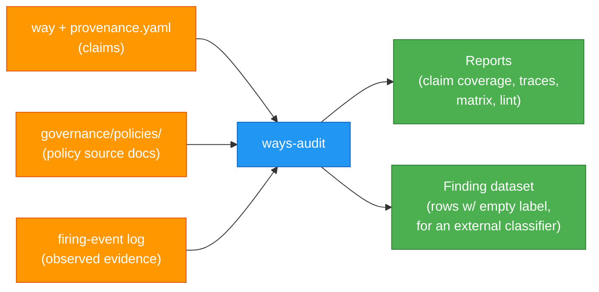

# Governance & Compliance Traceability

How agent-ways links its guidance to external control frameworks — and, plainly, what
that link is and is not. This is the reference layer; for the model and its rationale
see **[ADR-200](architecture/governance/ADR-200-compliance-claims-and-session-derived-findings.md)**
(compliance claims and session-derived findings).

> **Read this first.** A way can carry a **claim** that its guidance is *designed* to
> steer work toward a specific control (NIST 800-53, OWASP, ISO 27001, SOC 2, CIS,
> IEEE). A claim is a control-*design* assertion — in audit terms the **SOC 2 Type I**
> posture (suitably designed at a point in time) — **not** evidence that the control
> operates. Evidence is a **finding**, produced later from real sessions (SOC 2 Type II) —
> the finding pipeline is the direction set in ADR-151, not yet built. Today `ways-audit`
> reports on **claims**, so read any coverage number as *claims made*, not *conformance
> achieved*.

## The chain

A way is authored guidance: a person (often Claude) reads a control or policy and writes
compact, directive guidance that steers work into the shape the control expects. The
claim records which control that guidance is *designed* to address, so the link is
walkable in either direction:

```
Control framework   (NIST 800-53, OWASP, ISO 27001, SOC 2, CIS, IEEE…)
       ↓  cited by
Policy document     (governance/policies/*.md — human prose)
       ↓  claimed by
Way + claim         (hooks/ways/**/{name}.md  +  provenance.yaml sidecar)
       ↓  injected at runtime (claim metadata stripped — zero tokens)
Agent context       (the guidance fires when its triggers match)
```

Each layer compresses the one above it. But the link is a *design* claim — that the
guidance was written to address the control — not proof the work conformed. Only a
session-derived finding can show that.

## Where a claim lives: the `provenance.yaml` sidecar

A claim lives in a **`provenance.yaml` sidecar** beside the way (ADR-110), not in the
way's own frontmatter. The runtime never reads the sidecar; way frontmatter is stripped
before injection anyway, so a claim reaches the agent's context **never** — zero tokens,
zero latency. It exists for the compliance tooling and for humans, not for the model.

```yaml
# hooks/ways/softwaredev/delivery/commits/provenance.yaml
policy:
  - uri: governance/policies/code-lifecycle.md
    type: governance-doc
controls:
  - id: NIST SP 800-53 CM-3 (Configuration Change Control)
    justifications:
      - Conventional commit types classify changes by nature
      - Atomic commits make each change independently reviewable
  - id: SOC 2 CC8.1 (Change Management)
    justifications:
      - Type prefix and scope create structured change records
verified: 2026-02-05
rationale: >
  Conventional commits create structured change records with type classification,
  implementing auditable change control.
```

### Fields

| Field | Purpose |
|-------|---------|
| `policy[].uri` | Source policy document — relative path or `github://org/repo/path` |
| `policy[].type` | Classification: `adr`, `governance-doc`, `regulatory-framework`, `control-spec` |
| `controls[].id` | The control this way *claims* to be designed for |
| `controls[].justifications[]` | How the guidance is meant to address the control (assertions, not evidence) |
| `controls[].satisfied_when` | The *determination criterion* — what observable session behavior would let a classifier mark this control *satisfied* / *other-than-satisfied* (ADR-200 §1, ADR-201). Optional; without it a control carries only a process-tier finding, never an outcome one |
| `verified` | Date the claim's *authoring* was last reviewed (not an assessment date) |
| `rationale` | Summary of how the way's guidance compiles the cited controls into practice |

> **The criterion is what makes a claim assessable.** A control with no `satisfied_when`
> is unfalsifiable — it can never graduate into an outcome finding. Most existing sidecars
> don't carry one yet; adding them is the seeding work that turns coverage into something a
> classifier can eventually assess.

## What the tooling does today

Compliance queries run through the `ways-audit` binary (`ways-audit <mode>`), a sibling of
the `ways` binary (ADR-151). The tool scans the `provenance.yaml` sidecars directly and
builds the manifest **in memory** — there is no persisted `provenance-manifest.json`, and
no separate shell scripts (the former `governance.sh` / `provenance-scan.py` were
consolidated into the binary, ADR-111).

| Mode | Command | Output |
|------|---------|--------|
| **Coverage** | `ways-audit report` | Which ways carry a claim, which don't |
| **Trace** | `ways-audit trace softwaredev/commits` | The full chain for one way |
| **Control query** | `ways-audit control OWASP` | Which ways *claim* a control |
| **Policy query** | `ways-audit policy code-lifecycle` | Which ways derive from a policy |
| **Gaps** | `ways-audit gaps` | Ways without a claim |
| **Stale** | `ways-audit stale 90` | Claims with old `verified` dates |
| **Active** | `ways-audit active` | Cross-reference claims with way firing stats |
| **Matrix** | `ways-audit matrix` | Flat sheet: way / control / justification |
| **Lint** | `ways-audit lint` | Validate claim integrity (URIs resolve, fields present) |
| **Assemble** | `ways-audit assemble [--write]` | Build the classifier-ready **finding dataset** from claims + firing evidence (ADR-201) |
| **Findings** | `ways-audit findings` | Show the assembled finding ledger |

All modes support `--json`.

### Findings: assembled, not determined

`ways-audit assemble` produces the finding dataset described in **ADR-201**: one row per
claimed `(way, control)`, carrying the `satisfied_when` criterion and the firing evidence
(counts, sessions as transcript pointers, first/last seen) **beside an empty
`determination`**. The tool never writes a determination — that would manufacture the
evidence the claim/finding split exists to keep honest. Each row is a classifier-ready
dataset entry with a uniform column set; the label is filled later by a **classifier**
(human, deterministic check, or model) that is **deliberately out of scope** — a separate,
undesigned system. `ways-audit`'s guarantee ends at producing a clean, accessible,
unambiguous-to-label record.



## Honest scope

- A claim is a **design** assertion (SOC 2 Type I; in NIST's OSCAL model, a *Component
  Definition*), **not** a finding.
- The reports show **claim coverage**, not conformance. "Complete" is not a state a claim
  can reach — it awaits a session-derived finding.
- This is a **first-line** aid — in the Three Lines Model (the IIA's framework for
  governance roles), the first line is the roles that own risk *in the doing of the
  work*. It helps the work take a control-aligned shape at the point of work. It is
  **not** an assessment, an attestation, or a certification — that is the third line,
  and agent-ways is built to *feed* it, not to be it.

See ADR-200 for the full model and its non-goals.

## Policy source documents

Policy documents live in `governance/policies/`. They are the human-readable
interpretation layer — why a way exists, what principle it implements, where the
boundaries are. `ways-audit lint` validates that every `policy.uri` in a claim
resolves to a real file; the chain breaks silently if policies move without the claims
following.

## Growth pattern

Compliance claiming is optional and additive. Most users never touch it.

1. **Ways** — encode how you work. Everyone starts here.
2. **Policies** — write down *why* (`governance/policies/`).
3. **Claims** — link a way to the controls it's *designed* to address (`provenance.yaml`).
4. **Reporting** — `ways-audit` surfaces claim coverage and gaps.
5. **Criteria** — give a control a `satisfied_when` so it becomes assessable (ADR-200 §1).
6. **Findings** — `ways-audit assemble` builds the classifier-ready dataset (ADR-201):
   session-derived evidence rows with an empty determination. The classifier that labels
   them is a separate, out-of-scope system — assembly is what agent-ways ships.

Each step builds on the previous without requiring it. A way without a claim runs
identically at runtime. The system doesn't penalize partial adoption.

## Cross-repo pattern

In an enterprise, policy documents and way implementations typically live in separate
repositories:

```
compliance-repo/              your-claude-config/
├── docs/architecture/        ├── hooks/ways/
│   ├── ADR-150.md            │   └── softwaredev/delivery/commits/
│   └── ADR-200.md            │       ├── commits.md
├── controls-catalog.md       │       └── provenance.yaml   (claim → ADR-150)
└── …                         └── governance/policies/
```

A claim references its policy by URI. `ways-audit` resolves those URIs and builds
the cross-repo view in memory at query time — nothing is persisted between repos, so the
two sides stay decoupled.

---

*Informally:* a way is compiled guidance and a claim is the note saying which standard it
was compiled to address — useful shorthand, but the note is an assertion, and only a
finding turns an assertion into evidence.
