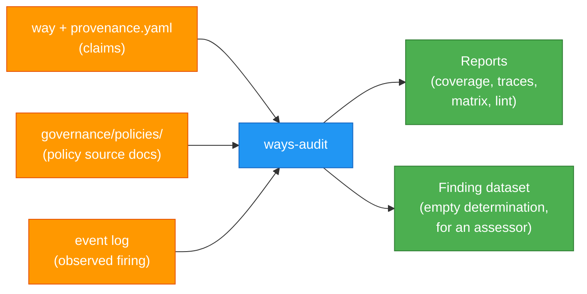

# Governance & Compliance Traceability

Reference for compliance claims on ways and the `ways-audit` binary: the claim fields, every command, and what the output does and does not show. To add a claim to a way, follow [provenance.md](hooks-and-ways/provenance.md). The model and its rationale are in [ADR-200](architecture/governance/ADR-200-compliance-claims-and-session-derived-findings.md), and the finding record in [ADR-201](architecture/governance/ADR-201-findings-assembled-as-classifier-ready-assessment-records.md).

> A way can carry a **claim** that its guidance is *designed* to steer work toward a control (NIST 800-53, OWASP, ISO 27001, SOC 2, CIS, IEEE). A claim is a design assertion, the **SOC 2 Type I** posture: suitably designed at a point in time. It is not evidence that the control operates. Evidence is a **finding**, built from real sessions (SOC 2 Type II). `ways-audit assemble` builds finding records; deciding whether a control is satisfied is left to a separate assessor and is out of scope. Read any coverage number as *claims made*, not *conformance achieved*.

## The chain

```
Control framework   (NIST 800-53, OWASP, ISO 27001, SOC 2, CIS, IEEE…)
       ↓  cited by
Policy document     (governance/policies/*.md, human prose)
       ↓  claimed by
Way + claim         ({way}.md + provenance.yaml sidecar)
       ↓  injected at runtime (the sidecar is never read: zero tokens)
Agent context       (the guidance fires when its triggers match)
       ↓  recorded
Finding             (firing events + transcript, judged against satisfied_when)
```

Each layer above the way compresses the one above it. Every layer down to the claim is authored; the finding is the only one that comes from a session.

## Claim fields

A claim is a `provenance.yaml` file in the way's directory (ADR-110). The runtime never reads it.

| Field | Purpose |
|-------|---------|
| `policy[].uri` | Source policy document: a relative path, or `github://org/repo/path` / an `http` URL for another repo |
| `policy[].type` | `adr`, `governance-doc`, `regulatory-framework` or `control-spec` |
| `controls[].id` | The control the way claims to be designed for |
| `controls[].justifications[]` | How the guidance is meant to address the control. Assertions, not evidence. |
| `controls[].satisfied_when` | The determination criterion: the session behavior that would let an assessor mark the control *satisfied* or *other than satisfied* (ADR-200 §1, ADR-201). Optional; a control without one can only ever have a process finding (the way fired), never an outcome finding. |
| `verified` | Date the claim's authoring was last reviewed, `YYYY-MM-DD`. Not an assessment date. |
| `rationale` | How the way's guidance turns the cited controls into practice |

## `ways-audit`

`ways-audit` is a sibling of the `ways` binary (ADR-151). It reads the sidecars on each run and builds its view in memory; nothing is persisted except by `assemble --write`. It is run by an operator on purpose; no hook or CI job runs it.

It reads one ways root: the current project's `.claude/ways/` when there is one, otherwise the shipped ways at `~/.claude/hooks/ways/`. `--global` skips the project. It does not read the personal root, `$XDG_CONFIG_HOME/agent-ways/ways/`.

| Command | Output |
|---------|--------|
| `ways-audit report` | Claim coverage: which ways carry a claim and which do not (the default) |
| `ways-audit trace <way>` | The chain for one way: policy sources, controls with justifications, verified date, rationale, firing history. Example: `ways-audit --global trace softwaredev/delivery/commits` |
| `ways-audit control <text>` | Ways that claim a control matching the text, such as `OWASP` |
| `ways-audit policy <text>` | Ways whose policy URI matches the text, such as `code-lifecycle` |
| `ways-audit gaps` | Ways without a claim |
| `ways-audit stale <days>` | Claims whose `verified` date is older than the given days |
| `ways-audit active` | Claims beside firing counts from the event log |
| `ways-audit matrix` | One row per way, control and justification |
| `ways-audit lint` | Claim integrity: controls and justifications present, policy URIs resolve, `verified` well formed |
| `ways-audit assemble [--write]` | The finding dataset; `--write` appends it to the findings ledger |
| `ways-audit findings` | The findings ledger |

Every command takes `--json`.

`lint` resolves a relative policy URI against the app directory (`$XDG_DATA_HOME/agent-ways`, where the shipped `governance/policies/` lives), the `~/.claude` projection, and the directory it runs from. `github://` and `http` URIs are not checked.

### Findings: assembled, not determined

`ways-audit assemble` builds one record per claimed way and control: the claim, its `satisfied_when` criterion, and the firing evidence (counts, sessions as transcript pointers, first and last seen), beside an empty `determination`. `ways-audit` never writes a determination; that would manufacture the evidence the claim/finding split exists to keep honest. The label is filled later by an assessor (a person, a deterministic check, or a model), which is a separate system outside agent-ways. With `--write`, records go to `$XDG_STATE_HOME/agent-ways/findings.jsonl`, an append-only ledger where each write adds a timestamped snapshot.


```mermaid
flowchart LR
    classDef tool fill:#2196F3,stroke:#1565C0,color:#fff
    classDef data fill:#FF9800,stroke:#E65100,color:#fff
    classDef output fill:#4CAF50,stroke:#2E7D32,color:#fff

    W["way + provenance.yaml<br/>(claims)"]:::data
    F["event log<br/>(observed firing)"]:::data
    P["governance/policies/<br/>(policy source docs)"]:::data
    CLI["ways-audit"]:::tool
    R["Reports<br/>(coverage, traces,<br/>matrix, lint)"]:::output
    D["Finding dataset<br/>(empty determination,<br/>for an assessor)"]:::output

    W --> CLI
    P --> CLI
    F --> CLI
    CLI --> R
    CLI --> D
```

## Scope

- A claim is a **design** assertion (SOC 2 Type I; an OSCAL *Component Definition*), not a finding.
- Reports show **claim coverage**, not conformance. A claim is never "complete"; it waits for a finding.
- This is a **first-line** aid. In the IIA's Three Lines Model the first line owns risk in the doing of the work; this helps the work take a control-aligned shape at that point. It is not an assessment, attestation or certification. That is the third line, which agent-ways feeds and does not replace.

## Policy documents

`governance/policies/` holds the human-readable interpretation layer that claims point at: why a way exists, what principle it implements, where the boundaries are. If a policy file moves, the claims that point at it break; `ways-audit lint` catches that.

## Adoption

Claims are optional and additive; a way without one runs identically.

1. **Ways**: encode how you work.
2. **Policies**: write down why, in `governance/policies/`.
3. **Claims**: link a way to the controls it is designed to address.
4. **Reporting**: `ways-audit report`, `gaps`, `matrix`.
5. **Criteria**: give each control a `satisfied_when` so it can be assessed.
6. **Findings**: `ways-audit assemble` builds the records an assessor labels.

## Across repositories

Policy documents and ways often live in separate repositories:

```
compliance-repo/              your ways/
├── docs/architecture/        └── softwaredev/delivery/commits/
│   ├── ADR-150.md                ├── commits.md
│   └── ADR-200.md                └── provenance.yaml   (policy uri → ADR-150)
└── controls-catalog.md
```

A claim names its policy by URI, and `ways-audit` resolves it at query time. Nothing is stored between the repositories, so the two sides stay decoupled.
