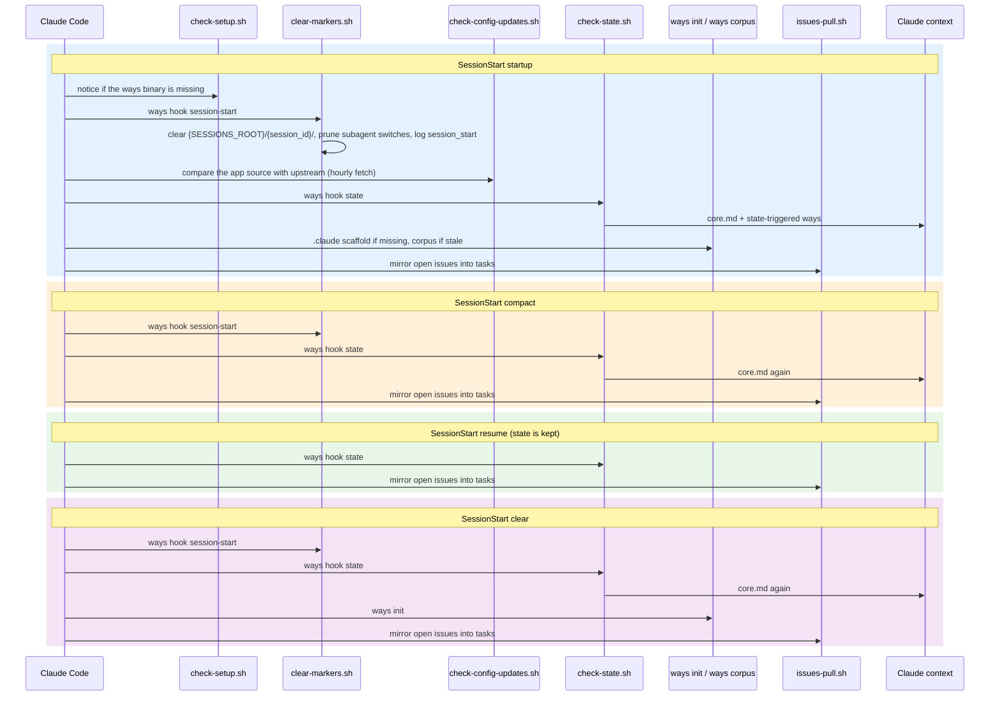
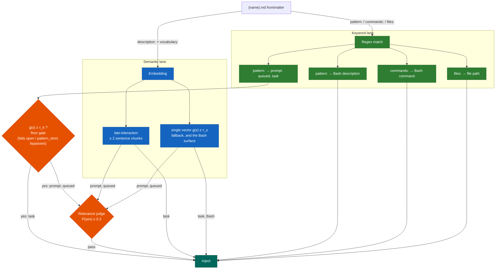
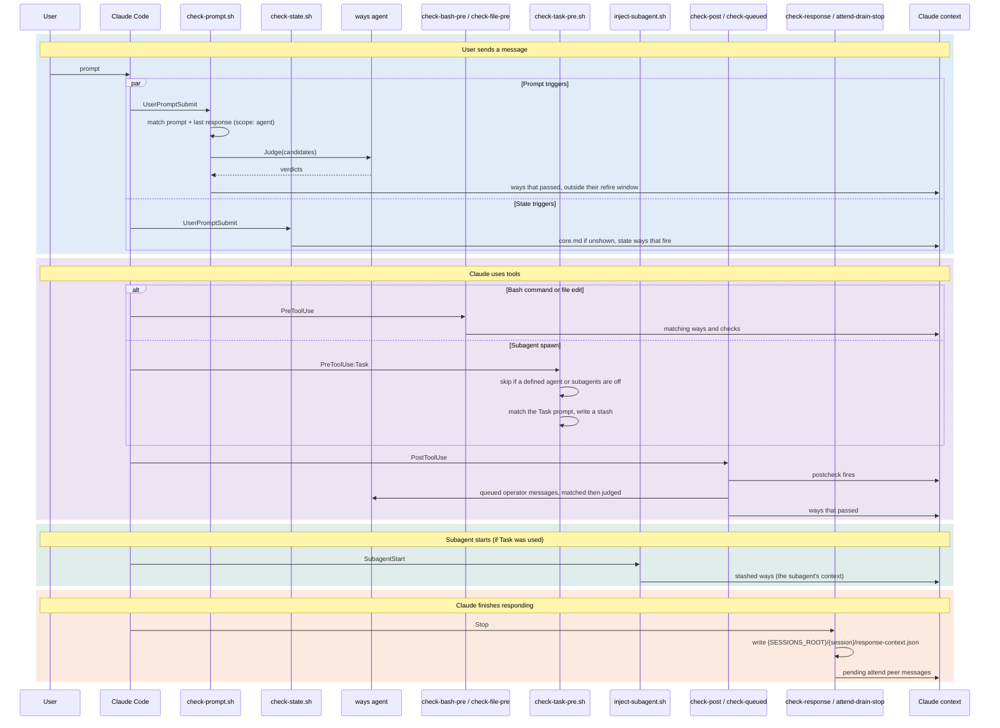

# Hooks and Ways System

How contextual guidance gets injected into Claude Code sessions. The diagrams of the internals are in [architecture.md](architecture.md), and the fire rule with its thresholds in [engine-reference.md](hooks-and-ways/engine-reference.md).

## Hook Events

The hooks are declared in the `hooks` block of the repo's [`settings.json`](../settings.json). `ways reconcile` three-way merges that block into the `settings.json` of each target it projects to (`~/.claude` by default, ADR-184), so edit the repo copy, not the projected one. Scripts run in the order listed.

| Event | Matcher | Scripts |
|-------|---------|---------|
| **SessionStart** | `startup` | `check-setup.sh`, `clear-markers.sh`, `check-config-updates.sh`, `check-state.sh`, `ways init`, `ways corpus --if-stale --quiet`, `issues-pull.sh session-start` |
| **SessionStart** | `compact` | `clear-markers.sh`, `check-state.sh`, `issues-pull.sh session-start` |
| **SessionStart** | `resume` | `check-state.sh`, `issues-pull.sh session-start` |
| **SessionStart** | `clear` | `clear-markers.sh`, `check-state.sh`, `ways init`, `issues-pull.sh session-start` |
| **UserPromptSubmit** | | `check-prompt.sh`, `check-state.sh`, `issues-pull.sh prompt` |
| **PreToolUse** | `Edit\|Write` | `check-file-pre.sh` |
| **PreToolUse** | `Bash` | `check-bash-pre.sh`, `strip-session-link-pre.sh` |
| **PreToolUse** | `TaskCreate` | `mark-tasks-active.sh` |
| **PreToolUse** | `Task` | `check-task-pre.sh` |
| **SubagentStart** | | `inject-subagent.sh` |
| **PostToolUse** | `Edit\|Write\|Bash\|Task` | `check-post.sh`, `check-queued.sh` |
| **PostToolUse** | `Bash`, if `Bash(gh issue *)` | `issues-pull.sh post-gh` |
| **PostToolUseFailure** | `Edit\|Write\|Bash\|Task` | `check-post.sh` |
| **Stop** | | `check-response.sh`, `attend-drain-stop.sh` |
| **TaskCreated** | | `issues-task-created.sh` |

`check-config-updates.sh` lives in `~/.claude/hooks/`. Every other script lives in `~/.claude/hooks/ways/`, and `ways` is `~/.claude/bin/ways`.

## What Each Script Does

Each script that touches ways is a thin adapter: it sources `require-ways.sh` and runs `ways hook <event>`, which reads Claude Code's JSON payload on stdin, makes every decision, and prints what the hook returns (ADR-504 §11). The scripts exit 0 whatever the binary returns, because a guidance hook never blocks a prompt or a tool. `ways scan` and `ways show` are internal subcommands the dispatcher uses. They are not part of the interface.

Before any injecting lane runs, `ways hook` checks the switches described in [Switching ways off](#switching-ways-off). Ways are on for subagents by default: a subagent's own tool calls run the main agent's lanes except the queued-message scan, which runs for the main agent only.

### Session lifecycle

- **`clear-markers.sh`** (`ways hook session-start`) - Clears this session's state under `{SESSIONS_ROOT}/{session_id}/`, as `ways session reset --session <id> --confirm` does, prunes subagent switches older than 30 days, and logs `session_start`. An id that is not a plain session id clears nothing.
- **`check-setup.sh`** - Prints a setup notice when `~/.claude/bin/ways` is missing, since every other ways hook is inert without it.
- **`ways init`** - If the project has a `.claude/` or `.git/` directory, writes `$PROJECT/.claude/.gitignore` and `$PROJECT/.claude/ways/_template.md` when they are missing, then seeds `MEMORY.md` (ADR-128). A fresh repo therefore gets these two files as untracked files. `.claude/.gitignore` keeps developer-local files (`settings.local.json`, `memory/`, `plans/` and similar) out of git, and `_template.md` is a starting point for writing a project way. Its empty frontmatter means it never fires. `ways init` does not overwrite either file.
- **`ways corpus --if-stale --quiet`** - Regenerates the embedding corpus if way files have changed since the last build.
- **`check-config-updates.sh`** - Checks the app source in `$XDG_DATA_HOME/agent-ways` against `aaronsb/agent-ways`. The `git fetch` is rate-limited to once per hour, and the notice shows every session while the install is behind. See [Updating](../README.md#updating) in the README.

### Trigger evaluation

The PreToolUse lanes run before the tool executes, so guidance arrives while Claude can still act on it. A commit format reminder after the commit is too late.

- **`check-prompt.sh`** (`ways hook prompt`) - Matches the user prompt, embedded together with Claude's previous response that the Stop hook recorded. The surviving candidates go to the [relevance gate](#relevance-gate-and-the-ways-agent) before they are shown. A prompt that is a harness envelope (a task notification, a system reminder, a skill body) bumps the epoch and is not matched.
- **`check-state.sh`** (`ways hook state`) - Shows `core.md` when its marker is missing, then evaluates `trigger:` fields. See [State triggers](#state-triggers).
- **`check-bash-pre.sh`** (`ways hook command`) - Three channels: `commands:` against the command, `pattern:` against the tool's description, and a semantic lane over the command, its description and Claude's prose since the last human turn (ADR-155 §4, ADR-191). `*.check.md` checks are scored on the same surface. This lane has no judge and logs no near-misses. ADR-188, still proposed, would retire its semantic lane.
- **`check-file-pre.sh`** (`ways hook file`) - Tests `files:` patterns against the path about to be edited. Regex only.

All lanes respect the `scope:` field and the `when:` preconditions.

### Post-tool lanes

- **`check-post.sh`** (`ways hook post-tool`) - Runs on PostToolUse and PostToolUseFailure. Each way's `postcheck.sh` is fed the hook payload, and a way whose postcheck exits 0 is shown through the same refire check and context budget as a predictive fire (ADR-123 Decision 5). A project-local postcheck runs only in a trusted project.
- **`check-queued.sh`** (`ways hook queued`) - Messages the operator types while Claude is working are queued and never reach UserPromptSubmit. This lane gathers the queued messages newer than the session's scan mark into one surface, matches it like a prompt (relevance gate included, epoch not bumped), and advances the mark (ADR-161). It runs for the main agent only, since queued messages go to it.

### Subagent injection

- **`check-task-pre.sh`** (`ways hook task`) - Phase 1. Matches the Task tool's `prompt` against ways with `subagent` scope (and `teammate` scope too when the Task names a team) and writes the matched ids to `{SESSIONS_ROOT}/{session_id}/subagent-stash/{ts}.json`. A Task naming an agent with its own definition (project, user or plugin `agents/*.md`) is skipped. Never blocks Task creation.
- **`inject-subagent.sh`** (`ways hook subagent-start`) - Phase 2. Claims the oldest stash and emits its ways as `hookSpecificOutput.additionalContext`, whatever the parent has been shown. Each fire is recorded under the subagent's own id, so the subagent's later hooks follow their own refire windows. A macro rendered here runs with `WAYS_SCOPE=subagent` (see [Macros](hooks-and-ways/macros.md)).

### State management

- **`check-response.sh`** (`ways hook stop`) - Records Claude's last response, raw and cut to 2,000 bytes, in `{SESSIONS_ROOT}/{session_id}/response-context.json`. The next prompt scan embeds it with the prompt and never keyword-matches it, so ways can trigger on what Claude discussed (ADR-155 §3). A turn that ends without text clears the record.
- **`mark-tasks-active.sh`** (`ways hook tasks-active`) - Writes `{SESSIONS_ROOT}/{session_id}/tasks-active`. Nothing reads the marker today. It is kept as the hook point should a way need it again.

### Other hooks in the block

- **`strip-session-link-pre.sh`** - Denies a `git commit` or `gh pr|issue` command that would publish a Claude Code session link as a trailer or footer line (ADR-167).
- **`attend-drain-stop.sh`** - Runs `attend inbox --drain --format hook` at the end of each turn, delivering pending peer messages (ADR-172). Does nothing when `attend` is not installed.
- **`issues-pull.sh`** / **`issues-task-created.sh`** - Mirror GitHub issues into the session's task list and reject unprefixed duplicates of mirrored issues (ADR-180).

## Session Lifecycle



## Way Scope

The `scope:` frontmatter field controls where a way fires. There are three scopes, reflecting the three kinds of Claude Code agents:

| Scope | Session type | Detection |
|-------|-------------|-----------|
| `agent` | Any agent that is not a teammate: your main session, and a quick subagent's own tool lanes | No teammate marker |
| `teammate` | Named agent in a coordinated team | A `teammate` marker in the agent's state directory |
| `subagent` | Quick Task tool delegate, reached only through the SubagentStart stash | Matched on the Task prompt by `check-task-pre.sh` |

Ways declare which scopes they apply to:

```yaml
scope: agent                     # Non-teammates on their own lanes (the default if omitted)
scope: teammate                  # Team members only
scope: agent, teammate           # Every agent's own lanes, no stash at dispatch
scope: agent, subagent           # Non-teammates, plus the stash at dispatch
scope: agent, teammate, subagent # Everyone, plus the stash at dispatch
```

A way without `scope:` takes `ways.default_scope`, which is `agent` unless configured.

### Scope detection

The `ways` binary reads the scope from the teammate marker: present means `teammate`, absent means `agent` (`session::detect_scope`). A running plain subagent is therefore `agent` scope on its own PreToolUse and PostToolUse lanes, and a `scope: agent` way can fire there. `subagent` scope applies only at dispatch, when `check-task-pre.sh` matches the Task prompt and writes the stash. `inject-subagent.sh` writes the teammate marker in the teammate's own state directory during Phase 2, so the main agent's scope is untouched. The marker holds the team name for telemetry.

### What gets gated

| Way | Scope | Why |
|-----|-------|-----|
| `meta/memory` | `agent` | Prevents concurrent MEMORY.md writes from multiple teammates |
| `meta/subagents` | `agent` | Keeps delegation guidance out of teammates and out of the Task stash. A plain subagent's own tool lanes can still fire it |
| `collaboration/teams` | `teammate` | Coordination norms only make sense for team members |

Firing state is kept per agent, so a way can fire for the parent and separately for each subagent or teammate. The parent's guidance does not transfer on its own because the Task prompt is a compact delegation, and the scope system bridges that gap.

See [teams.md](hooks-and-ways/teams.md) for the full team coordination model.

## Way Matching Modes

Each way declares how it should be matched in its frontmatter. The lanes are additive-OR: a way with both a `pattern:` and a `description:` + `vocabulary:` can fire from either.

- **Keyword lane** - the regex `pattern:` against the prompt, plus the deterministic `commands:` and `files:` triggers on the tool surfaces.
- **Semantic lane** - on the prompt, queued and task surfaces, the ADR-160 late-interaction matcher: the surface is split into sentences, each way is ranked by its best chunk and must either win a share of the chunks or match one chunk strongly, and the chunk it won must be corroborated by the way's own body. When the surface is too short to chunk, or the engine is missing, the single-vector calibrated gate decides instead (ADR-156). The bash surface uses the single-vector gate only.
- **Relevance gate** - on the prompt and queued surfaces, what the two lanes fired is judged by a hosted model before it is shown (ADR-196).

The exact fire rule, thresholds and calibration are stated once in [hooks-and-ways/engine-reference.md](hooks-and-ways/engine-reference.md).



A gated keyword never shadows a semantic fire: the semantic lane is checked first, and the keyword veto is reported only when nothing cleared it.

### Pattern

```yaml
pattern: commit|push          # matched against the prompt
commands: git\ commit         # matched against Bash commands
files: \.env$|config\.json    # matched against file paths
```

Fast and precise. Keyword matching is case-insensitive (ADR-157): the pattern is compiled case-insensitively, so a lowercase pattern matches the acronyms users type (`\bssh\b` matches `SSH`). The prompt keeps its original case, with only code fences and URLs stripped. Write patterns in lowercase and mean the concept.

The prompt `pattern:` hit is floor-gated: it fires only when the way's calibrated probability also clears the keyword floor `τ_k`, so a lexical coincidence can't drag in an unrelated prompt. It fails open when there is no calibrated signal, and `pattern_strict: true` makes it unconditional.

### Semantic matching

```yaml
description: "API design, REST endpoints, request handling"
vocabulary: api endpoint route handler middleware
```

There is no per-way threshold field. Firing is decided by global settings (see [engine-reference.md](hooks-and-ways/engine-reference.md)).

| Model | How it works |
|-------|-------------|
| **EN** | `all-MiniLM-L6-v2` sentence embeddings via the `way-embed` binary and a GGUF model, 384-dim. Serves late-interaction and the EN single-vector lane. |
| **Multilingual** | 768-dim model, loaded in localized mode only (ADR-139). It serves only the single-vector fallback. A prompt long enough to split into sentences is matched by late-interaction against the English corpus. |

The embedding engine is a hard dependency of `ways`. `make setup` fetches the binary and the English model on four supported platforms.

#### Setup

```bash
make setup      # builds ways, downloads the model, generates the corpus
make test       # lint, smoke, unit, simulation, ADR, statusline and hook tests
ways status     # engine status
```

The model, `ways-corpus.jsonl`, `ways-corpus-en.jsonl`, `ways-corpus-multi.jsonl` and `embed-manifest.json` live in `${XDG_CACHE_HOME:-~/.cache}/agent-ways/user/`. The corpus covers all three way roots: the project's `.claude/ways/`, your own `$XDG_CONFIG_HOME/agent-ways/ways/`, and the shipped ways under `~/.claude/hooks/ways/`. A higher root shadows the same id below it (ADR-143).

## Relevance Gate and the Ways Agent

On the prompt and queued lanes, the ways about to be shown are sent in one request to a hosted yes/no judge, together with the last turn (ADR-196). In `enforce` mode a blocked way is not shown, leaves no marker, and keeps its refire budget. In `shadow` mode every verdict is logged and nothing is blocked. Ways with `pattern_strict: true` are not judged, and a failure fails open.

The judge runs in the **ways agent**, one resident daemon per user on a Unix socket (ADR-502). Hooks start it on demand, and it exits when idle or when its binary is replaced. It holds the provider key and does judging and key custody only. Matching stays in the hook's `ways` process.

```bash
ways agent key            # add, check, rotate or remove a provider key
ways agent status         # engine, requests, fallbacks, latency
ways agent cost           # what the judge has cost, from the event log
ways settings set gate.mode shadow      # enforce | shadow | off
ways settings set gate.engine <profile> # anthropic | openrouter | your own
```

Without a key file the gate is off. What the judge sees, its threshold, cap and cost are covered in [the relevance judge](explanation/relevance-judge/relevance-judge-the-model.md).

## State Triggers

Evaluated by `check-state.sh` on SessionStart and every UserPromptSubmit. They fire on session conditions rather than content.

### context-threshold

```yaml
trigger: context-threshold
threshold: 75
```

Fires when the context in use reaches `threshold` percent. The percentage is the API-reported token count from the transcript divided by the resolved model context window, the same figure `ways context` shows (ADR-166). A prompt that is a harness envelope does not count as a turn here. The way is shown through the usual marker and re-discloses on its own `refire:` cadence.

### file-exists

```yaml
trigger: file-exists
path: .claude/ways/*.md
```

Fires when the glob matches any file relative to the project directory, then follows its `refire:` cadence.

### session-start

```yaml
trigger: session-start
```

Fires once per marker reset: on the first state scan after the session's markers were cleared (startup, compact, clear). It does not ride the refire cadence on later prompts.

## Disclosure Cadence

A way that fires stamps a marker at `{SESSIONS_ROOT}/{session_id}/ways/{way_id}/.marker.{agent_id}` holding the agent's token position. A later match is withheld until the agent has consumed the way's `refire:` fraction of its context window since that stamp (ADR-126), and is then re-disclosed. A withheld match is logged as `way_suppressed` with reason `refire`. A way that does not fit in the hook's 10,000-character budget is logged with reason `context_cap` and is not recorded as fired. Markers are cleared on SessionStart startup, compact and clear.

State is kept per agent. A subagent's fires, token position and window come from its own transcript, so its cadence does not move the main agent's. The state machine is drawn in [architecture.md](architecture.md#disclosure-cadence).

## Full Data Flow



## Telemetry

Firing activity is logged to `$XDG_STATE_HOME/agent-ways/events.jsonl`, one JSON object per line. The events are:

| Event | Emitted when |
|---|---|
| `session_start` | `ways hook session-start` runs |
| `way_fired`, `way_redisclosed` | a way is shown for the first time, or again after its refire window |
| `way_suppressed` | a way or check matched but was held back (`refire` or `context_cap`) |
| `way_nearmiss` | a way's single-vector probability landed within `near_miss_margin` below `τ_s` and it did not fire |
| `way_keyword_gated` | a `pattern:` hit was vetoed by the keyword floor `τ_k` |
| `way_judged`, `judge_call`, `gate_capped`, `gate_fallback` | the relevance gate's verdicts, provider calls, cap overflows and fallbacks |
| `injection_suppressed` | a lane was skipped because ways are switched off for subagents |
| `check_fired` | a `*.check.md` check was shown |

Every field is listed in [reference/events.md](reference/events.md). `ways session` (`ways`, `fires`, `replay`, `live`, `dump`) and `ways tune stats` read the log, and `ways agent cost` sums the judge's spend.

`fire_score` on `way_fired` is the deciding score of the semantic channel that fired: the summed softmax share for `semantic:late-interaction:en`, the calibrated probability `g(s)` for `semantic:embedding:*`. Read it by `trigger`, since the two are on different scales. It is recorded on every semantic fire, first fires and re-disclosures alike (filter on `event` to isolate first placements), and it is not the source of the `g(s)` calibration, which is fit at corpus generation from the committed probe corpus.

`near_miss_margin` (default `0.05`) only controls logging. The log is bounded: once `events.jsonl` exceeds about 32 MiB, `log_event` keeps the most recent 24 MiB, cut at a line boundary and written atomically. Readers holding the old file keep reading it intact.

### Calibrating from telemetry

```bash
ways tune precision   # flag ways landing in off-domain sessions
```

`ways tune precision` is a report-only relevance audit (ADR-134 Decision 3). For each way it estimates how often its fires landed off-class, in sessions whose activity (judged by the parent family of the ways that co-fired) never touched the way's own domain, and reports an irrelevance rate and a flag. **mis-targeted** is a narrow way repeatedly firing into the same wrong kind of session: narrow its vocabulary, tighten its `pattern:`, or change the trigger channel, then re-measure. There is no per-way threshold to move. **cross-cutting** is a way that fires broadly by design, such as `meta/todos`: scope it by trigger, and never auto-narrow its vocabulary. Flags: `--min-sessions` (default 5), `--flag-threshold` (default 0.5), `--project`, `--way`, `--json`.

Cadence has no tuning command. `refire:` is authored on each way (ADR-126). The threshold auto-tune of ADR-134 is deferred until enough `fire_score` data accumulates (issue #123), and that data now mixes two scales.

## Macros

Ways can include a `macro.sh` alongside the way file. Frontmatter declares positioning:

```yaml
macro: prepend   # macro output before static content
macro: append    # macro output after static content
```

Macros generate dynamic content. Examples:
- `documentation/adr/macro.sh` - Tri-state detection: no tooling, tooling available, tooling installed
- `softwaredev/code/quality/macro.sh` - Scans for long files in the project, outputs a priority list
- `softwaredev/delivery/github/macro.sh` - Detects solo vs team project, adjusts PR guidance

**Security**: project-local macros and postchecks run only if the project is listed in `~/.claude/trusted-project-macros`.

## Project-Local Ways

Ways resolve through three roots, highest first: the project's `$PROJECT/.claude/ways/`, your own `$XDG_CONFIG_HOME/agent-ways/ways/`, and the shipped ways at `~/.claude/hooks/ways/` (ADR-143). A way at the same id in a higher root shadows the lower ones, for matching and for rendering, and one marker per id and agent covers whichever copy fired. See the [lookup diagram](architecture.md#project-local-override).

## Switching Ways Off

Several switches turn ways off at different reaches. Each is checked by `ways hook` before a lane runs, except `ways target disable`, which removes the hooks themselves, and the domain and per-way switches, which drop ways when the candidates are collected (so a disabled way never boosts a child or takes a judge slot) and are checked again when a way is shown.

| Switch | Reach | Where it is set |
|---|---|---|
| `ways target disable <dir>` | Everything for that target: the hooks block and the links are withdrawn, so no ways hook runs at all | The target's `settings.json` and projection (see the [install guide](install-guide.md)) |
| `ways.enabled: false` | Every injecting hook in a project, or everywhere. Session upkeep (clearing, the response record) still runs (ADR-184). | `enabled:` in the project's `.claude/ways.yaml`, the user `config.yaml`, or a target's `config.yaml` |
| `ways.subagents: false` | Every lane that injects into a subagent or teammate. The main agent keeps its ways. Logged as `injection_suppressed`. | `subagents:` in the same files |
| `ways session subagents off` | The same, for one session, until switched back on | `$XDG_STATE_HOME/agent-ways/subagent-switch/<session_id>` |
| Defined agent | A Task whose `subagent_type` has its own `agents/<name>.md` (project, user or plugin) gets nothing, whatever the switches say | The agent definition itself |
| `ways.disabled_domains` | Every way under the listed domains | `disabled_domains:` in any of the config files |
| `ways.project.<id>: false` | One way, in one project (ADR-131) | `ways:` map in the project's `.claude/ways.yaml` only |

The config files layer in this order, each overriding the one before: the user `$XDG_CONFIG_HOME/agent-ways/config.yaml`, the current target's `$XDG_CONFIG_HOME/agent-ways/targets/<key>/config.yaml`, then the project's `.claude/ways.yaml`. A session switch for subagents applies even when the config says `subagents: true`.

```bash
ways settings set ways.enabled false            # --project for this project's .claude/ways.yaml
ways settings set ways.subagents false
ways settings set ways.disabled_domains ea,itops
ways settings set ways.project.itops/incident false
ways session subagents off                      # this session only; `on` to undo
```

## Testing

Three test layers verify the matching and injection pipeline. See [tests/README.md](../tests/README.md) for full details.

| Layer | Command | What it tests |
|-------|---------|---------------|
| **Make** | `make test` | Lint, smoke (match, graph), Rust unit tests, simulation, ADR, statusline and hook tests |
| **Simulation** | `make test-sim` | 8 integration scenarios: matching, idempotency, commands, files, checks, disclosure, scope, epochs |
| **Activation** | `read and run the activation test at tests/way-activation-test.md` | Live hook pipeline: regex, embedding semantic match, negative control, subagent injection |

The `/ways-tests` skill provides ad-hoc scoring for vocabulary tuning:

```
/ways-tests "write some unit tests for this module"
```
