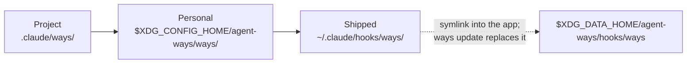

# Extending the System

How to write a way, where to put it, and how to switch ways and domains off. Writing a way is externalization of tacit knowledge applied to agent guidance: a norm the team carries in its head, "the way we do it around here", made explicit and sized for a context window.

## Where ways live

A session reads ways from three roots, in this order:

| Root | Path | Who writes it |
|------|------|---------------|
| Project | `<project>/.claude/ways/` | The project, checked into its repo |
| Personal | `$XDG_CONFIG_HOME/agent-ways/ways/` (usually `~/.config/agent-ways/ways/`) | You, for every project (ADR-143) |
| Shipped | `~/.claude/hooks/ways/` | agent-ways. Read-only. |



A way's id is its path under the root, such as `softwaredev/code/testing`. When two roots hold the same id, the earlier root wins: a project way overrides your personal way, and your personal way overrides the shipped one. Only the winning copy fires.

Do not author in `~/.claude/hooks/ways/`. It is a symlink into the app's own copy under `$XDG_DATA_HOME/agent-ways`, and `ways update` replaces it.

## Creating a way

A way is a directory holding `{wayname}.md`: YAML frontmatter, then the guidance. Optional files beside it are `macro.sh` for dynamic content (see [macros.md](macros.md)) a `provenance.yaml` sidecar that claims the controls the way serves (see [provenance.md](provenance.md)), and a `{wayname}.golden.jsonl` sidecar of test prompts: one `direct` and one `situational` line, each `{"kind":"direct","prompt":"..."}`. A core way must have one filled in; `ways author lint` checks it. There is no registration step.

1. **Scaffold.** `ways author template <domain>/<wayname> -d "what this way covers" -V "words users would say"` writes the file and a blank golden sidecar. Run inside a project, it writes to the project's `.claude/ways/`. With `--global`, or outside a project, it writes to your personal root.
2. **Edit.** Write the description, vocabulary and body, and fill both golden prompts. Add `pattern:`, `commands:`, `files:` or `trigger:` if the way should fire on those.
3. **Lint.** `ways author lint <path>` checks the frontmatter against the schema. Fix every error.
4. **Rebuild the corpus.** `ways corpus` re-embeds the ways. The semantic matcher reads the corpus, not the files, so an edit to `description:` or `vocabulary:` does nothing until the rebuild. A new session runs `ways corpus --if-stale`, which rebuilds when a way file is newer than the corpus.
5. **Check the match.** `ways author match "a prompt that should fire it"` shows how the live matcher scores the prompt against every way. Try prompts that should fire it and prompts that should not.

### `refire:` is required

Every way that fires on something needs a `refire:` field. That covers any way with `description:` and `vocabulary:`, `pattern:`, `commands:`, `files:` or `trigger:`. The firing gate resolves the way's cadence before its first fire and refuses a way without one, so a way with no `refire:` never reaches the agent, not even once. The one exception is the Task lane: a way that matches a Task prompt is stashed for the subagent without passing the gate. `ways author lint` reports a missing `refire:` as an error. The scaffolder writes `refire: 0.15`.

`refire:` takes a fraction of the context window (`0.15`) or a preset name (`once`, `rare`, `normal`, `frequent`). It sets how long a way stays quiet after it fires before it may disclose again. See [context-decay.md](context-decay.md) for the model behind it. Check files and attend handlers are exempt; they ride on their parent way or on a signal.

### Choosing a matching mode

| If your trigger is... | Use |
|----------------------|-----|
| Specific keywords or commands | `pattern:`, `commands:`, or `files:` (regex) |
| A broad concept users describe in different words | `description:` + `vocabulary:` (semantic matching) |
| A session condition, not content | `trigger:` with `context-threshold`, `file-exists`, or `session-start` |

The lanes are independent, and a way can carry a `pattern:` and a `description:` + `vocabulary:` together. A keyword hit still has to clear a low semantic floor, so a bare word cannot pull in an unrelated prompt; `pattern_strict: true` skips that floor. When a relevance judge is configured (`gate.mode=enforce`), a matched way on the prompt lane can still be judged irrelevant and withheld. [matching.md](matching.md) and [engine-reference.md](engine-reference.md) give the exact rules.

### Writing effective guidance

The way content goes into Claude's context window, so every token costs something. Write for a language model, not a wiki:

- **Be directive**: "Use conventional commits", not "It is recommended to use conventional commits"
- **Be specific**: include the exact format, pattern, or command
- **Be brief**: past about 40 lines, ask whether all of it is needed every time; past 10,000 characters lint fails the way
- **Use tables**: they are dense and scannable
- **Skip preambles**: deliver the guidance, not a description of it

### Voice and framing

**Include the why, not just the what.** "Use conventional commits" is a rule. "Use conventional commits; the release tooling parses them to generate changelogs" is a rule with its reason. An agent that knows the reason applies the rule with better judgment at the edges.

**Write as a collaborator, not a commander.** "Run the tests before committing" is an instruction. "We run tests before committing to catch regressions early" is a shared practice. The inclusive framing carries intent that a bare directive does not, and an agent that understands "we do this because we care about X" makes better calls.

**Write for a reader with no history.** The agent arrives with no memory of earlier sessions. The injected ways are its whole understanding of how work is done here. If the guidance only makes sense with context the agent will never have, rewrite it.

**Respect the reader.** Guidance that explains its reasoning gets better adherence than guidance that asserts authority. That holds for people reading policy and for models reading injected context.

### Testing a way

`ways author match` is the main check. The `/ways-tests` skill wraps the authoring commands for vocabulary work:

```
ways author match "sample prompt"     # every way against one prompt
ways author suggest <way-file>        # vocabulary candidates from the body
ways author siblings <way>            # how close the way sits to its siblings
ways author lint <path>               # frontmatter
```

Take only the suggested vocabulary that discriminates. Body words like "code" or "use" match everything. Add the domain words users actually say. [scoring-and-testing.md](scoring-and-testing.md) walks through tuning.

To check the live system, send a prompt that should fire the way, then run `ways session ways` to list the ways fired in the current session.

## Progressive disclosure with sub-ways

Ways nest: `{domain}/{parent}/{child}/{child}.md`. Each level adds context only when the conversation goes deeper into that topic, which keeps token cost in line with relevance.

```
meta/knowledge/knowledge.md                 — fires on "ways" (overview)
meta/knowledge/authoring/authoring.md       — fires when editing way files (format spec)
meta/knowledge/authoring/*/                 — children on refire, the keyword lane, trees, frontmatter fields, locale stubs
meta/knowledge/optimization/optimization.md — fires on vocabulary tuning (workflow plus live health via macro)
```

Asking "what are ways?" gets the overview. The authoring spec loads when you start editing a way file, and its children load when the work turns to their topic. Parent ways orient; child ways add depth. Each child has its own trigger, so it loads only when its sub-topic is active.

A sub-way with `macro: prepend` can inject current state. The optimization way's macro runs `ways author suggest` across the semantic ways and includes the results, so the agent gets the workflow and the data together.

## Project ways

Project ways live at `<project>/.claude/ways/{domain}/{way}/{way}.md` and follow the same rules as the other roots.

```
myproject/.claude/ways/
└── myproject/
    ├── api/api.md                 # "Our API uses GraphQL, not REST"
    ├── deployment/deployment.md   # "Deploy via Terraform in us-east-1"
    └── testing/testing.md         # "We use Vitest, not Jest"
```

To replace a shipped way for one project, give the project way the same id. `.claude/ways/softwaredev/code/testing/testing.md` replaces the shipped `softwaredev/code/testing` in that project.

A project way's `macro.sh` runs only when the project is trusted: add its path, one per line, to `~/.claude/trusted-project-macros`.

## Switching ways off

### One way in one project

From inside the project:

```
ways settings set ways.project.itops/incident false
ways settings list ways.project           # what is off in this project
ways settings unset ways.project.itops/incident
```

That writes the project's `.claude/ways.yaml`:

```yaml
ways:
  itops/incident: false
```

Per-way switches are project-scope only. There is no global per-way switch. A way is on unless a project turns it off.

### A whole domain

```
ways settings set ways.disabled_domains '[itops, ea]'
```

That writes `disabled_domains:` in `$XDG_CONFIG_HOME/agent-ways/config.yaml`; add `--project` to set it for one project. Every way in a listed domain stays silent. Use a domain switch for "never anywhere" and a per-way switch for "not in this project".

### Ways in subagents

Some workflows run their agents without ways, so injection does not bias what they produce. The main agent keeps its ways; only the agents it dispatches are affected.

For every session in a project, set `subagents: false` in the project's `.claude/ways.yaml`, or in the user config for every project:

```yaml
subagents: false
```

For one session, for example before launching a workflow or a swarm:

```
ways session subagents off     # this session's dispatched agents get no ways
ways session subagents on      # back to the configured setting
ways session subagents --json  # which switch is in effect
```

The command acts on `--session <id>`, or on the session it runs in when Claude Code sets `CLAUDE_CODE_SESSION_ID`. The session switch lives outside the session's state, so it holds through compaction and `ways session reset`. `/clear` starts a new session id without it, and a switch untouched for 30 days is pruned.

Both switches withhold the ways stashed for a Task dispatch and every hook that runs inside a subagent. A teammate whose own hooks do not identify it as a subagent is covered at dispatch only. Each suppression is logged as an `injection_suppressed` event, once per Task dispatch and once per agent. See [the events catalog](../reference/events.md).

## Creating a domain

A domain is a top-level directory in a ways root. Create it in your personal root or the project's `.claude/ways/`, add way directories inside, and rebuild the corpus. Name domains for the concern they cover, not for how they trigger; the domain is the unit `ways.disabled_domains` switches off.
