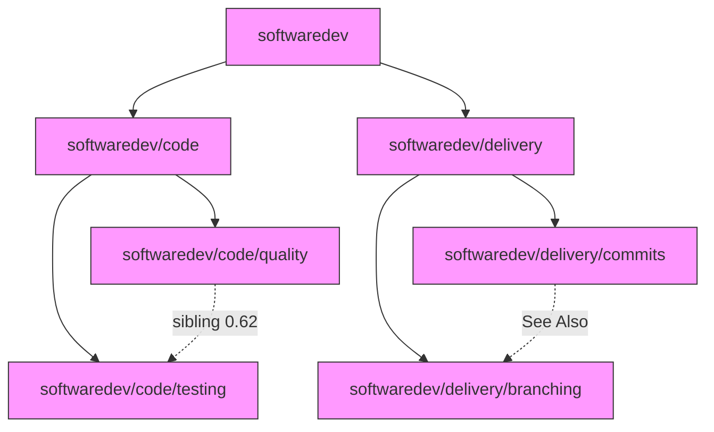
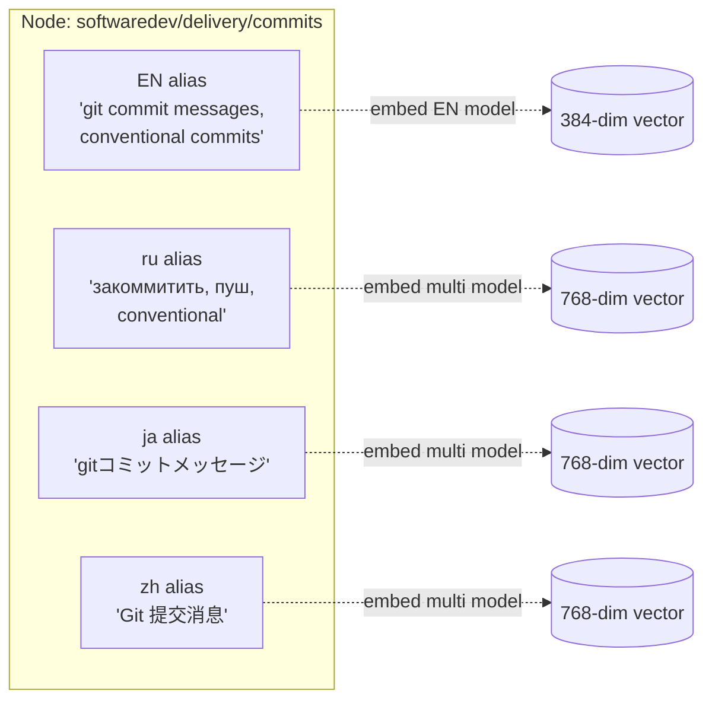
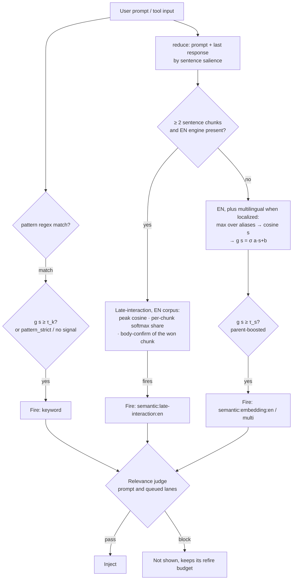
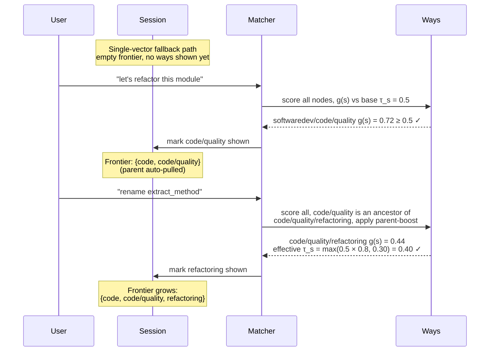

# Matching and Routing

How ways decide when to fire, and how progressive disclosure is structured. Matching is text retrieval applied to guidance routing: the user's prompt (or tool input) is the query, the ways are the document collection, and a way "fires" when it is retrieved and injected. The [What This Actually Is](#what-this-actually-is) section maps the full workflow to its information-retrieval lineage.

## The Way Graph

Ways are not a flat list — they form an **authored disclosure graph** (ADR-125). Each way is a node; the graph has three kinds of edges.



- **Parent/child edges** — from the directory tree (`softwaredev/delivery/commits` is a child of `softwaredev/delivery`)
- **See Also edges** — declared explicitly in a way's body prose
- **Sibling edges** — computed by `ways author siblings`, weighted by cosine similarity between canonical embeddings

Every node carries one or more **coordinate aliases** — embeddings that route queries to it. The canonical alias comes from the English frontmatter (description + vocabulary). In **localized mode** (ADR-139), the node also carries a locale alias per localized language in `.locales.jsonl` plus the English root re-embedded with the multilingual model as the anchor; English installs carry only the canonical alias. All aliases on a node route to the same node's body content.



Each alias is embedded once (at `ways corpus` time) into the appropriate model's vector space and stored. At match time, the query is embedded and compared against every alias of every node; the node's score is the max across its aliases.

## How a Prompt Routes to a Way

Three channels decide whether a way fires. They run additively — any one firing activates the way. The full fire rule, with source citations, lives in [engine-reference.md](engine-reference.md); this section states it in context.



**Channel 1 — keyword (explicit triggers).** `pattern:` (prompt text), `commands:` (bash commands), `files:` (file paths). The prompt `pattern:` lane is **floor-gated** (ADR-155/156): a regex hit fires only if the way's calibrated probability `g(s)` also clears the keyword floor `τ_k` on at least one model lane, so a keyword can't drag in an unrelated prompt *when calibration is loaded*. It **fails open** (fires unconditionally) when there is genuinely no calibrated signal either direction — the engine didn't run, the way isn't embeddable, or no calibration is loaded — so the author's explicit trigger stands. `pattern_strict: true` also forces the unconditional fire by design (and bypasses the URL / code-fence mask). The `commands:` and `files:` fields match against tool inputs on PreToolUse and fire on the regex match itself; they are the author's "I know exactly when this should fire" surface.

**Channel 2 — embedding.** Sole semantic retrieval tier (ADR-125), in two tiers. The primary is the ADR-160 late-interaction matcher: the reduced surface is split into sentence chunks, each way is ranked by its best chunk, it must win a share of the chunks in a per-chunk softmax (or match one chunk strongly), and the chunk it won must be corroborated by the way's own body. It reads the **English** corpus only. When the surface yields fewer than two chunks, or the engine is missing, the single-vector fallback decides: the surface is embedded once per model, a node's score is the max cosine across its aliases, and the per-model calibration `g(s) = σ(a·s + b)` maps it to a probability that must clear `τ_s` on either lane. In **localized mode only** (ADR-139) the 768-dim multilingual lane runs as part of that fallback, so a native-language query reaches its node through a locale alias only when the surface is too short to chunk. Late-interaction matches a longer native-language prompt against the English aliases. English installs never load the multilingual model. The engine is a hard dependency: if it is missing, no semantic matching happens.

On the prompt and queued lanes, whatever channels 1 and 2 fire then goes to the [relevance gate](../hooks-and-ways.md#relevance-gate-and-the-ways-agent), which can block it.

**Channel 3 — state triggers.** Not content-based. `trigger: context-threshold` fires when the context in use reaches the configured percentage; `file-exists` fires when a glob matches; `session-start` fires once per session. See the [State Triggers](#state-triggers) section.

## Progressive Disclosure (Session Subgraph)

"Progressive disclosure" in this system is not a top-down cascade. It is the gradual accumulation of fired nodes in the session — the **session subgraph** — and a **parent-boost** to the semantic fire probability that applies once a parent has fired.

Parent-boost lowers `τ_s`, so it acts only where `τ_s` decides: the single-vector fallback and the Bash semantic lane. When late-interaction decides a prompt, the boost has no effect. The example below is a fallback-path example: each prompt is one sentence, too short to chunk.



**Two mechanics make this work together:**

1. **Marker accumulation.** Each time a way fires, a marker records it for the agent it fired for (the main agent and each subagent keep their own). The set of fired markers is the session subgraph — the portion of the way DAG that has been "disclosed" in this conversation.

2. **Parent-boost.** Before comparing a candidate way's semantic probability `g(s)` to `τ_s`, the matcher walks the way's ancestor chain for a fired marker, or for an ancestor that fired earlier in the same scan. If found, the effective semantic threshold drops from `τ_s` to `(τ_s × parent_threshold_multiplier).max(parent_boost_floor)` — by default `max(0.5 × 0.8, 0.30) = 0.40`. The multiplier (0.8) lowers the child's bar — the boost; the floor (0.30) stops cascading boosts from reaching the noise band. **Both keys are live**: ADR-156 changed the *operand* to the global probability `τ_s` (not a raw per-way cosine threshold), it did not remove the multiplier. `τ_k` is global and is **not** parent-boosted. Children within an active parent domain fire on weaker semantic signal; children in cold domains need to clear the full bar. A child that fired only on a boost from a parent fired in the same scan is shown only if that parent is shown. See [engine-reference.md](engine-reference.md) for the source citations.

Configure via `~/.config/agent-ways/config.yaml` — these are **global** thresholds, not per-way:
```yaml
semantic_fire_probability: 0.5     # τ_s: semantic lane fires at g(s) ≥ this
keyword_floor_probability: 0.15    # τ_k: keyword floor, independent of τ_s
parent_threshold_multiplier: 0.8   # parent-boost; 1.0 disables the boost
parent_boost_floor: 0.30           # floor under a boosted child's τ_s
near_miss_margin: 0.05             # how far below τ_s a non-fire is logged as a near-miss (ADR-134)
```

A way's **effective semantic threshold** therefore depends on session state, not just the global `τ_s`. This is what makes disclosure feel progressive: the same query "rename this variable" may not fire the refactoring way in a fresh session but will fire it once the code/quality parent has been active.

The matcher itself is stateless per call — it reads session markers every turn and recomputes effective thresholds. There is no "revealed ways list" to maintain.

## Regex Matching

The default and most common mode. Three fields can be tested independently:

- `pattern:` - tested against the user's prompt text
- `commands:` - tested against bash commands (PreToolUse:Bash)
- `files:` - tested against file paths (PreToolUse:Edit|Write)

A way can declare any combination. Each field is a standard regex evaluated case-insensitively against its input (ADR-157 — the pattern is compiled case-insensitively; the input keeps its original case).

### Why regex is the default

Most ways have clear trigger words. "commit", "refactor", "ssh" - these don't need fuzzy matching. Regex is fast, predictable, and easy to debug. When a way misfires, you can read the pattern and understand why.

### Pattern design considerations

Patterns need to balance sensitivity and specificity:
- Too broad: `error` fires on "no errors found"
- Too narrow: `error_handling` misses "exception handling"
- Right: `error.?handl|exception|try.?catch` catches the concept without false positives

Word boundaries (`\b`) help with short words that appear inside other words. The `commits` way uses `\bcommit\b` to avoid matching "committee" or "commitment".

## Semantic Matching

For concepts that users express in varied language. "Make this faster", "optimize the query", "it's too slow" all mean the same thing but share few words.

### How it works

A way with `description:` and `vocabulary:` frontmatter fields is automatically eligible for semantic matching. The `description` plus `vocabulary` is the way's **canonical alias**. Locale stubs in `.locales.jsonl` add language-specific aliases to the same node. See [The Way Graph](#the-way-graph) above for how aliases relate to nodes.

```yaml
description: debugging code issues, troubleshooting errors, investigating broken behavior
vocabulary: debug breakpoint stacktrace investigate troubleshoot regression bisect crash error
```

There is **no per-way threshold field** — firing is governed by global settings. A multi-sentence query is matched by late-interaction against the English corpus. A short one is embedded once per model and scored against every alias in the corpus; the node's score is the max cosine across its aliases, mapped through the calibration `g(s) = σ(a·s + b)` to a relevance probability, and the way fires if that probability clears the effective semantic threshold `τ_s` (see [How a Prompt Routes](#how-a-prompt-routes-to-a-way) for the full flow, [Progressive Disclosure](#progressive-disclosure-session-subgraph) for how the effective threshold is boosted, and [engine-reference.md](engine-reference.md) for the source-cited fire rule).

### Engine and setup

The embedding engine is a hard dependency (ADR-125). `make setup` fetches the `way-embed` binary and the **English** GGUF model; the 127MB multilingual model is on-demand, fetched by `ways-localize` (or `make -C tools/way-embed model-multilingual`) only when an adopter localizes (ADR-139). If the engine/English model is missing, ways with only semantic triggers will not fire — only `pattern:`, `commands:`, `files:` ways will. The `ways status` command reports whether the engine is installed.

### Vocabulary design

Good vocabulary terms are domain-specific words that **users would say** when asking about the topic:

- **Include**: Terms users type in prompts — `bcrypt`, `xss`, `breakpoint`, `monolith`
- **Skip**: Generic terms that don't discriminate — `code`, `use`, `make`, `change`
- **Keep unused terms**: Vocabulary terms that don't appear in the way body are often intentional — they catch user prompts, not body text

Use `/ways-tests suggest <way>` to find gaps and `/ways-tests score-all "prompt"` to check for cross-way false positives.

### Sparsity over coverage

The goal of vocabulary design isn't to maximize each way's match rate — it's to maximize the semantic distance *between* ways. Each way should occupy a distinct region of the scoring space with minimal overlap. When a prompt fires exactly one way with a clear margin above others, the system is working well. When multiple ways fire on the same prompt, their vocabularies overlap and need sharpening.

This means expanding vocabulary can be counterproductive. Adding generic terms like `error` to the debugging way might catch more debugging prompts, but it also creates overlap with the errors way. Narrow, specific vocabulary creates sparsity — clean separation between ways — which is more valuable than broad recall on any single way.

### Which ways use semantic matching

Ways covering broad concepts where regex would be too narrow or too noisy use semantic matching — most ways in `softwaredev/code/*`, `softwaredev/architecture/*`, `softwaredev/delivery/*`, and domains like `ea`, `itops`, `writing`, `research`. The test harness maintains 0 false positives as a hard constraint; see [scoring-and-testing.md](scoring-and-testing.md) for the vocabulary-tuning workflow.

## What This Actually Is

The vocabulary tuning workflow — choosing terms, measuring precision, eliminating false positives, running test fixtures — has a name. Several names, in fact, depending on which decade of research you're reading.

### The lineage

The matching system is a **text retrieval** system. The user's prompt is the query; the ways are the document collection; the embedding scorer ranks documents by relevance. This is the core problem of information retrieval, studied continuously since the 1950s.

| What we do | Established term | Field |
|------------|-----------------|-------|
| Choosing which terms to include/exclude per way | Feature selection / controlled vocabulary design | ML / library science |
| Tuning vocabularies so ways occupy distinct scoring regions | Discriminative feature engineering | ML |
| Removing terms like "risk" or "standard" after false positive detection | Precision optimization with hard constraint | IR evaluation |
| The 0 FP constraint with tolerable FN | High-precision classifier tuning | Classification theory |
| TP/FP/TN/FN tracking per scorer | Confusion matrix evaluation | Statistics (1940s+) |
| Co-activation fixtures with array expected values | Multi-label classification evaluation | ML |
| The test fixtures file with known-good judgments | Test collection / qrels | IR (Cranfield, 1960s) |

The test harness is essentially the **Cranfield evaluation paradigm**: a fixed test collection (`test-fixtures.jsonl`) + relevance judgments (expected values) + evaluation metrics (TP/FP/TN/FN). Cyril Cleverdon developed this at Cranfield University in the early 1960s. TREC (Text REtrieval Conference) has been running standardized evaluations on the same model since 1992. Our harness is a miniature TREC track.

Retrieval is sentence-embedding similarity (ADR-108, ADR-125), applied per sentence chunk by late-interaction (ADR-160), and on the prompt lanes its output is re-judged by a hosted model (ADR-196). The IR lineage below still frames the tuning workflow — document representations, test collections, precision-first evaluation — but the numerator is learned embedding similarity rather than hand-tuned term overlap.

### Why this matters

The broader Claude Code ecosystem has developed its own vocabulary for agent steering: [Ralph Wiggum loops](https://github.com/ghuntley/how-to-ralph-wiggum), CLAUDE.md "constitutions," PROMPT.md steering files, AGENTS.md orchestration, "vibe coding." These are practical techniques — legitimate and useful — but the informal naming can obscure what's actually happening underneath.

What's happening underneath is information retrieval. The vocabulary tuning loop is **relevance engineering**: the iterative process of adjusting document representations to improve retrieval quality against a test collection with known-good judgments. The matching system is a **ranked retrieval** system with a precision-first objective. The sparsity principle is a restatement of **discriminative power** — descriptions that occupy distinct regions of embedding space produce clean matches, and descriptions that drift into neighbors produce confusion.

This isn't to diminish the newer work. Ralph Wiggum loops are a genuine contribution to autonomous agent workflows. CLAUDE.md files are effective cognitive scaffolds (see [rationale.md](rationale.md) for the situated cognition framing). But the matching and evaluation layer of this system draws from a 60-year research tradition, and knowing that tradition helps when you're stuck:

- If ways are cross-firing, you have a **discrimination** problem — read about IDF weighting and feature selection
- If a way isn't catching enough prompts, you have a **recall** problem — but expanding vocabulary trades recall for precision, so measure both
- If you're unsure whether your test fixtures are good enough, look at TREC's methodology for building test collections
- If the manual tuning feels unsustainable, the next step is a learned re-ranker; the relevance gate is a first step of that kind

### Scale-appropriate methods

The corpus is about 150 ways. Vocabulary, patterns and test fixtures are still tuned by hand, and that remains the right tool for the first stage: it decides which ways reach the agent at all, and it stays readable when a way misfires. Learning to Rank and dense retrieval at scale would overfit on a collection this small. The relevance gate (ADR-196) adds a learned second stage without training anything: a hosted model judges each candidate the matcher proposes, which is the role a neural re-ranker plays in a large retrieval system.

The field term for where we sit: **manual relevance engineering** with **Cranfield-style evaluation**, followed by a model-judged re-ranking step.

### References

- Cleverdon, C. W. (1967). The Cranfield tests on index language devices. *Aslib Proceedings*, 19(6), 173-194.
- Voorhees, E. M. (2002). The philosophy of information retrieval evaluation. *CLEF 2001*, LNCS 2406, 355-370.
- Reimers, N., & Gurevych, I. (2019). Sentence-BERT: Sentence Embeddings using Siamese BERT-Networks. *EMNLP 2019*.

## State Triggers

Unlike the other modes, state triggers don't match against content. They evaluate session conditions.

### context-threshold

Fires when the context in use reaches the way's `threshold` percentage. The percentage is the API-reported token count read from the transcript divided by the resolved model context window, the same figure `ways context` shows (ADR-166). A prompt that is a harness envelope (a task notification, a system reminder) does not count. Once shown, the way re-discloses on its own `refire:` cadence like any other.

### file-exists

Checks for a glob pattern relative to the project directory. Fires when any matching file exists, then follows its `refire:` cadence. Useful for detecting project state - e.g., whether a lockfile or a generated client exists.

### session-start

Fires once per session, on the first state scan after the session's markers were cleared (startup, compact, clear). The state hook also runs on every prompt for the two conditional triggers above, and a session-start way does not ride that cadence on its refire curve.
