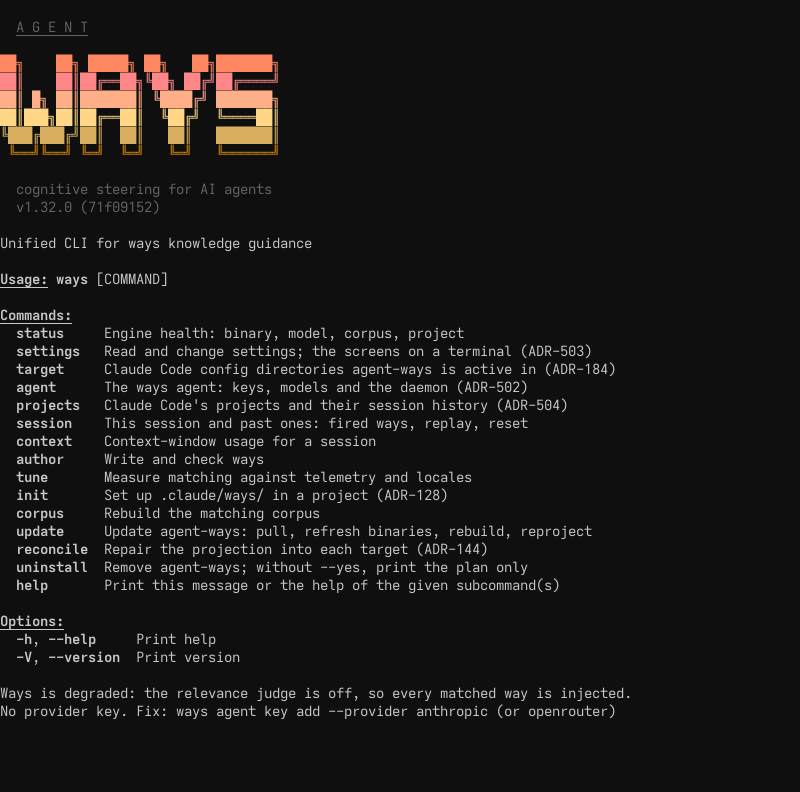
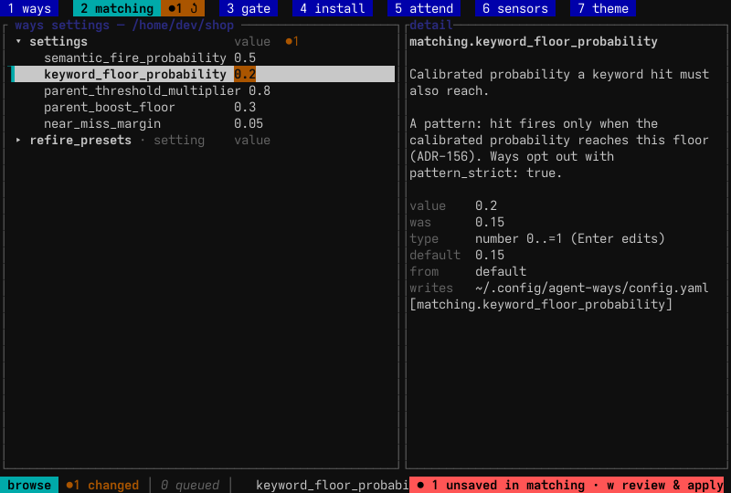
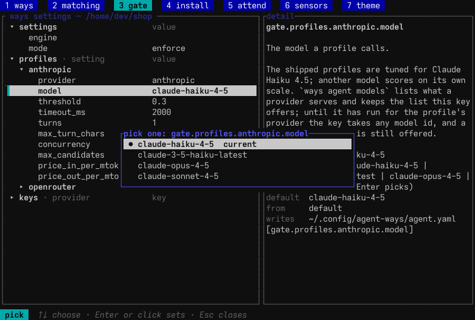
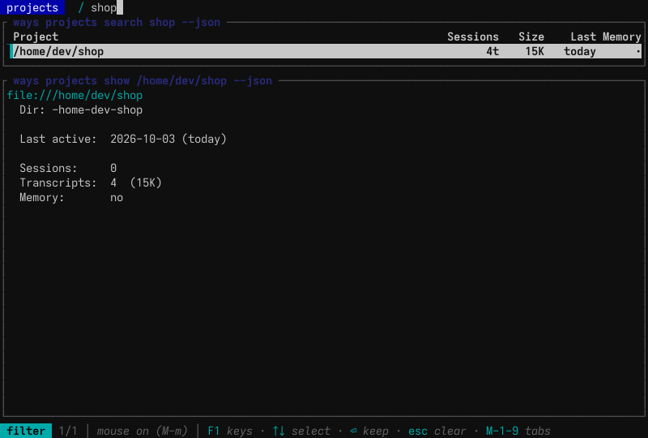
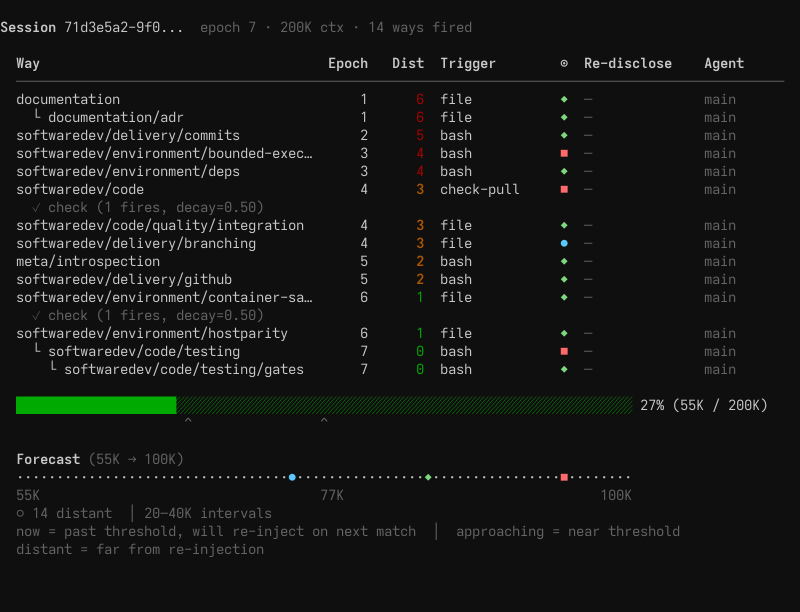
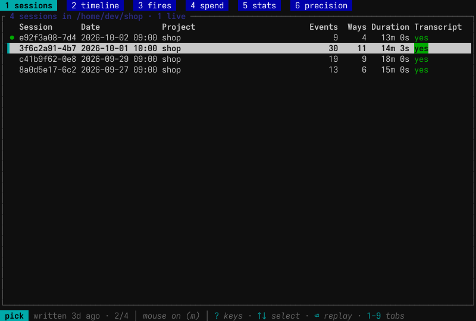
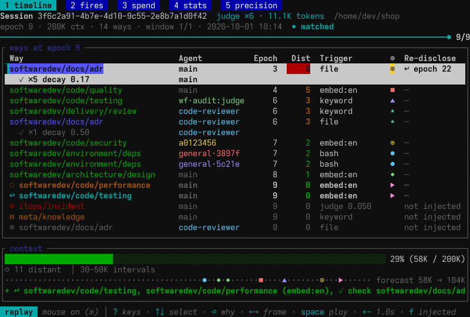
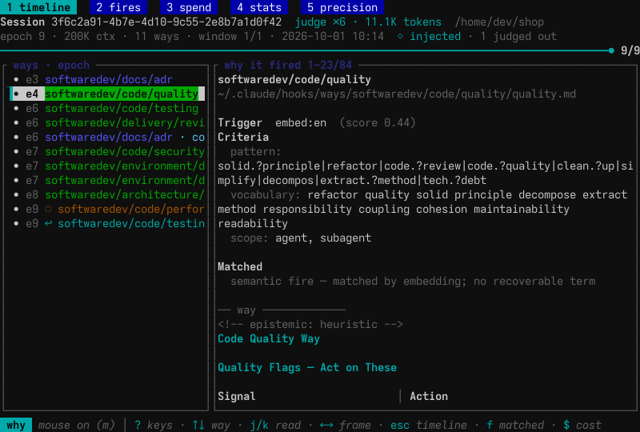
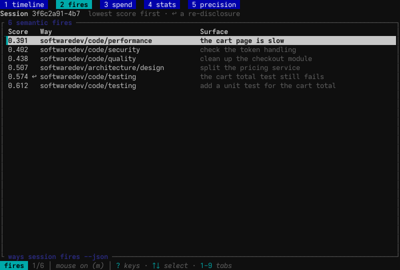
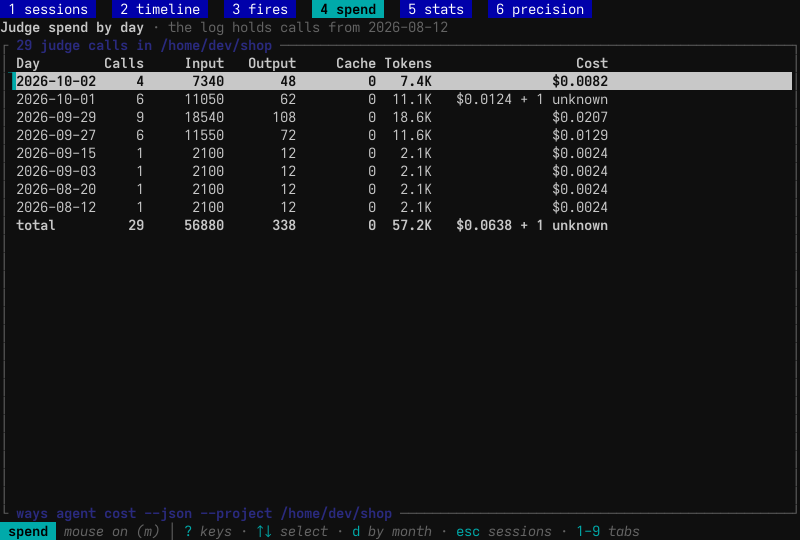

# ways CLI Reference

`ways` is the command-line interface to agent-ways. The hooks call it to match and inject ways, and the operator uses it to install, configure, observe and author. This page covers the commands in the order `ways --help` lists them ([ADR-507](../architecture/platform/ADR-507-the-ways-commands-regroup-into-operator-commands-and-six-groups-names-another-process-calls-stay-fixed.md)), then the hidden plumbing the hooks call.

Each entry says when to reach for the command, where to run it from, and what it tells you.



Bare `ways` prints this help, under the banner on a terminal. When the relevance judge cannot run, the last lines say why and name the fix.

## The screens

`ways settings`, `ways session`, `ways projects`, `ways agent` and `ways target` open a full-screen view when run bare on a terminal. Each screen is a view over commands that print the same data with `--json`. A table's bottom border names its command, with the scope the screen is showing, so an agent can read what the operator sees. In a pipe, each prints its help or its default listing instead.

The session and projects screens share these keys:

| Key | Does |
|---|---|
| `1`-`9` | Show that tab. A click on a tab shows it too. |
| `?` or F1 | Open the key help for the screen and the current tab. Any other key closes it. |
| `m` | Turn mouse capture on or off. With it off, the terminal selects text and a middle-click pastes. With it on, Shift-drag selects text in most terminals. |
| `q`, Esc, ^C | Quit. Esc first leaves an inner view, such as a filter or the why page. |

While the projects filter has the keyboard, these keys take Alt: `M-1`-`M-9` for tabs and `M-m` for the mouse, and F1 opens the key help. The footer shows the form in effect.

The settings screens have their own keys, listed under [settings screens](#settings-screens). Their key help opens with `?` only, and in a filter or an edit every key, Alt chords included, is typed into the field.

## `ways status`

**When:** After installing or updating, or when ways stop firing.

**Run from:** Anywhere.

**Tells you:** The binary and embedding model paths with their state, the corpus size split by English and multilingual entries, and the ways each known project holds.

```
ways status
ways status --json
```

## `ways settings`

**When:** Reading or changing any setting: matching thresholds, the language, the relevance gate's engine, model and mode, or a way switched off in one project ([ADR-503](../architecture/platform/ADR-503-settings-are-files-described-by-one-typed-registry-the-cli-and-the-tui-are-two-ways-in.md)).

**Run from:** Anywhere. Keys under `ways.project` write the project's `.claude/ways.yaml`. The project is `--project <dir>`, else `CLAUDE_PROJECT_DIR`, else the working directory.

**Tells you:** Settings live in files, and every verb reads or writes those files.

| Verb | Does |
|---|---|
| `get <key>` | Print the value in effect. `--json` adds its layer, default and file. |
| `set <key> <value>` | Write a key. Prints nothing on success. `--project` writes the project file. |
| `unset <key>` | Remove a key so the layer below applies. |
| `list [prefix]` | Print `key=value` lines in effect. `--json` prints a fragment keyed by the file each key lives in, and `--effective` adds the defaults. |
| `help [topic]` | Say what a key or section does, and list a choice key's options. |
| `emit [prefix]` | Print the canonical fragment, shaped like its file, with comments. `--effective` prints the values in effect. |
| `lint` | Check the settings files against the schema. Exits 3 with findings. |
| `apply` | Write a settings object (YAML or JSON, from stdin or `--file`) and answer with a JSON report. `--dry-run` writes nothing. |
| `fix <section>` | Rewrite one section of a file from canonical. |

`get`, `list` and `lint` take `--file <path>` to read one file alone instead of the live layers. The exit codes are 0 done, 2 usage error or unknown key, 3 rejected, 4 overridden by a higher layer, and 5 write failed.

A key whose value comes from a list computed from the files, such as `gate.engine` (the shipped profiles and your own), lists its choices in `help`, as an `options` array in `get --json` and `list --json`, and as a comment in `emit`. `set` and `apply` refuse a value outside the list with exit 3, and `lint` reports one written by hand.

```
ways settings list                                   # every key in effect
ways settings list gate --effective                  # the relevance gate as resolved
ways settings get gate.engine --json
ways settings set ways.project.itops/incident false  # silence a way in this project
ways settings unset ways.project.itops/incident      # back on
ways settings set gate.engine openrouter
ways settings set gate.mode shadow
ways settings emit                                   # the canonical file, with comments
```

### Settings screens

Bare `ways settings` on a terminal opens the settings screens. `ways settings <tab>` opens them on a tab: `ways`, `matching`, `gate`, `install`, `attend`, `sensors` or `theme`. Bare `ways agent` opens the gate tab, and bare `ways target` opens the install tab. The data is what `ways settings list --json` prints.



Each tab is a tree of settings on the left and the selected key's detail on the right: what it does, its value, type, default, the layer it comes from and the file it writes. An edit is queued, not written. The tab badge and footer count what is pending, and nothing reaches a file until the review applies it.

| Key | Does |
|---|---|
| Tab, S-Tab, `1`-`9` | Switch tab. Each tab keeps its cursor and open groups. |
| ↑↓ or `j` `k`; PgUp PgDn `g` `G` | Move; jump. |
| → or `l`; ← or `h` | Open a group; close it or go to the parent. |
| Enter or Space | Toggle a bool, pick a choice, edit a value, or open a group. On a secret, a masked entry. On an action-only node, its menu. |
| `e` | Edit as text. ^U clears the field. |
| `d` | Set to the default. |
| `u` | Revert the row. |
| `/` | Filter every tab by key. Enter on a hit jumps to it in its tab. |
| `a` | Menu of the row's actions, or the tab's. Each action's own key runs it. |
| `x` | Unqueue the last action. |
| `c` | The pending pane: changes and queued actions. |
| `w` or ^S | Review this tab's pending items, read-only. In the review, `a` applies the tab, `X` discards it, Tab goes to the next tab and Esc goes back. |
| `X` | Discard this tab's pending items, after a y/n confirm. |

In the tree, colour marks a row's state: a changed value, a value that differs from its default, a read-only row, a queued action. The `?` help lists the states. `[a]` marks a row with actions and `!` a lint finding.

Some tabs have keys of their own, which the footer names. On the ways tab, `s` sets up agent-ways in a project, and `p` switches between this project's and all projects' switched-off ways. On the install tab, `t` activates a target, `A` adds one and `p` shows a target's plan (see [`ways target`](#ways-target)). On the theme tab, ↑↓ previews a theme and Enter uses it.

**The model picker.** Enter on a choice key opens a picker. `gate.profiles.<profile>.model` offers the models the provider serves once [`ways agent models`](#ways-agent) has fetched and cached the list. Until then the key takes any model id as text.



## `ways target`

**When:** Finding out where agent-ways is active on this machine, or activating and deactivating it for a Claude Code config directory ([ADR-184](../architecture/platform/ADR-184-installation-and-activation-are-separate-states-targets-as-the-unit-of-activation.md)).

**Run from:** Anywhere.

**Tells you:** `list` prints each target with its enabled and observe flags, its converged state (`active`, `pending`, `partial`, `refused`, `stale` or `withdrawn`), and its own config file when one exists. With no `targets` key in the user config, the one target is `~/.claude`.

`plan <dir>` previews activation and touches nothing. It shows every projection root as `linked`, `link`, `relink` or `refused`, and the settings merge as what is kept of yours, what is added, what of a prior install is replaced and what would be removed. `add <dir>` prints that plan and stops with exit 3 when a real path sits at a root or an entry of yours would go; `--force` moves real paths aside and proceeds. `disable` withdraws and keeps the record; `enable` reconciles into it again; `remove` withdraws and drops the record. `list`, `plan` and `add` take `--json`.

A target can carry its own configuration: a `config.yaml` at `$XDG_CONFIG_HOME/agent-ways/targets/<key>/config.yaml`, or the path in the entry's `config:` field. It has the same keys as the user config and is layered over it for sessions under that target's config directory. `ways settings list` names the layer it applied.

A project can switch ways off for itself with `enabled: false` in its `.claude/ways.yaml`. Every scan lane then injects nothing there.

```
ways target list
ways target plan ~/.claude-work
ways target add ~/.claude-work            # record, then reconcile into it
ways target add ~/.claude-work --dry-run  # the plan only
ways target disable ~/.claude-work        # withdraw our links and hooks
ways target enable ~/.claude-work
ways target remove ~/.claude-work
```

Bare `ways target` on a terminal opens the settings screens on their install tab. In a pipe it prints its help and exits 2.

## `ways agent`

**When:** Adding or checking a provider key, choosing a model, checking the running agent, or finding out what the relevance judge has cost ([ADR-502](../architecture/platform/ADR-502-the-ways-agent-one-resident-daemon-per-user-for-search-judging-and-key-custody.md)).

**Run from:** Anywhere. `ways agent` forwards to the `ways-agent` binary.

**Tells you:** Depends on the subcommand.

| Subcommand | Does |
|---|---|
| `key add --provider <p>` | Store a key. It reads `--from-file`, else stdin when piped, else a prompt that shows a dot per character. It checks the key with the provider first; `--no-check` stores it unchecked, and the gate stays off until a check passes. `--force` replaces a stored key when the provider cannot be reached. |
| `key check [--provider <p>]` | Check stored keys with a call that costs nothing, against the model the gate is set to use. |
| `key rotate --provider <p>` | Replace an existing key, checking the new one first. Takes `--from-file` and `--force`. |
| `key remove --provider <p>` | Delete a stored key file. |
| `key status` | Where each provider's key comes from, and its last four characters. |
| `models [--provider <p>] [--all]` | List a provider's models with the recommended one marked, and cache the list for the settings model picker. The default provider is the configured engine's. On OpenRouter, `--all` lists every model, not only Anthropic's. |
| `status` | The running agent: engine, requests, fallbacks, latency. Says whether the engine was set or picked by key order. |
| `load` | Start the agent if it is not running, then report it. |
| `unload` | Stop the running agent. |
| `cost` | What the judge has cost; see below. |

A key does not choose the engine. The engine is the setting `gate.engine`. Unset, the gate takes the first shipped profile whose provider has a key, anthropic before openrouter. `key add` names the engine in effect, and the `ways settings set gate.engine` command when the new key's provider is not it.

```
ways agent key add --provider anthropic
ways agent key check
ways agent models --provider openrouter
ways agent status
```

Bare `ways agent` on a terminal opens the settings screens on their gate tab. In a pipe it prints `ways-agent`'s help.

What the judge does, what it sends and how to watch it are explained in [the relevance judge](../explanation/relevance-judge/relevance-judge-the-model.md), [what the judge sends and what it costs](../explanation/relevance-judge/what-the-judge-sends-and-costs.md) and [watching and tuning the judge](../explanation/relevance-judge/watching-and-tuning-the-judge.md).

### `ways agent cost`

**When:** Finding out what the relevance judge has cost, for one session or over a period.

**Run from:** Anywhere. It reads the events log, which every project shares.

**Tells you:** The judge's provider calls with their tokens and cost in USD, as a total and one row per day. `--by month`, `session` or `project` groups them otherwise. `--project <path>` keeps one project's calls, matched as [`ways session`](#ways-session) matches a project, and `--since <YYYY-MM-DD>` and `--session <id>` narrow further. `--json` prints the total, all four groupings and `covers_since`, with `cost_usd` null for a group whose calls all have unknown cost.

The hook logs each call as one `judge_call` event in `events.jsonl`, beside the `way_judged` events the call produced. OpenRouter reports each call's cost, and a request a provider refuses with a 4xx other than 408 costs nothing. An Anthropic call is priced from its tokens at the profile's `price_in_per_mtok` and `price_out_per_mtok`, which apply as a pair. When those are unset, it is priced at Claude Haiku 4.5's list price for that model. A call that returned no usage, such as one that hit its deadline, or one with no price for its model, has unknown cost: it is counted apart and never summed as zero. The events log keeps its newest 24 MiB, so older calls drop out; when that bounds the query, the text ends with the date of the earliest judge call the log still holds.

```
ways agent cost                          # spend per day
ways agent cost --by session --since 2026-10-01
ways agent cost --session <id> --json
ways agent cost --project ~/src/app --by month --json
ways settings set gate.profiles.anthropic.price_in_per_mtok 3.0
ways settings set gate.profiles.anthropic.price_out_per_mtok 15.0
```

## `ways projects`

**When:** Finding a project's session history, seeing what `~/.claude/projects` holds, clearing out empty project entries, or moving a project's history after the project directory moved.

**Run from:** Anywhere. It reads Claude Code's `~/.claude/projects`, never your project directories.

**Tells you:** Depends on the subcommand. `cleanup` and `hygiene` list what they would remove, ask first, and move it to a `.trash-<stamp>` directory under `~/.claude/projects` rather than deleting it; `--dry-run` only lists. `relocate` prints a plan and changes nothing without `--execute`. It refuses while a session is running in the project, and a rerun after a failed step resumes where it stopped.

| Subcommand | Shows or does |
|---|---|
| `list` (default) | Projects, most recently active first. `--active`, `--memory` and `--stale` filter, `--urls` prints `file://` links, `--json` prints them as data. |
| `search <query>` | Projects whose path, session summaries or first prompts match. `--deep` also searches transcript text. `--json` prints every match, best first, with its score. |
| `show <fragment>` | One project: dates, branch, transcripts, memory, recent sessions. The fragment matches an exact path first (`~/…` or the full path), then a project's name (its last path component), then the first path containing it. `--json` prints the project with its indexed sessions, or `null`. |
| `stats` | Totals, and the projects using the most disk and holding the most sessions. |
| `cleanup` | Moves project entries with no sessions and no transcripts to the trash directory. Skips entries modified in the last 5 minutes. |
| `hygiene` | Large transcripts, and empty session directories, which it moves to the trash directory. |
| `relocate OLD NEW` | Moves the history of sessions started in OLD to NEW: the project directory, transcript `cwd`s, `sessions-index.json`, the `~/.claude.json` key and `history.jsonl`. `--merge` combines with an existing project, `--keep-transcript-cwd` leaves transcripts untouched, `--force` proceeds past a live-session warning. |

The `--json` forms give each project's `path` as shown (`~/…`) and its `absolute_path`, times as UTC ISO timestamps (the session index's own, else the newest transcript's), and `null` for a value the project lacks.

```
ways projects
ways projects search orbit
ways projects show agent-ways --json
ways projects cleanup --dry-run
ways projects relocate ~/old/repo ~/new/repo            # preview
ways projects relocate ~/old/repo ~/new/repo --execute
```

### Projects screen

Bare `ways projects` on a terminal opens the projects screen. In a pipe it runs `list`. The top table is `ways projects list --json` (or `search <filter> --json` while a filter is set), and the detail below it is `ways projects show <path> --json` for the selected project.



| Key | Does |
|---|---|
| ↑↓ or `j` `k`; PgUp PgDn; `g` `G` | Move the selection; by a page; to the top or the end. |
| `J` `K` | Scroll the detail. The wheel over the detail scrolls it too. |
| `/` | Type a filter. Enter keeps it, Esc clears it. |
| Esc | Clear the filter, or quit when there is none. |

## `ways session`

**When:** Seeing which ways fired in a session and why, following the current session as ways fire, switching ways off for a session's subagents, or clearing a session's state.

**Run from:** The project directory, which scopes the sessions to that project and the paths under it. An agent's worktree in `.claude/worktrees/` counts toward its project; `/a/foo-bar` is not part of `/a/foo`. The tune commands and `ways agent cost --project` match a project the same way. A relative `--project`, such as `.`, is resolved against the working directory. With no `--session`, the default session is the newest at the project itself, else the newest under it. `--project <dir>` picks another project on `replay`, `live`, `list`, `dump` and `fires`, and `--all` takes every project on `replay`, `list`, `dump` and `fires`. `ways` and `subagents` take neither: they read the current session or `--session`. On `reset`, `--all` means every session's state. When the current project cannot be detected, the command fails rather than reading every project.

**Tells you:** Depends on the verb.

| Verb | Shows or does |
|---|---|
| `ways` | The ways fired in this session's current compaction window, with epoch, distance, trigger, re-disclosure forecast and agent. `--sort epoch` (default), `name` or `distance`. |
| `replay` | Opens the session screen. `--json` prints the reconstructed timeline instead. |
| `live` | Opens the session screen on the session writing events now, following it. |
| `list` | The session table. `--json` gives each session with `last_write` (the transcript's mtime, or null without one) and `live`. |
| `dump` | The session's introspection model as JSON: turns, fired ways, their criteria, the keyed transcript join and matched spans. |
| `fires` | The session's semantic fires with their scores, lowest first, and the text each matched. `--max-score` keeps the low tail and `--limit` caps the rows. |
| `subagents [on\|off]` | Report or switch whether this session's subagents get ways. |
| `reset` | Clear the session's markers. A dry run unless `--confirm`. |

`ways`, `fires`, `dump` and `replay --json` show what reached the session; `--matched` adds the ways the relevance judge kept out, each with its P(yes) against the threshold. `ways` lists the current compaction window, but its `--matched` list (`judge_blocks` in `--json`) covers the whole session.

In `dump`, a re-disclosure is a row with `redisclosed: true` and can carry the judge's verdict. `summary.redisclosures` counts it, and `total_fires` does not. A turn can hold only re-disclosures. Turns are numbered as `--matched` numbers them, so the default dump skips the number of a turn that held only blocked ways.

**`replay --json`** is a single object with `session`, `project`, `context_window_k`, a `summary`, the full `frames` timeline and `near_misses`. The summary holds the epoch count, duration, distinct ways, total fires, re-disclosures, checks, near-misses, trigger breakdown, top ways, the relevance gate's work, and `suppressed`: the `injection_suppressed` count, split into `dispatches` and `agents` and by switch. Each frame has its epoch, timestamp, token position, active ways, what newly fired that turn, and `suppressed` (`switch`, `lane` and `agent`) when the subagent switch held ways back in it. A near-miss is a way whose calibrated probability came within `near_miss_margin` of the semantic firing threshold without firing, with its English and multilingual probabilities (`prob_en`, `prob_multi`), the threshold `tau_s` and the `margin` below it. The screen omits near-misses. A multi-day session can run to thousands of frames, so slice it with `jq`.

**`subagents`** names the switch that decides: the session's own, the `subagents:` setting in the project or user `ways.yaml`, or the default (on). Switching names a session: `--session <id>`, or the session the command runs in (`CLAUDE_CODE_SESSION_ID`). The main agent's ways are unaffected. The session switch holds through compaction and `ways session reset`; `/clear` starts a new session id without it, and a switch untouched for 30 days is pruned.

**`reset`** clears markers, epoch counters and check fire counts. Use it when a way should fire and does not (a stale marker), when checks fire too often (an inflated epoch), or after editing a way mid-session.

```
ways session ways                                   # the current session
ways session ways --session <id> --matched --json
ways session replay                                 # the screen, on this project's sessions
ways session replay --session <id>                  # one session
ways session replay --all                           # sessions across every project
ways session replay --speed 500                     # faster playback (ms per frame)
ways session replay --session <id> --json           # the timeline as JSON
ways session live                                   # follow the active session
ways session list --json
ways session dump --session <id>
ways session fires --session <id> --max-score 0.6   # the borderline semantic fires
ways session subagents off                          # this session's subagents get no ways
ways session reset --confirm
```



### Session screen

Bare `ways session` on a terminal opens the session screen, as `replay` does. In a pipe it prints its help and exits 2, so a script names the verb.

The screen has six tabs. Each is a view over a command that prints its data:

| Tab | Shows | Command |
|---|---|---|
| 1 sessions | The sessions in scope, newest first. Only when no `--session` was given. | `ways session list --json` |
| 2 timeline | The selected session frame by frame. | `ways session replay --session <id> --json` |
| 3 fires | The session's semantic fires, lowest score first. | `ways session fires --json` |
| 4 spend | The judge's spend over the scope, ccusage-style. | `ways agent cost --json --project <dir>` |
| 5 stats | The scope's usage. | `ways tune stats --json --project <dir>` |
| 6 precision | Fire precision, with the selected way's remedy. | `ways tune precision --json --project <dir>` |

With `--session`, the sessions tab is absent and the others move up one digit. Esc on a report tab goes back to the sessions tab, or quits when there is none.

#### Sessions tab



A session whose transcript Claude Code wrote within the last two minutes is live. Its row is marked `●`, the title counts them (`4 sessions in /home/dev/shop · 1 live`), and the bar says when the selected session was last written. The session the screen was opened from (`CLAUDE_CODE_SESSION_ID`) reads `this session`.

| Key | Does |
|---|---|
| ↑↓ | Select. |
| Enter | Open the session on the timeline: `follow` on a live one, `replay` otherwise. A click on the selected row does the same. |
| PgUp PgDn Home End | Move by a page or to an end. |

Liveness comes from `stat` alone, never a read of the transcript. The list stats each transcript once when it is built, then re-stats each on its own interval: 2s after a write, doubling while it stays quiet, up to 60s. A transcript last written more than a day ago is not checked again while the list is open.

#### Timeline tab



The header gives the session, the judge's calls and the tokens they used (`judge ×6 · 11.1K tokens`), the project, and for the frame shown its epoch, the context window, the ways in the table, the compaction window and the time. The scrubber under it spans the session's frames and compaction windows; a `⊝` on it marks a frame where the subagent switch held ways back.

The table has one row per way and agent that fired it:

| Column | Shows |
|---|---|
| Way | The way's id, with its outcome mark and colour (below). A way fired or re-disclosed in this frame is bold. A narrow column keeps the leaf: `…/docs/adr`. |
| Agent | Who fired it: `main`; a Task subagent by its `subagent_type` (`general-purpose` reads `general`); a workflow member as `wf·` and its label; any other subagent by a short id. Two agents with the same name each add `·` and five characters of their id (`general·3897f`). Main is muted, and each subagent takes its own colour. |
| Epoch | The epoch it fired in. |
| Dist | Epochs since then, coloured by distance. |
| Trigger | What fired it: `keyword`, `embed:en`, `file`, `bash`, `check-pull` and so on. A row the judge blocked shows `judge` and its P(yes). |
| ◎ | A pin for where the way's next re-disclosure falls on the forecast line, one symbol and colour per cluster. |
| Re-disclose | The re-disclosure forecast: `● now` past its refire window, `◐ N%` at 75% of the window or more, `◔ N%` at 50% or more, `↩ epoch N` when a check's decay holds it back until epoch N, `↩ suppressed` when that is more than 500 epochs off, else `─`. A row that injected nothing reads `not injected`. |

A way whose check has fired has a second line, `✓ ×N decay D`: the check's fires and its decay, 1/(N+1).

The mark before a way's name and the name's colour say what happened to it. The colours are the theme's roles, so they follow `ways settings theme`:

| Mark | Colour | Outcome | View |
|---|---|---|---|
| none | ok | Fired and injected. | both |
| none | info | Injected, and its check has fired since. | both |
| `↩` | accent | Its latest injection was a re-disclosure. | both |
| `◌` | warn | Injected; the judge, in shadow mode, would have kept it out. | both |
| `⊘` | error | The judge kept it out. | matched |
| `◷` | muted | Matched again inside its refire window and not shown again. | matched |
| `⊟` | alt | Matched but withheld by the context cap. | matched |

By default the table shows the ways injected into the session. `f` widens it to every matched candidate and back, and the header names the filter (`◇ injected`, with a count of the ways the judge kept out, or `◆ matched`). A session the judge never saw is all injected, and its header leaves the filter unnamed. A withheld row injected nothing, so it appears only in the frame it was judged or held in; a way already active keeps its own row beside it. A way blocked because the judge blocked its ancestor shows the ancestor's P(yes) and names it: `⊘ <way> (with <ancestor>)`.

Under the table, the context lines give the token gauge, the re-disclosure zones (`● now`, `◐ approaching`, `○ distant`) with the refire intervals, the forecast line with each cluster's pin, and what changed in this frame. A `⊝ suppressed:` line names a Task dispatch or agent whose ways the subagent switch held back.

| Key | Does |
|---|---|
| ←→ or `h` `l` | Step a frame. |
| ↑↓ or `j` `k`; PgUp PgDn | Select a row; move by ten. |
| Space | Play or pause. On a live session: follow or pause. |
| `+` `-` | Playback speed. |
| Home End, or `g` `G` | The first frame; the newest. On a live session, End follows again. |
| Enter or Tab | Open why the selected way fired. A click on the selected row does the same. |
| `f` | Injected or matched view. |
| `$` | Switch the header's judge figure between tokens and cost. A call of unknown cost is counted apart. [`ways agent cost`](#ways-agent-cost) breaks the spend down. |
| Esc | Back to the sessions tab. |

A click on the scrubber seeks to that frame, and the wheel there steps one.

**Why it fired.** Enter or Tab opens a list of the frame's ways beside the selected way's detail: its file, trigger and score, the criteria in its frontmatter, the judge's verdict when there was one, the matched span, and the way's own text.



| Key | Does |
|---|---|
| ↑↓ | Select a way. A click on one does the same. |
| `j` `k`; PgUp PgDn; `g` `G` | Read the detail by a line, by a page, to the top, to the end. |
| ←→ | Step a frame. |
| `f`, `$` | As on the timeline. |
| Esc or Tab | Back to the timeline. |

**Live sessions.** Replay and live are one view. Enter on a live session opens its replay at the newest frame, following it: new frames append, and the cursor rides the newest way while it is there. Moving back stops the follow, with `LIVE paused` in the bar; End or Space resumes it. While following, the screen re-stats the event log and the transcript every 2s after a write, backing off to 5s, and reads the log again only when one of them was written. A followed session quiet for 10 minutes has most likely ended, so its follow backs off to once a minute until it is written again. A replay opened on a quiet session watches its transcript on the list's schedule (not at all when it was last written more than a day ago), and goes live on the first write: following when the newest frame is shown, paused otherwise. `replay --session <id>` follows a live session too. `live` opens the screen on the session writing events now, with the project's sessions on the sessions tab behind it and its report tabs scoped to `--project`, or else the root of the project it was launched in.

#### Fires tab



Each semantic fire of the session as score, way and the surface it matched, lowest score first, so a fire on the wrong text stands out. `↩` marks a re-disclosure. Keyword and state fires carry no score and are not listed. ↑↓ selects a row.

#### Spend tab



The judge's calls over the scope as calls, input, output and cache tokens, and cost, one row per day. `d` switches between days and months. The line above the table gives the date of the earliest judge call the event log still holds. ↑↓ selects a row.

#### Stats and precision tabs

The stats tab is [`ways tune stats`](#ways-tune) for the scope: the ways by fires beside how they fired, by channel, scope, checks, ways per invocation and model. The precision tab is [`ways tune precision`](#ways-tune) for the scope, with the selected way's remedy under the table. ↑↓ selects a row on both.

## `ways context`

**When:** During a long session, to see how much of the context window is used before compaction.

**Run from:** Inside an active Claude session, from the project directory, so it finds the right transcript.

**Tells you:** Token counts for the current transcript: the total, by role, and the remaining budget.

```
ways context
ways context --session <id>   # pin to one session instead of guessing from cwd
ways context --project <dir>  # resolve the transcript for another project
ways context --json
```

`--json` carries `window_source` beside `tokens_total` ([ADR-166](../architecture/ways/ADR-166-single-source-of-truth-for-model-context-window-resolution.md)): `model_table` (the model was recognized), `env_override` (`CLAUDE_CONTEXT_WINDOW` was set and beat detection), or `default` (the model was not recognized and a conservative 200K was assumed, so the percentage is a guess). `CLAUDE_CONTEXT_WINDOW` overrides detection on every model.

## `ways author`

Commands for writing and checking ways.

### `ways author template`

**When:** Creating a new way. The template gives valid frontmatter and a body to fill in ([ADR-139](../architecture/ways/ADR-139-shelve-maintainer-i18n-adopter-run-localization-via-ways-localize.md)).

**Run from:** The project directory to create it in `.claude/ways/`. `--global` creates it in `$XDG_CONFIG_HOME/agent-ways/ways/`.

**Tells you:** Writes the way file at the given path. `-d` (description) is required; `-V` sets the vocabulary; `--scope` sets `agent`, `subagent` or `teammate`, comma-separated (default `agent`). Ways are authored in English; locale stubs come from the ways-localize skill.

```
ways author template softwaredev/myteam/workflow -d "team deployment workflow and release process"
ways author template itops/alerts -d "alerting runbooks" -V "alert pager oncall runbook" --global
```

### `ways author lint`

**When:** After editing a way's frontmatter; before committing; in CI.

**Run from:** The project directory to scan the project's ways; elsewhere it scans the global ways. Pass a path to lint one file or directory. `--global` scans the global ways and ignores `CLAUDE_PROJECT_DIR`.

**Tells you:** Errors and warnings per file against the frontmatter schema. `--schema` prints the schema. `--check` exits non-zero on errors, for CI.

`--fix` corrects what it can, and takes its scope from `path`, not from the flag. Without a path it refuses rather than rewrite every way in the resolved corpus; `--all` asks for that deliberately. Each correction is reported on its own `FIXED:` line. Review the writes with `git diff`.

```
ways author lint                                          # the project's ways
ways author lint .claude/ways/myteam/deploy/deploy.md     # one file
ways author lint <path> --fix                             # correct within that path
ways author lint --fix --all                              # correct the whole resolved corpus
ways author lint --check                                  # CI: non-zero exit on errors
ways author lint --schema
```

Exit codes: `0` clean, `1` errors found (with `--check`), `2` the invocation was wrong.

### `ways author match`

**When:** A way does not fire, or the wrong way wins, or you changed vocabulary and want to see the effect. It shows how a query matches under the live matcher.

**Run from:** Anywhere. It covers the global ways plus the project-local ways of `--project <dir>` (default: the current directory).

**Tells you:** The late-interaction diagnostic ([ADR-160](../architecture/ways/ADR-160-chunked-late-interaction-matching-with-softmax-share-gating-for-way-selection.md)). A header gives the gates in force (admit on share or peak, then confirm) and how many ways would fire, then the reduced surface the query was chunked from. Then, for the top 20 candidates ranked by share:

| Column | Meaning |
|---|---|
| `peak` | The way's strongest single-chunk cosine |
| `share` | Softmax mass the way won across chunks, which the share gate reads |
| `confirm` | Best match of the way's own body against the chunk it won (`—` when not admitted) |
| `outcome` | `fired ✓`, `< gate` (admitted by neither share nor peak), or `< confirm` (admitted, but the body did not corroborate) |
| `won chunk` | The surface chunk the way matched on |

When the query is too sparse to chunk, or the embedding engine cannot run late interaction, it says so on stderr and prints the single-vector view instead, as the fire path does. There the cosines are mapped through the calibrated logistic `g(s)` and fire when `g(s) ≥ τ_s`; see [the engine reference](../hooks-and-ways/engine-reference.md).

```
ways author match "how do I test if a way is working"
ways author match "git commit message format" --project ~/my-project
```

### `ways author tree`

**When:** Checking how a domain's progressive-disclosure tree is built, or its thresholds and sizes before editing it.

**Run from:** Anywhere. Pass a way name or path (`softwaredev` or `meta/knowledge`).

**Tells you:** A table of each node in the subtree with its depth, type (way or check), disclosure threshold, vocabulary count and token size. `--jaccard` adds the vocabulary overlap between siblings.

```
ways author tree softwaredev
ways author tree softwaredev --jaccard
```

### `ways author siblings`

**When:** Checking whether two ways are so similar that both fire for the same query or one shadows the other, or whether a new way is distinct enough.

**Run from:** Anywhere. Pass `all` as the id for the full matrix.

**Tells you:** The cosine similarity between the way and every other way above `--threshold` (default 0.3). Above 0.7 suggests vocabulary overlap worth resolving. `--corpus <path>` and `--model <path>` point at another corpus or embedding model.

```
ways author siblings meta/knowledge
ways author siblings all --threshold 0.5
```

### `ways author suggest`

**When:** A way's match scores are low for queries it should catch: its vocabulary does not match how people phrase them.

**Run from:** Anywhere. Pass the path to the way file.

**Tells you:** Terms to add to the `vocabulary:` field, ranked by frequency in the way's body. `--min-freq` sets the minimum frequency (default 2).

```
ways author suggest .claude/ways/myteam/deploy/deploy.md
```

### `ways author graph`

**When:** Loading the ways graph into another tool.

**Run from:** Anywhere. `--ways-dir <dir>` reads another ways root.

**Tells you:** JSONL of node records (id, description, type) and edge records (parent to child), on stdout or to `-o <file>`.

```
ways author graph -o ways-graph.jsonl
```

### `ways author reflow`

**When:** A markdown file has prose hard-wrapped at a column, which ways and docs avoid.

**Run from:** Anywhere. Pass a markdown file, or pipe text on stdin.

**Tells you:** The wrapped paragraphs it finds. `--fix` rewrites the file after backing up the original; `--json` prints the findings as data; `--quiet` prints nothing. Exit codes: `0` clean, `1` wrapped prose found, `2` error. The markdown way's postcheck and `ways author lint` use the same detector.

```
ways author reflow docs/guide.md
ways author reflow docs/guide.md --fix
```

### `ways author permissions`

**When:** After adding `requires:` to a way's frontmatter, to check Claude has the permissions those ways depend on ([ADR-116](../architecture/platform/ADR-116-declarative-permission-requirements.md)).

**Run from:** The project directory to check the project's ways. `--global` checks only global ways.

**Tells you:** Each way's required permissions against the grants in `settings.json`, granted in green and missing in red.

```
ways author permissions
ways author permissions --global
```

## `ways tune`

Commands that measure matching against the event log and the locales.

### `ways tune stats`

**When:** Seeing which ways are used, which never fire, and how triggers break down.

**Run from:** The project directory to scope to it, or `--project <dir>`. `--global` covers every project, and `--days N` narrows the time window.

**Tells you:** The top ways by fire count, the breakdown by trigger type (keyword, semantic, state, file, bash, check-pull), a breakdown by model, ways per hook invocation, check fires and the session count. `--json` lists every count table by count, then name, so two runs over one log print the same bytes.

```
ways tune stats
ways tune stats --days 7
ways tune stats --global --json
```

**By model:** fires and re-disclosures split by the model id stamped on each event at fire time (the `model` field, read from the transcript the invoking hook named). A second table shows the same top ten ways with a column per model. Two buckets are not model ids. `unknown` means no model was resolved for the fire: the scan ran without `--transcript` (a dry run, the task or SubagentStart lane, or a hook from before the flag), the transcript could not be read, or it had no assistant turn yet. The model is never taken from a session-id or project lookup, since for a subagent those resolve the parent's or a sibling's transcript. `(unstamped)` means the row predates the field. No way is gated or presented differently by model.

**Ways per hook invocation:** how many ways one hook call delivered, per channel (`prompt`, `bash`, `file`, `state`, ...): the invocation count, how many delivered 1, 2, 3 or 4+ ways, and the maximum. An invocation is approximated as the `way_fired` rows that share a session, an agent (`agent_id`, since subagent hooks report the parent's session id), a timestamp (one-second resolution) and a channel. Rows written before `agent_id` existed merge parallel agents under one session, so on old data the 4+ tail is an upper bound. The prompt channel folds the keyword and semantic prompt matchers together, and the bash channel folds `bash` with `semantic:bash:*`.

`--json` adds `by_model` (`{model: {fires, redisclosures}}`), `by_way_model` (`{way: {model: fires}}`) and `ways_per_invocation` (`{channel: {invocations, "1", "2", "3", "4+", max}}`).

### `ways tune precision`

**When:** Checking whether ways land in sessions they do not belong in, such as a `softwaredev` way firing in a writing session ([ADR-134](../architecture/ways/ADR-134-empirical-auto-tuning-from-fire-and-near-miss-telemetry.md)).

**Run from:** Anywhere. `--project <dir>` keeps one project's events and `--way <substring>` some ways.

**Tells you:** Each way's off-domain fire rate. A way with at least `--min-sessions` sessions (default 5) at or above `--flag-threshold` (default 0.5) is flagged for tighter vocabulary. `--json` prints it as data.

```
ways tune precision
ways tune precision --flag-threshold 0.3
ways tune precision --way itops --json
```

### `ways tune locale`

**When:** After localizing, to check that each locale's matching metadata means what the English does.

**Run from:** Anywhere. `--way <substring>` filters, `--lang <code>` audits one language (default: the active one), and `--ways-dir <dir>` reads another ways root.

**Tells you:** Each locale entry's fidelity (cross-lingual cosine with its English) and discrimination gap (its score against its own way minus its score against the way it is most confused with). An entry under `--fidelity-threshold` (default 0.60) or `--discrimination-threshold` (default 0.03) is flagged for re-authoring. `--json` prints it as data.

```
ways tune locale
ways tune locale --lang es --fidelity-threshold 0.7
```

### `ways tune language`

**When:** Before rolling out to a team that works in other languages, to see which ways cover a language.

**Run from:** Anywhere.

**Tells you:** The active language and model availability, the corpus split into English and multilingual, coverage across the supported languages, and which ways are English-only. `--filter <lang>` lists the ways supporting one language, `--audit` gives the full per-way detail, and `--json` prints it as data.

```
ways tune language
ways tune language --filter fr
ways tune language --audit
```

## `ways init`

**When:** Setting up ways in a project for the first time ([ADR-128](../architecture/practice/ADR-128-memory-as-repo-portable-ways-seed-routing-over-accumulated-snapshots.md)).

**Run from:** The project root, or pass `--project <dir>`.

**Tells you:** Creates the `.claude/ways/` directory and seeds a `MEMORY.md` template. It writes `.claude/.gitignore` (keeps developer-local files out of git) and `.claude/ways/_template.md` (a starting point for a project way that never fires) when they are missing. SessionStart runs it on `startup` and `clear`, so a fresh repo gets both files without running it by hand. Projects may commit or ignore them.

```
ways init
ways init --project ~/my-other-project
```

## `ways corpus`

**When:** After adding or editing ways, since the corpus is what matching reads, or when `ways status` shows the corpus as stale.

**Run from:** Anywhere.

**Tells you:** Progress during the rebuild, which writes the corpus to the XDG cache directory. `--if-stale` skips the rebuild when no way file changed since the last build; the SessionStart hook runs it that way. `--ways-dir <dir>` with `--output <dir>` builds an isolated corpus that leaves yours alone.

```
ways corpus
ways corpus --if-stale              # skip if current
ways corpus --quiet                 # no progress output
ways corpus --verbose               # trace every phase; diagnose a stalled build
```

**A build that seems to hang.** A quiet build is silent for long stretches: it walks every project's ways, then runs `way-embed` three times and discards the per-way progress, so a slow pass and a wedged one look the same. `--verbose`, which overrides `--quiet`, prints each phase with its elapsed time before the work starts, so the last line names the step that stalled. It streams `way-embed`'s `[n/total] <way-id>` output, which pins a hang to one way, and prints each child's arguments so you can rerun that pass alone.

The phases, in order: path resolution; the user and core way scans; per-project resolution, each project named as it is resolved (a stalled network mount or a cloud-storage placeholder directory hangs here, under that project's name); the corpus write; the three `way-embed generate` passes (`en`, `multi`, then `combined`, which re-embeds what the first two did and takes longest); the two calibration lanes; and the manifest write.

## `ways update`

**When:** Updating agent-ways to the latest release.

**Run from:** Anywhere. The app source in `$XDG_DATA_HOME/agent-ways` must be an agent-ways git checkout; an install from before 1.0 is refused and needs migrating first.

**Tells you:** Each step as it runs: pull the app source, refresh every binary of the suite (a pre-built download first, a build from source as the fallback), rebuild the corpus, run `ways reconcile`, and check the judge's keys. A binary that fails to refresh is put back, so a failed update leaves the old install working. `--dry-run` prints the steps and runs nothing. `--ref <branch|tag|commit>` pins the install to that ref and builds the whole suite from source, leaving the release channel until `ways update --ref main`.

```
ways update
ways update --dry-run
ways update --ref ways-v1.32.0
```

## `ways reconcile`

**When:** Repairing the `~/.claude` projection ([ADR-144](../architecture/platform/ADR-144-install-repair-migrate-as-one-manifest-reconciler.md)). The installer and `ways update` run it for you; run it by hand after pulling the app source, or when a projected root is missing.

**Run from:** Anywhere.

**Tells you:** Which projection roots it linked or relinked, one line each, and a summary unless `--quiet`. It stops with a non-zero exit, before touching anything, when a projected root (`skills/`, `agents/`, `commands/`, `hooks/ways/`, `hooks/check-config-updates.sh`, `bin/*`) is a real directory or file rather than a symlink, and lists the paths. It never deletes a real path.

With no `--dest`, it runs over every target in the user config ([ADR-184](../architecture/platform/ADR-184-installation-and-activation-are-separate-states-targets-as-the-unit-of-activation.md)). Each enabled target is converged. Each disabled one is withdrawn: our symlinks are unlinked, and our hooks block and permissions are removed from its `settings.json` through the same merge base that wrote them. An explicit `--dest` is a single-target run and leaves the list alone.

```
ways reconcile                       # every target in config.yaml; default: ~/.claude
ways reconcile --dry-run             # preview; prints "refused <root>" for real paths, exit 0
ways reconcile --force               # rename each real path to <name>.ways-backup-<seconds>, then link
ways reconcile --source <checkout> --dest <dir>   # dogfood a development checkout
ways reconcile --mode copy           # copy files instead of symlinking (default: symlink)
ways reconcile --quiet               # no summary line
```

## `ways uninstall`

**When:** Removing agent-ways from the machine ([ADR-198](../architecture/ways/ADR-198-uninstall-is-a-lifecycle-command-that-keeps-what-the-operator-owns.md)).

**Run from:** Anywhere.

**Tells you:** The plan: every target it withdraws from, the agent it stops, the command links it removes, and the app and cache directories it deletes. Without `--yes` it prints the plan and changes nothing. Your config (your ways, API keys and settings) and state (events) stay unless `--purge` is given. A plan that would delete anything but the app's own directories is refused.

```
ways uninstall                 # the plan only
ways uninstall --yes
ways uninstall --yes --purge   # also your config and state
```

## Plumbing

The hooks call these. They are hidden from `ways --help`, and their names stay fixed because processes that do not reload with the binary call them ([ADR-507](../architecture/platform/ADR-507-the-ways-commands-regroup-into-operator-commands-and-six-groups-names-another-process-calls-stay-fixed.md)). They are safe to call by hand when testing a way or a custom hook.

| Command | Used by |
|---|---|
| `ways hook <event>` | Every script under `hooks/ways/`. Reads the hook's JSON payload on stdin and prints what the hook returns. Events: `prompt`, `state`, `command`, `file`, `task`, `post-tool`, `queued`, `stop`, `subagent-start`, `session-start`, `tasks-active`. |
| `ways scan prompt` | `ways hook prompt` (UserPromptSubmit): keyword and semantic matching against the prompt. |
| `ways scan messages` | `ways hook queued` (PostToolUse): matches operator messages queued mid-turn ([ADR-161](../architecture/ways/ADR-161-queued-mid-turn-operator-messages-as-an-aggregated-scan-surface.md)). |
| `ways scan command` | `ways hook command` (PreToolUse Bash): matches the command Claude runs. |
| `ways scan file` | `ways hook file` (PreToolUse Edit and Write): matches the file Claude edits. |
| `ways scan task` | `ways hook task` (PreToolUse Task): matches the delegation and stashes the ways; `ways hook subagent-start` injects them when the subagent starts. |
| `ways scan state` | `ways hook state` (SessionStart, UserPromptSubmit): context-threshold, file-exists and session-start triggers. `--query` carries the prompt, so a harness envelope (Monitor notification, task hand-back, skill body) is skipped. |
| `ways show way\|check\|core\|attend` | Agents told by attend to run `ways show attend <signal>`; authors checking a way's delivered text. |
| `ways sessions-root` | Scripts the binary does not run (`gh-tasks`). Macros and postchecks get it as `WAYS_SESSIONS_ROOT`. |
| `ways project-slug [path]` | Macros that read per-project state (`meta/memory/macro.sh`). |
| `ways events-log-path` | Scripts outside the binary that read the event log. |
| `ways manifest` | Debugging `reconcile`: the projection manifest it converges toward. |
| `ways judge-setup` | The installer and the end of `ways update`: checks the judge's keys and, on a terminal, offers to add one. |

**Testing a way by hand.** `ways scan prompt` runs the same code as the UserPromptSubmit hook and prints the markdown that would be injected; no output means nothing crossed a threshold. `ways show way` prints a way as Claude receives it. Both need `--session`; any string, such as `dummy`, makes a dry run that touches no real session. Both are session-aware, so a second call with the same session prints nothing for a way already shown. `--project <dir>` adds that project's ways.

```
ways scan prompt --query "how do I test if a way is working" --session dummy
ways scan prompt --query "git commit" --session dummy --project ~/my-project
ways show way softwaredev/code/testing --session dummy
```

`--transcript <path>` (on `scan prompt`, `command`, `file` and `state`) is the transcript the hook payload names as `transcript_path`. A fired way reads the invoking agent's model id from it, stamps the event with `model` and `agent_id`, and resolves its `refire:` window from the same read. The hooks pass it. Without it the binary still finds a transcript by session id for the window, but stamps `model: unknown`, because that lookup finds the parent's transcript for a subagent.

## `ways-audit`

`ways-audit` is a sibling binary ([ADR-151](../architecture/governance/ADR-151-extract-ways-core-crate-and-ways-audit-sibling-binary.md)), not a `ways` subcommand. It reports which ways carry governance provenance (ADR links, control references, policy derivations) and cross-references it with firing activity.

**Run from:** Anywhere. `--global` restricts it to global ways, and `--json` works on every subcommand.

| Subcommand | Shows |
|---|---|
| `report` | Coverage: how many ways have provenance, and the gaps. `--json` is the claim manifest. |
| `gaps` | Ways with no provenance sidecar. |
| `stale` | Ways with outdated `verified:` dates. |
| `active` | Provenance cross-referenced with firing stats. |
| `matrix` | A flat sheet of way, control and justification. |
| `lint` | Provenance integrity. |
| `trace <id>` | End-to-end provenance for one way. |
| `control <id>` | Which ways claim a control. |
| `policy <id>` | Which ways derive from a policy. |
| `assemble [--way <id>] [--write]` | The classifier-ready finding dataset ([ADR-201](../architecture/governance/ADR-201-findings-assembled-as-classifier-ready-assessment-records.md)): one row per way and control with firing evidence and an empty determination. `--write` appends it to the finding ledger. |
| `findings` | The assembled finding ledger. |

`assemble` never writes a determination. It leaves the label empty for a separate classifier outside agent-ways: assembly is not assessment.

```
ways-audit report
ways-audit trace meta/knowledge
ways-audit matrix --json > coverage.jsonl
ways-audit assemble --json > findings.json
```

## Renamed commands

The old command names, and what replaced each, are in [ways-cli-renames.md](ways-cli-renames.md).
